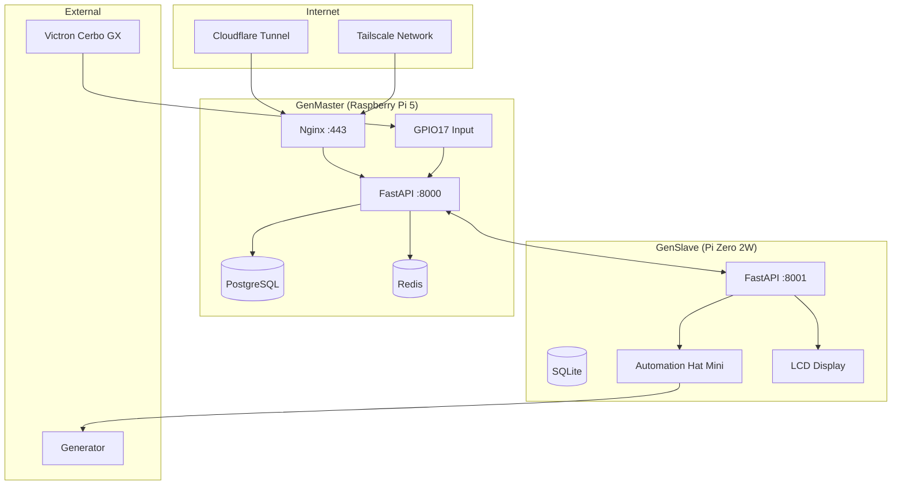

# RPi Generator Control

[](https://opensource.org/licenses/MIT)
[](https://fastapi.tiangolo.com)
[](https://vuejs.org)
[](https://www.postgresql.org)
[](https://www.docker.com)
[](https://tailscale.com)
[](https://www.raspberrypi.com)

> *"The best automation is the kind you forget is running."*

A production-ready, distributed generator control system designed for off-grid solar installations with Victron energy systems. Built on a master-slave architecture using Raspberry Pi devices, it provides automated generator management with manual override capabilities, scheduling, and real-time monitoring through a modern web interface.

---

## Table of Contents

- [Overview](#overview)
- [Features](#-features)
- [System Architecture](#-system-architecture)
- [Hardware Requirements](#-hardware-requirements)
- [Quick Start](#-quick-start)
- [Configuration](#-configuration)
- [Web Interface](#-web-interface)
- [API Reference](#-api-reference)
- [Development & Testing](#-development--testing)
- [Troubleshooting](#-troubleshooting)
- [Security](#-security)
- [License](#license)
- [Acknowledgments](#acknowledgments)

---

## Overview

The RPi Generator Control system automates generator management for off-grid solar installations. When your Victron Cerbo GX determines that battery levels are low and generator power is needed, it sends a signal to GenMaster, which coordinates with GenSlave to physically start the generator.

```
┌─────────────────────────────────────────────────────────────────────────────┐
│                              VICTRON CERBO GX                               │
│                            (MK2 Relay Output)                               │
└─────────────────────────────────────────────────────────────────────────────┘
                                      │
                            2-Wire Connection
                           (Normally Open Contact)
                                      │
                                      ▼
┌─────────────────────────────────────────────────────────────────────────────┐
│                               GenMaster                                     │
│                    (Raspberry Pi 5 - 8GB RAM, 128GB NVMe)                   │
├─────────────────────────────────────────────────────────────────────────────┤
│  • GPIO17 Input (Victron Signal Sensing)                                    │
│  • FastAPI Backend + Vue.js Frontend (Docker)                               │
│  • PostgreSQL 16 Database                                                   │
│  • Nginx Reverse Proxy (HTTPS only)                                         │
│  • APScheduler (Scheduled Runs)                                             │
│  • Optional: Tailscale VPN, Cloudflare Tunnel, Portainer                    │
└─────────────────────────────────────────────────────────────────────────────┘
                                      │
                            WiFi / Tailscale
                          (Bidirectional API)
                                      │
                                      ▼
┌─────────────────────────────────────────────────────────────────────────────┐
│                                GenSlave                                     │
│                          (Raspberry Pi Zero 2W)                             │
├─────────────────────────────────────────────────────────────────────────────┤
│  • Automation Hat Mini (Relay + LCD Display)                                │
│  • FastAPI Backend (Native Python - No Docker)                              │
│  • SQLite Database                                                          │
│  • Independent Failsafe Monitor                                             │
└─────────────────────────────────────────────────────────────────────────────┘
                                      │
                               Relay Contact
                                      │
                                      ▼
┌─────────────────────────────────────────────────────────────────────────────┐
│                              GENERATOR                                      │
│                     (Remote Start Terminal)                                 │
└─────────────────────────────────────────────────────────────────────────────┘
```

---

## ✨ Features

### Automated Control
| Feature | Description |
|---------|-------------|
| **Victron Integration** | Monitors GPIO signal from Cerbo GX relay for automated start/stop |
| **Scheduled Runs** | APScheduler-based scheduling with cron expressions |
| **Manual Override** | Force start/stop from web UI regardless of Victron signal |
| **State Machine** | Comprehensive state tracking (idle, starting, running, stopping, cooldown) |

### Reliability & Safety
| Feature | Description |
|---------|-------------|
| **Automation Arming** | Explicit arm/disarm prevents accidental operations during startup or maintenance |
| **Heartbeat System** | Continuous health monitoring between GenMaster and GenSlave |
| **Independent Failsafe** | GenSlave automatically stops generator if communication lost for 30s |
| **State Persistence** | PostgreSQL database survives reboots and power failures |
| **Webhook Notifications** | Real-time alerts to n8n, Home Assistant, or any webhook receiver |

### Modern Web Interface
| Feature | Description |
|---------|-------------|
| **Real-time Dashboard** | Live status updates via WebSocket |
| **Dark Mode** | Full dark/light theme support |
| **Mobile Responsive** | Works on any device |
| **Container Management** | Portainer integration for Docker control |

### Operational Excellence
| Feature | Description |
|---------|-------------|
| **Run History** | Complete log of all generator runs with duration and trigger |
| **Statistics** | Daily, monthly, and all-time runtime tracking |
| **System Health** | CPU, memory, disk, and temperature monitoring |
| **Backup/Restore** | Database backup with one-click restore |

---

## 🏗 System Architecture



### Component Overview

| Component | Technology | Purpose |
|-----------|------------|---------|
| **GenMaster Backend** | FastAPI + Python 3.11 | REST API, state machine, scheduler |
| **GenMaster Frontend** | Vue.js 3 + Tailwind CSS | Reactive web interface |
| **Database** | PostgreSQL 16 | State persistence, run history, configuration |
| **Cache** | Redis | Session storage, real-time data |
| **Reverse Proxy** | Nginx | HTTPS termination, rate limiting, security headers |
| **GenSlave Backend** | FastAPI (native) | Relay control, heartbeat responder |
| **HAT** | Pimoroni Automation Hat Mini | Physical relay + LCD status display |

---

## 🔧 Hardware Requirements

### GenMaster

| Component | Specification |
|-----------|---------------|
| **Computer** | Raspberry Pi 5 (8GB RAM) |
| **Storage** | 128GB NVMe SSD via PCIe adapter |
| **Power** | 5V 5A USB-C supply (27W recommended) |
| **GPIO** | Pin 11 (GPIO17) for Victron input |
| **Network** | WiFi or Ethernet |

### GenSlave

| Component | Specification |
|-----------|---------------|
| **Computer** | Raspberry Pi Zero 2W |
| **HAT** | Pimoroni Automation Hat Mini |
| **Storage** | Quality SD card or USB SSD |
| **Power** | 5V 2.5A supply |
| **Relay** | Built-in 24V @ 2A max (GPIO16) |
| **Display** | Built-in 0.96" 160x80 LCD |

### Victron Connection

- 2-wire normally-open contact from Cerbo GX MK2 Relay
- Connected to GPIO17 (Pin 11) and Ground (Pin 9)
- Internal pull-up resistor enabled

---

## 🚀 Quick Start

### Prerequisites

- Raspberry Pi 5 with Raspberry Pi OS (64-bit)
- Docker and Docker Compose installed
- Network connectivity between GenMaster and GenSlave

### One-Command Install

```bash
curl -fsSL https://raw.githubusercontent.com/rjsears/pizero_generator_control/main/genmaster/install.sh | sudo bash
```

### Manual Installation

```bash
# Clone repository
git clone https://github.com/rjsears/pizero_generator_control.git
cd pizero_generator_control/genmaster

# Run interactive setup
./setup.sh
```

The setup wizard will:
1. **Detect environment** - Raspberry Pi, LXC container, or standard Linux
2. **LXC Warning** - Show Proxmox configuration requirements if running in LXC
3. **Hardware detection** - Enable mock GPIO mode if not on Raspberry Pi
4. **System checks** - Verify memory, disk, ports, network connectivity
5. **Install Docker** if needed (with platform-specific guidance for macOS/WSL)
6. **Domain validation** - DNS resolution, IP matching, connectivity tests
7. **Configure GenSlave** - URL, API secret, connection validation
8. **Configure timezone** - Default America/Phoenix with host sync option
9. **Optional services** - Tailscale VPN, Cloudflare Tunnel, Portainer
10. **Generate configs** - .env, docker-compose.yml, nginx.conf
11. **Deploy stack** - Start all containers

### Setup Command Line Options

```bash
# Interactive setup
./setup.sh

# Show help
./setup.sh --help

# Use pre-configuration file
./setup.sh --config myconfig.conf

# Validate GenSlave connection (run after GenSlave is set up)
./setup.sh --genslave

# Update GenSlave IP/URL address
./setup.sh --genslaveip

# Show version
./setup.sh --version
```

### Verify Installation

```bash
# Check container status
docker compose ps

# View logs
docker compose logs -f genmaster

# Access web interface
# https://your-domain.com or https://genmaster (via Tailscale)
```

### GenSlave Installation (Pi Zero 2W)

GenSlave runs as a native Python service (no Docker) on the Pi Zero 2W:

```bash
# Clone repository on the Pi Zero 2W
git clone https://github.com/rjsears/pizero_generator_control.git
cd pizero_generator_control/genslave

# Run interactive setup
sudo ./setup.sh
```

The GenSlave setup will:
1. **Check I2C/SPI** - Verify hardware interfaces are enabled
2. **Install dependencies** - Python, system libraries, Automation Hat Mini
3. **Create virtual environment** - Isolated Python environment
4. **Deploy application** - Copy app code to /opt/genslave/
5. **Configure Tailscale** - Optional VPN for GenMaster connectivity
6. **Create systemd service** - Auto-start on boot
7. **Start service** - Begin listening on port 8001

### Verify GenSlave

```bash
# Check service status
sudo systemctl status genslave

# View logs
sudo journalctl -u genslave -f

# Test API
curl http://localhost:8001/api/health
```

---

## ⚙ Configuration

### Environment Variables

Configuration is managed through `.env` file. Key settings:

```bash
# Domain Configuration
DOMAIN=genmaster.example.com

# Application
APP_ENV=production
APP_DEBUG=false
APP_SECRET_KEY=<generated-secret>

# Database
DATABASE_USER=genmaster
DATABASE_PASSWORD=<generated-password>
DATABASE_NAME=genmaster

# GenSlave Communication
GENSLAVE_ENABLED=true
SLAVE_API_URL=http://genslave.local:8001
SLAVE_API_SECRET=<shared-secret>

# Heartbeat
HEARTBEAT_INTERVAL_SECONDS=60
HEARTBEAT_FAILURE_THRESHOLD=3

# Webhooks (Optional)
WEBHOOK_BASE_URL=https://n8n.example.com/webhook/xxx
WEBHOOK_SECRET=<webhook-secret>

# Cloudflare Tunnel
CLOUDFLARE_TUNNEL_TOKEN=<tunnel-token>

# Tailscale (Optional)
TAILSCALE_AUTHKEY=<auth-key>
TAILSCALE_HOSTNAME=genmaster
```

### Docker Profiles

Enable optional services using profiles:

```bash
# Basic stack (GenMaster, PostgreSQL, Nginx)
docker compose up -d

# With Tailscale VPN
docker compose --profile tailscale up -d

# With Cloudflare Tunnel
docker compose --profile cloudflare up -d

# With Portainer
docker compose --profile portainer up -d

# All optional services
docker compose --profile tailscale --profile cloudflare --profile portainer up -d
```

---

## 🖥 Web Interface

### Dashboard

The dashboard provides at-a-glance status of:
- **Generator State** - Current status with color-coded indicator
- **GenSlave Status** - Online/offline with last heartbeat time
- **Victron Signal** - Active/inactive GPIO17 state
- **System Health** - CPU, memory, disk usage

### Quick Actions

- **Start Generator** - Manual start (requires GenSlave online)
- **Stop Generator** - Manual stop
- **View Schedule** - Manage scheduled runs
- **View History** - Browse run history

### Settings

- **Webhook Configuration** - URL, secret, event toggles
- **GenSlave Settings** - API URL and secret
- **Backup/Restore** - Database backup management
- **System** - Timezone, logging level

---

## 📡 API Reference

### Generator Control

```bash
# Get current status
GET /api/status

# Start generator manually
POST /api/generator/start
Content-Type: application/json
{"trigger": "manual"}

# Stop generator
POST /api/generator/stop
```

### Schedule Management

```bash
# List schedules
GET /api/schedule

# Create schedule
POST /api/schedule
Content-Type: application/json
{
  "name": "Morning Run",
  "cron_expression": "0 6 * * *",
  "duration_minutes": 60,
  "enabled": true
}

# Delete schedule
DELETE /api/schedule/{id}
```

### System

```bash
# Health check
GET /api/health

# System metrics
GET /api/system/health

# GenSlave status
GET /api/system/slave
```

### GenSlave API (Port 8001)

```bash
# Health check
GET /api/health

# Relay control
GET  /api/relay/state    # Get current relay state
POST /api/relay/on       # Turn relay ON (requires armed)
POST /api/relay/off      # Turn relay OFF

# Arming
GET  /api/relay/arm      # Get arm status
POST /api/relay/arm      # Arm automation
POST /api/relay/disarm   # Disarm automation

# Heartbeat (from GenMaster)
POST /api/heartbeat      # Receive heartbeat with command

# System info
GET  /api/system         # CPU, RAM, temperature
GET  /api/failsafe       # Failsafe monitor status
```

### Automation Arming

```bash
# Get arm status
GET /api/system/arm

# Arm automation (enables all automated actions)
POST /api/system/arm
Content-Type: application/json
{"source": "api"}

# Disarm automation (blocks all automated actions)
POST /api/system/disarm
Content-Type: application/json
{"source": "api"}
```

---

## 🛡️ Automation Arming System

The arming system prevents accidental generator operations during startup, maintenance, or testing. **Automation is disarmed by default** and must be explicitly armed before any automated actions can occur.

### Why Arming?

- **Startup Safety**: Prevents race conditions when GenMaster/GenSlave boot at different times
- **Maintenance Mode**: Disarm before working on the generator or electrical systems
- **Testing**: Safely test configurations without triggering the generator
- **Power Loss Recovery**: After any reboot, system starts disarmed requiring operator confirmation

### Power Loss / Reboot Behavior

When power is lost or devices reboot, the system automatically enters a safe state:

| On Boot | GenMaster | GenSlave |
|---------|-----------|----------|
| **Automation Armed** | Always reset to **False** | Reset to **False** (synced via heartbeat) |
| **Generator Running** | Reset to **False** | N/A |
| **Relay State** | N/A | Always **OFF** on boot |
| **Connection Status** | Reset to "unknown" | Waits for heartbeat |

**What happens on GenMaster boot:**
1. Resets `automation_armed = False` (requires operator to re-arm)
2. Resets `generator_running = False` if it was True before crash
3. Closes any orphaned generator run records with `stop_reason = "power_loss"`
4. Attempts to reconcile state with GenSlave
5. Logs `SYSTEM_BOOT_RESET` event

**What happens on GenSlave boot:**
1. Relay is immediately set to **OFF** (hardware safety)
2. Internal armed state reset to **False**
3. Failsafe monitor starts waiting for heartbeats
4. Armed state is synced from GenMaster via heartbeat

**Important:** The generator will NOT auto-start after a power loss, even if the Victron signal is active. An operator must explicitly arm the system first.

### Arming Behavior

| State | Victron Signals | Scheduled Runs | Manual Start |
|-------|-----------------|----------------|--------------|
| **Disarmed** | Logged but ignored | Skipped (logged) | Blocked |
| **Armed** | Trigger start/stop | Execute normally | Allowed |

### Arming Workflow

```
1. Boot GenMaster and GenSlave
2. Verify GenSlave connection (should show "connected")
3. Review system status in web UI
4. Click "Arm Automation" in dashboard
5. System now responds to Victron signals and schedules
```

### Disarming Notes

- **Running Generator**: Disarming does NOT stop a running generator
- **Manual Stop**: Use manual stop to halt generator before disarming
- **Maintenance**: Always disarm before physical work on generator

### API Examples

```bash
# Check arm status
curl https://genmaster.example.com/api/system/arm

# Response
{
  "armed": false,
  "armed_at": null,
  "armed_by": null,
  "slave_connection": "connected"
}

# Arm the system
curl -X POST https://genmaster.example.com/api/system/arm \
     -H "Content-Type: application/json" \
     -d '{"source": "api"}'

# Response
{
  "success": true,
  "armed": true,
  "message": "Automation armed successfully",
  "armed_at": 1736985600,
  "warnings": []
}
```

---

## 🧪 Development & Testing

### LXC Container Testing

GenMaster can run in LXC containers for development without GPIO hardware:

```bash
# Clone and setup
git clone https://github.com/rjsears/pizero_generator_control.git
cd pizero_generator_control/genmaster

# Run setup (auto-detects mock GPIO mode)
./setup.sh

# Or manually with docker compose
docker compose up -d
```

### Mock GPIO Mode

When not running on a Raspberry Pi, GenMaster automatically:
- Detects missing GPIO hardware
- Falls back to mock GPIO mode
- Enables development API at `/api/dev/*`

### Simulating Victron Signal

```bash
# Signal ON (generator wanted)
curl -X POST http://localhost:8000/api/dev/gpio/victron-signal \
     -H "Content-Type: application/json" \
     -d '{"active": true}'

# Signal OFF (generator not wanted)
curl -X POST http://localhost:8000/api/dev/gpio/victron-signal \
     -H "Content-Type: application/json" \
     -d '{"active": false}'

# Get current state
curl http://localhost:8000/api/dev/gpio/state

# Toggle signal
curl -X POST http://localhost:8000/api/dev/gpio/toggle
```

### UI-Only Testing

To test the web interface without GenSlave:

```bash
# Set in .env
GENSLAVE_ENABLED=false
```

This disables heartbeat service and suppresses slave offline warnings.

---

## 🔍 Troubleshooting

### Common Issues

| Issue | Solution |
|-------|----------|
| **GenSlave shows offline** | Run `./setup.sh --genslave` to validate connection |
| **GenSlave IP changed** | Run `./setup.sh --genslaveip` to update the URL |
| **Generator won't start** | Verify GenSlave is online, check for active override |
| **Victron signal not detected** | Check GPIO17 wiring, verify signal in `/api/dev/gpio/state` |
| **Container won't start** | Run `docker compose logs <container>` for details |
| **Database connection failed** | Check `DATABASE_PASSWORD` matches in both services |
| **LXC Docker issues** | Ensure `lxc.apparmor.profile: unconfined` is set in Proxmox |

### GenSlave Connection Management

```bash
# Validate GenSlave connection (tests DNS, ping, port, API health)
./setup.sh --genslave

# Update GenSlave URL/IP (with optional health checks and restart)
./setup.sh --genslaveip
```

The `--genslave` option performs comprehensive validation:
- DNS resolution of hostname
- Ping connectivity test
- TCP port availability check
- API health endpoint test (`/api/health`)

### Useful Commands

```bash
# View all container logs
docker compose logs -f

# Restart specific container
docker compose restart genmaster

# Check database
docker compose exec db psql -U genmaster -d genmaster -c "SELECT * FROM system_state;"

# Test GenSlave connection manually
curl -X GET http://genslave.local:8000/api/health

# Check GPIO state (mock mode)
curl http://localhost:8000/api/dev/gpio/state
```

### Log Locations

| Log | Location |
|-----|----------|
| GenMaster | `docker compose logs genmaster` |
| Nginx | `docker compose logs nginx` |
| PostgreSQL | `docker compose logs db` |
| Application | `/app/logs/` inside container |

---

## 🔒 Security

### Network Security

- **Tailscale VPN** - Encrypted WireGuard mesh network
- **Cloudflare Tunnel** - No exposed ports, DDoS protection
- **Nginx Rate Limiting** - API: 30r/s, Auth: 5r/m

### Application Security

- **JWT Authentication** - Token-based API access
- **HTTPS Only** - No HTTP traffic accepted
- **HMAC Webhooks** - Signed webhook payloads
- **API Secrets** - Shared secrets for GenSlave communication

### Access Control

- **Nginx Geo Module** - Internal vs external request classification
- **Tailscale ACLs** - Tag-based access control
- **Cloudflare Access** - Optional additional authentication layer

---

## Port Reference

| Service | Internal Port | External Access | Notes |
|---------|---------------|-----------------|-------|
| Nginx | 443 | Yes (HTTPS only) | Main entry point |
| FastAPI | 8000 | No (internal) | Backend API |
| PostgreSQL | 5432 | No (internal) | Database |
| Redis | 6379 | No (internal) | Cache |
| Portainer | 9000 | /portainer/ path | Optional |
| GenSlave API | 8001 | Tailscale only | Pi Zero 2W |

---

## License

This project is licensed under the MIT License - see the [LICENSE](LICENSE) file for details.

---

## Acknowledgments

- [Victron Energy](https://www.victronenergy.com/) - Cerbo GX integration
- [Pimoroni](https://shop.pimoroni.com/) - Automation Hat Mini
- [FastAPI](https://fastapi.tiangolo.com/) - Modern Python web framework
- [Vue.js](https://vuejs.org/) - Progressive JavaScript framework
- [Tailscale](https://tailscale.com/) - Zero-config VPN
- [Cloudflare](https://www.cloudflare.com/) - Tunnel and security services

## Support

- **Issues:** [GitHub Issues](https://github.com/rjsears/pizero_generator_control/issues)
- **Discussions:** [GitHub Discussions](https://github.com/rjsears/pizero_generator_control/discussions)

---

## Special Thanks

* **My amazing and loving family!** My family puts up with all my coding and automation projects and encourages me in everything. Without them, my projects would not be possible.
* **My brother James**, who is a continual source of inspiration to me and others. Everyone should have a brother as awesome as mine!

---

## Author

**Richard J. Sears**
- GitHub: [@rjsears](https://github.com/rjsears)

---

*Welcome to the off-grid community*
