# GenMaster/GenSlave System Architecture

## Overview

The RPi Generator Control system is a distributed two-device architecture for automated generator management. It uses a master-slave pattern where GenMaster (Raspberry Pi 5) handles the web interface, business logic, and Victron integration, while GenSlave (Pi Zero 2W) controls the physical relay for generator start/stop.

---

## System Architecture


---

## GenMaster Docker Container Architecture

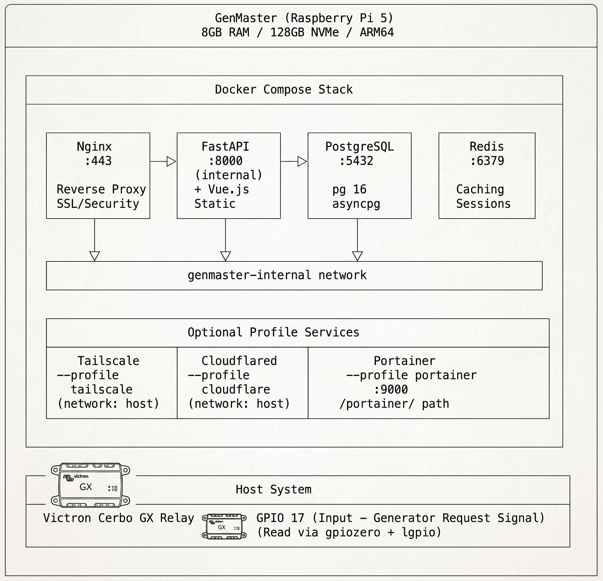

---

## GenSlave Native Application Architecture

GenSlave runs as a native Python service (no Docker) to minimize resource usage on the Pi Zero 2W.

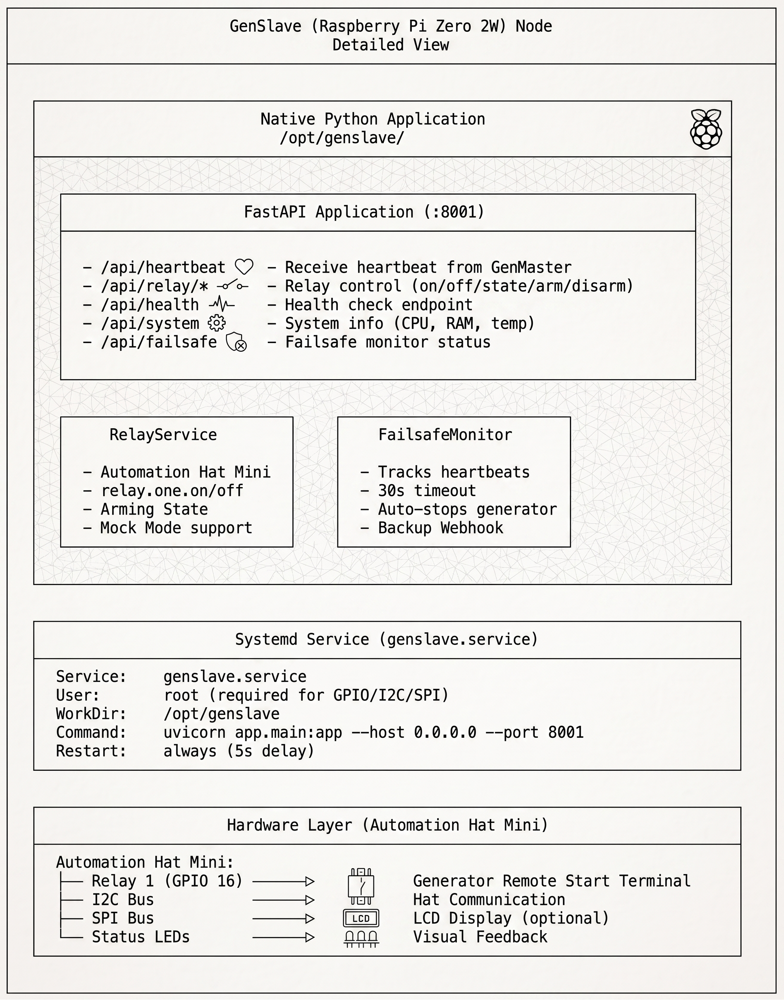

### GenSlave File Structure

```
/opt/genslave/
├── app/
│   ├── __init__.py
│   ├── main.py              # FastAPI application
│   ├── config.py            # Configuration from environment
│   ├── routers/
│   │   ├── health.py        # Health check + heartbeat
│   │   ├── relay.py         # Relay control + arming
│   │   └── system.py        # System info
│   └── services/
│       ├── relay.py         # Automation Hat Mini control
│       └── failsafe.py      # Heartbeat monitor
├── data/
│   └── genslave.db          # SQLite database (optional)
├── logs/                    # Application logs
├── venv/                    # Python virtual environment
├── requirements.txt         # Python dependencies
└── .env                     # Environment configuration
```

---

## Request Flow Architecture

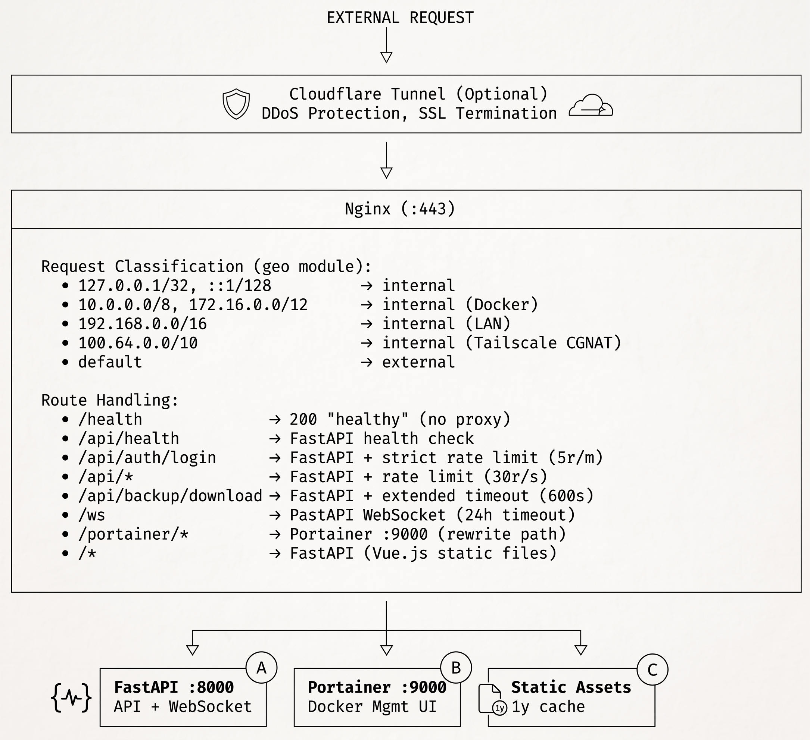

---

## Heartbeat System Architecture

The heartbeat system ensures reliable communication between GenMaster and GenSlave, with failsafe mechanisms.

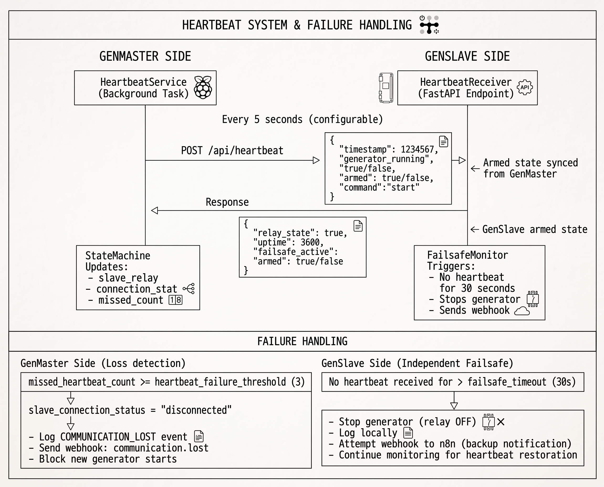

---

## Boot Sequence / Power Loss Recovery

Both GenMaster and GenSlave implement safety measures for power loss and reboot scenarios.

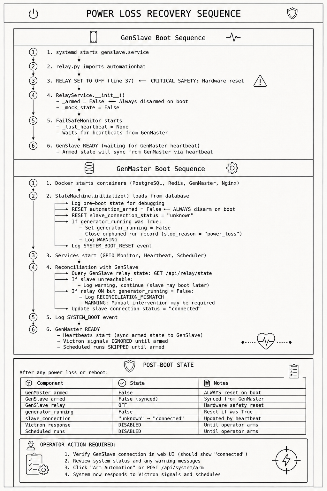

### Reconciliation Events

| Event | Severity | Description |
|-------|----------|-------------|
| `SYSTEM_BOOT_RESET` | WARNING/INFO | Logged on every boot with pre-boot state |
| `RECONCILIATION_MISMATCH` | WARNING | GenSlave relay ON but no active run in GenMaster |

### Database Fields Reset on Boot

```sql
-- Always reset
automation_armed = False
automation_armed_at = NULL
automation_armed_by = NULL
slave_connection_status = 'unknown'
missed_heartbeat_count = 0

-- Reset if generator was running
generator_running = False
run_trigger = 'idle'
generator_start_time = NULL
current_run_id = NULL  -- After closing orphaned run
```

---

## State Machine Flow

The StateMachine class (`state_machine.py`) is the central controller for generator operations.

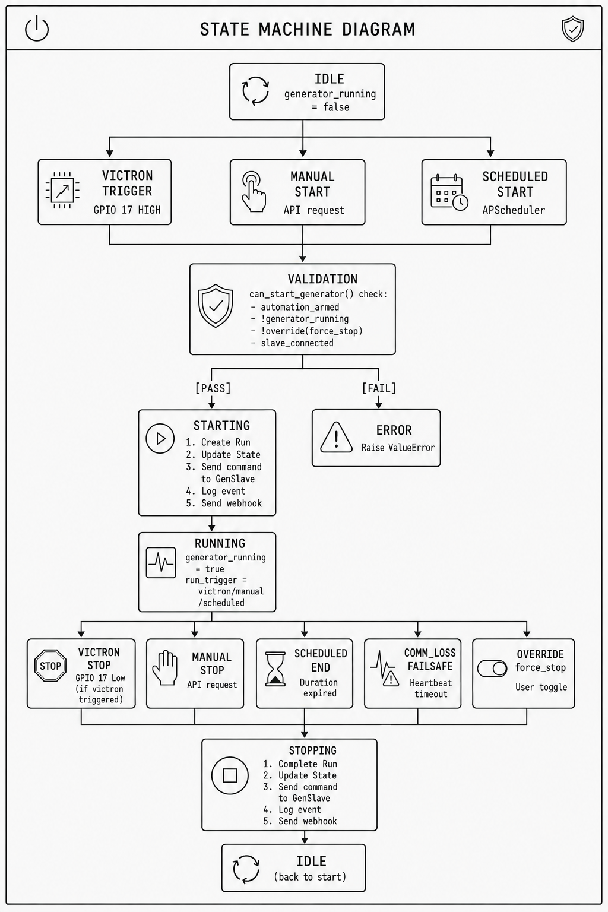

---

## Automation Arming System

The arming system is a safety layer that prevents automated actions during startup, maintenance, or testing. Automation is **disarmed by default** and must be explicitly armed by an operator.

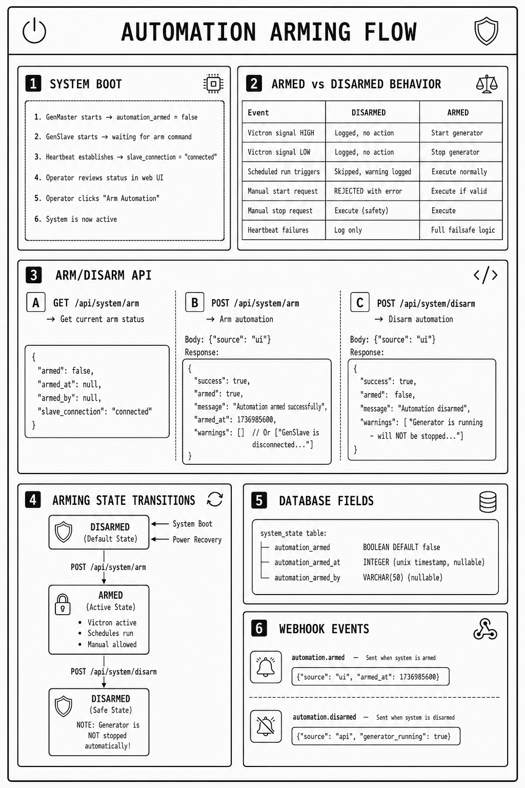

### Arming Integration Points

1. **Victron Signal Handler** (`handle_victron_signal_change`)
   - Checks `automation_armed` before taking action
   - Logs signal changes regardless of arm state

2. **Start Generator** (`start_generator`)
   - `can_start_generator()` requires `automation_armed == true`
   - Returns clear error: "Cannot start - automation is not armed"

3. **Scheduler** (`_execute_scheduled_run`)
   - Checks `is_armed()` before executing
   - Logs skipped runs with reason

4. **Full Status** (`get_full_status`)
   - Includes `automation_armed` in system status response

---

## Webhook Event System

The webhook system sends notifications to external services (like n8n) for various system events.

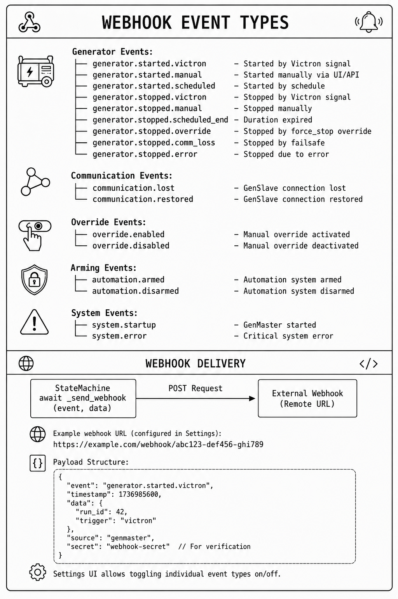

---

## Database Schema Overview

PostgreSQL 16 with asyncpg driver for async operations.

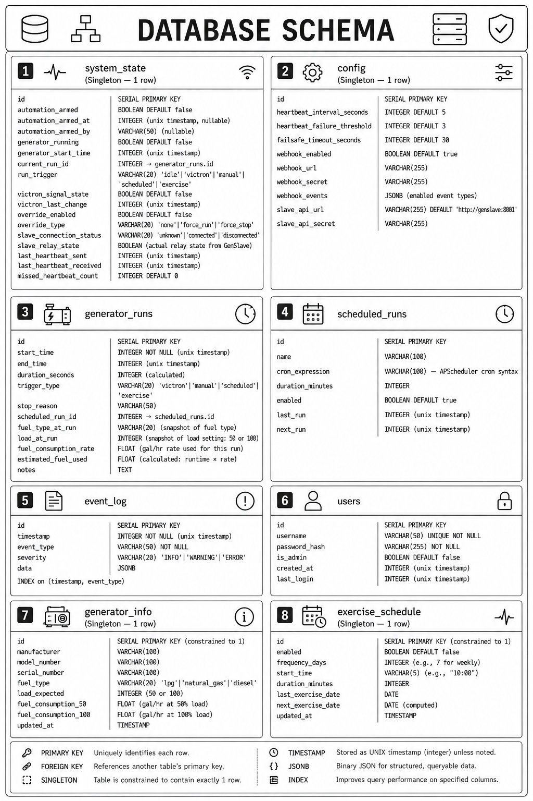

---

## Installation & Setup Flow

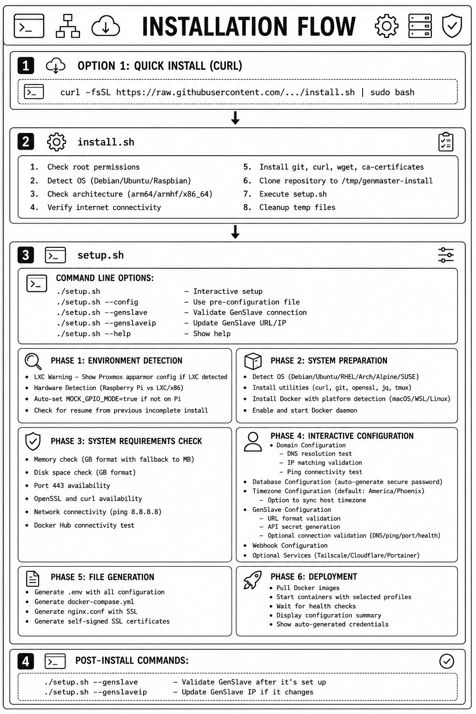

---

## Memory Budget (Raspberry Pi 5 - 8GB)

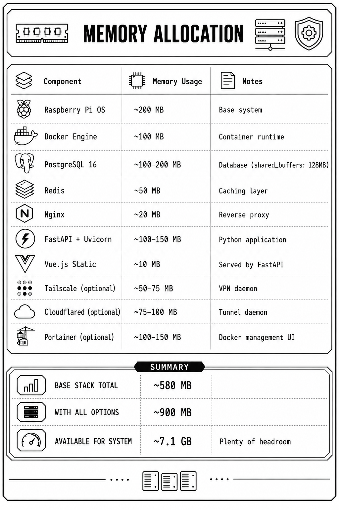

---

## Port Reference

| Service      | Internal Port | External Access    | Notes              |
|--------------|---------------|--------------------|--------------------|
| Nginx        | 443           | Yes (HTTPS only)   | Main entry point   |
| FastAPI      | 8000          | No (internal only) | Backend API        |
| PostgreSQL   | 5432          | No (internal only) | Database           |
| Redis        | 6379          | No (internal only) | Cache              |
| Portainer    | 9000          | /portainer/ path   | Optional profile   |
| GenSlave API | 8001          | Tailscale only     | On Pi Zero 2W      |

---

## Security Layers

1. **Network Level**
   - Tailscale mesh VPN (WireGuard encryption)
   - UFW firewall rules
   - Docker network isolation

2. **Application Level**
   - Nginx rate limiting (API: 30r/s, Auth: 5r/m)
   - JWT authentication for API
   - API secret for GenSlave communication
   - Webhook secret for external services

3. **Transport Level**
   - HTTPS via Tailscale certs or Cloudflare
   - Nginx security headers (X-Frame-Options, X-XSS-Protection, etc.)

4. **Access Control**
   - Nginx geo module — IP allowlist gating the entire 443 interface (UI, API, websocket, health, Portainer); off-list clients receive HTTP 403
   - Tailscale ACLs (tag-based access)
   - Cloudflare Access (optional additional auth)

---

## Development/Testing Mode (LXC Containers)

GenMaster can run in LXC containers for testing without real GPIO hardware.

### Auto-Detection

- GenMaster automatically detects when NOT running on a Raspberry Pi
- Falls back to mock GPIO mode (checks `/proc/cpuinfo` for "Raspberry Pi")
- Development API becomes available at `/api/dev/*`
- Set `GENSLAVE_ENABLED=false` in `.env` for UI-only testing (disables heartbeat)

### Development API Endpoints

When in mock mode, these endpoints simulate Victron GPIO signals:

```
GET  /api/dev/status           - Development mode status
GET  /api/dev/gpio/state       - Current mock GPIO state
POST /api/dev/gpio/victron-signal  - Simulate Victron signal {"active": true/false}
POST /api/dev/gpio/toggle      - Toggle signal state
POST /api/dev/gpio/reset       - Reset to inactive
POST /api/dev/webhook/test     - Test webhook delivery
```

### Testing a Generator Cycle

```bash
# Start GenMaster (auto-detects LXC/dev environment)
docker compose up -d

# Simulate Victron requesting generator
curl -X POST http://localhost:8000/api/dev/gpio/victron-signal \
     -H "Content-Type: application/json" \
     -d '{"active": true}'

# Watch state transition: IDLE → STARTING → RUNNING

# Simulate Victron releasing generator
curl -X POST http://localhost:8000/api/dev/gpio/victron-signal \
     -H "Content-Type: application/json" \
     -d '{"active": false}'

# Watch state transition: RUNNING → STOPPING → IDLE
```

---

## Related Documentation

- [Generator Controls](GENERATOR.md) - Start, stop, and monitor operations
- [Scheduling](SCHEDULING.md) - Automated and exercise runs
- [GenSlave Setup](GENSLAVE.md) - Hardware and installation
- [Victron Integration](VICTRON.md) - GPIO signal monitoring
- [Tailscale VPN](TAILSCALE.md) - Secure device communication
- [Cloudflare Tunnel](CLOUDFLARE.md) - Remote access setup
- [Troubleshooting](TROUBLESHOOTING.md) - Common issues and solutions
