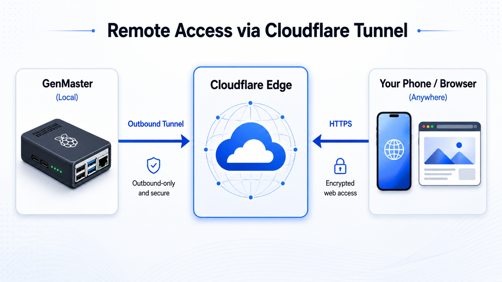

# Cloudflare Setup Guide

This guide covers how to configure Cloudflare Tunnel for secure remote access to GenMaster.

## Table of Contents

- [Overview](#overview)
- [Prerequisites](#prerequisites)
- [Creating a Tunnel](#creating-a-tunnel)
- [Docker Configuration](#docker-configuration)
- [DNS Configuration](#dns-configuration)
- [Security Considerations](#security-considerations)
- [Troubleshooting](#troubleshooting)

---

## Overview

Cloudflare Tunnel provides secure remote access to GenMaster without exposing ports on your router or requiring a static IP address.

### Benefits

| Feature | Description |
|---------|-------------|
| **No port forwarding** | Tunnel connects outbound to Cloudflare |
| **Built-in SSL** | Automatic HTTPS with Cloudflare certificates |
| **DDoS protection** | Cloudflare's network protects your origin |
| **Zero Trust** | Optional Access policies for authentication |
| **No static IP** | Works with dynamic IP addresses |

### Architecture



---

## Prerequisites

1. **Cloudflare account** (free tier works)
2. **Domain name** added to Cloudflare
3. **Docker** running on GenMaster

---

## Creating a Tunnel

### Step 1: Access Zero Trust Dashboard

1. Log in to [dash.cloudflare.com](https://dash.cloudflare.com)
2. Navigate to **Zero Trust** (or [one.dash.cloudflare.com](https://one.dash.cloudflare.com))
3. Go to **Networks > Tunnels**

### Step 2: Create the Tunnel

1. Click **Create a tunnel**
2. Select **Cloudflared** as the connector
3. Name your tunnel (e.g., `genmaster-tunnel`)
4. Click **Save tunnel**

### Step 3: Get Your Token

After creating the tunnel, you'll see a token. It looks like:

```
eyJhIjoiNzM0MzU5NmQ1ZmM4N2I2MjE5NmY5...
```

Copy this token - you'll need it for Docker configuration.

### Step 4: Configure Public Hostname

1. In the tunnel settings, click **Public Hostname**
2. Add a hostname:
   - **Subdomain:** `generator` (or your choice)
   - **Domain:** Select your domain
   - **Service Type:** `HTTPS`
   - **URL:** `nginx:443`
3. Under **Additional settings:**
   - Enable **No TLS Verify** (for self-signed certs)
   - Or use HTTP if preferred

---

## Docker Configuration

### Environment Variable

Add to your `.env` file:

```bash
CLOUDFLARE_TUNNEL_TOKEN=eyJhIjoiNzM0MzU5NmQ1ZmM4N2I2MjE5NmY5...
```

### Docker Compose

The cloudflared service is defined with a profile:

```yaml
cloudflared:
  image: cloudflare/cloudflared:latest
  container_name: genmaster_cloudflared
  command: tunnel --no-autoupdate run
  environment:
    - TUNNEL_TOKEN=${CLOUDFLARE_TUNNEL_TOKEN}
  restart: unless-stopped
  networks:
    - genmaster-external
  profiles:
    - cloudflare
```

### Starting the Tunnel

```bash
# Start with Cloudflare profile enabled
docker compose --profile cloudflare up -d

# Check tunnel status
docker compose logs cloudflared

# Verify tunnel is connected
docker compose ps cloudflared
```

### Verifying Connection

1. Check Cloudflare Dashboard: Tunnel should show **Healthy**
2. Visit your hostname: `https://generator.yourdomain.com`
3. Check logs: `docker compose logs -f cloudflared`

---

## DNS Configuration

### Automatic (Recommended)

When you add a public hostname to your tunnel, Cloudflare automatically creates a CNAME record pointing to your tunnel.

### Manual Configuration

If you need to configure DNS manually:

1. Go to **DNS** in Cloudflare Dashboard
2. Add a CNAME record:
   - **Name:** `generator`
   - **Target:** `<tunnel-id>.cfargotunnel.com`
   - **Proxy status:** Proxied (orange cloud)

---

## Security Considerations

### Cloudflare Access (Optional)

For additional security, add authentication via Cloudflare Access:

1. Go to **Zero Trust > Access > Applications**
2. Click **Add an application**
3. Select **Self-hosted**
4. Configure:
   - **Application name:** GenMaster
   - **Subdomain:** `generator`
   - **Domain:** Your domain
5. Add an Access Policy:
   - **Rule action:** Allow
   - **Include:** Emails ending in `@yourdomain.com`
   - Or use one-time PIN, Google auth, etc.

### IP Restrictions

The tunnel accepts all traffic from Cloudflare. For additional security:

1. Configure Nginx to only accept Cloudflare IPs
2. Or use Access policies as described above

### Firewall

Since the tunnel connects outbound, you don't need to open any ports. However, ensure:

- Outbound HTTPS (443) is allowed
- The cloudflared container can reach the internet

---

## Multiple Services

You can route multiple services through one tunnel:

### GenMaster Web UI

```yaml
Public hostname: generator.yourdomain.com
Service: https://nginx:443
```

### Portainer (Optional)

```yaml
Public hostname: portainer.yourdomain.com
Service: http://portainer:9000
```

### API Only

```yaml
Public hostname: api.yourdomain.com
Service: https://nginx:443
Path: /api/*
```

---

## Troubleshooting

### Tunnel Not Connecting

1. **Check token:**
   ```bash
   echo $CLOUDFLARE_TUNNEL_TOKEN | head -c 20
   ```
   Verify it matches the dashboard.

2. **Check container logs:**
   ```bash
   docker compose logs cloudflared
   ```

3. **Check network access:**
   ```bash
   docker compose exec cloudflared ping -c 3 cloudflare.com
   ```

### 502 Bad Gateway

The tunnel is connecting but can't reach your service:

1. **Check nginx is running:**
   ```bash
   docker compose ps nginx
   ```

2. **Verify service URL:**
   - Should be `nginx:443` or `genmaster:8000`
   - Not `localhost` (containers are isolated)

3. **Check TLS settings:**
   - Enable "No TLS Verify" for self-signed certs
   - Or configure proper certificates

### Tunnel Keeps Reconnecting

1. **Check for conflicts:**
   - Only one cloudflared should run per tunnel
   
2. **Check resources:**
   ```bash
   docker stats cloudflared
   ```

3. **Update cloudflared:**
   ```bash
   docker compose pull cloudflared
   docker compose --profile cloudflare up -d
   ```

### Access Denied (403)

If using Cloudflare Access:

1. Check your email is in the allowed list
2. Clear browser cookies
3. Try incognito mode
4. Check Access policy configuration

---

## Maintenance

### Updating Cloudflared

```bash
docker compose pull cloudflared
docker compose --profile cloudflare up -d
```

### Rotating Tunnel Token

1. Go to Cloudflare Dashboard
2. Delete the old tunnel
3. Create a new tunnel
4. Update `CLOUDFLARE_TUNNEL_TOKEN`
5. Restart cloudflared

### Disabling Tunnel

```bash
# Stop cloudflared only
docker compose --profile cloudflare stop cloudflared

# Or start without cloudflare profile
docker compose up -d  # Doesn't include cloudflare profile
```

---

## Best Practices

1. **Use Access policies** for authentication
2. **Monitor tunnel health** in Cloudflare Dashboard
3. **Set up alerts** for tunnel disconnections
4. **Keep cloudflared updated** for security patches
5. **Use separate tunnels** for production and development

---

## Next Steps

- [Tailscale Setup](TAILSCALE.md) - VPN alternative for local network
- [Notifications](NOTIFICATIONS.md) - Get alerts for system events
- [Troubleshooting](TROUBLESHOOTING.md) - Common issues and solutions
