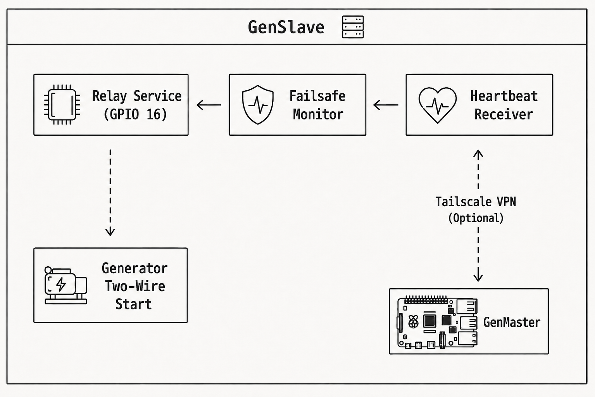
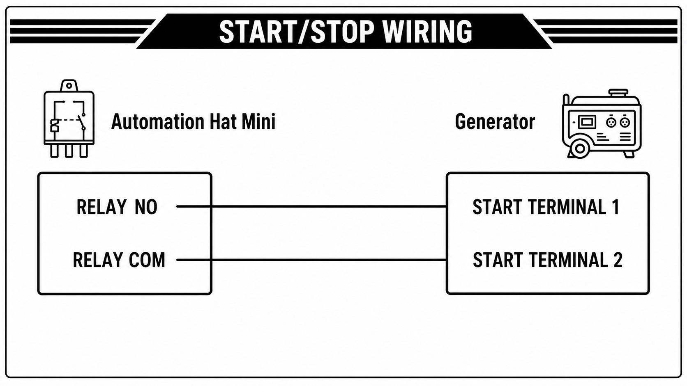

# GenSlave Setup Guide

This guide covers how to set up and configure GenSlave, the relay controller component that runs on a Raspberry Pi Zero 2W.

## Table of Contents

- [Overview](#overview)
- [Hardware Requirements](#hardware-requirements)
- [Installation](#installation)
- [Configuration](#configuration)
- [API Reference](#api-reference)
- [Failsafe System](#failsafe-system)
- [WiFi Configuration](#wifi-configuration)
- [Scheduled Reboot](#scheduled-reboot)
- [Troubleshooting](#troubleshooting)

---

## Overview

GenSlave is a lightweight FastAPI application that:

- **Controls the relay** connected to your generator's two-wire start input
- **Receives heartbeats** from GenMaster and synchronizes state
- **Triggers failsafe** if communication with GenMaster is lost
- **Displays status** on the LCD screen (Automation Hat Mini)
- **Sends notifications** via Apprise when failsafe triggers

### Architecture



---

## Hardware Requirements

### Raspberry Pi Zero 2W

| Spec | Requirement |
|------|-------------|
| **Model** | Pi Zero 2W (recommended) or Pi Zero W |
| **RAM** | 512MB (sufficient for GenSlave) |
| **Storage** | 8GB+ microSD card |
| **Power** | 5V 2.5A power supply |

### Automation Hat Mini

The [Pimoroni Automation Hat Mini](https://shop.pimoroni.com/products/automation-hat-mini) provides:

- **1 Relay** - 24V 2A switching (connects to generator)
- **1 LCD** - 160x80 pixel display for status
- **3 Inputs** - Digital/analog inputs (not used)
- **1 Output** - Additional output (not used)

### Wiring

Connect the Automation Hat Mini relay to your generator's two-wire start terminal:



- **NO** = Normally Open
- **COM** = Common
- Use appropriate gauge wire for your installation

> **Warning:** Consult your generator's manual and a qualified electrician before making connections.

---

## Installation

### Quick Start with Pre-built Image

```bash
# SSH into your Pi Zero 2W
ssh pi@your-pi-zero.local

# Create installation directory
sudo mkdir -p /opt/genslave
cd /opt/genslave

# Download docker-compose.yaml
curl -O https://raw.githubusercontent.com/rjsears/pizero_generator_control/main/genslave/docker-compose.yaml

# Create .env file (see Configuration section)
nano .env

# Start GenSlave
docker compose up -d
```

### Building from Source

If you need to build for your specific architecture:

```bash
# Clone the repository
git clone https://github.com/rjsears/pizero_generator_control.git
cd pizero_generator_control/genslave

# Build for ARM (Pi Zero)
docker buildx build --platform linux/arm/v7 -t genslave:local .

# Update docker-compose.yaml to use local image
# Change: image: rjsears/pizero_generator_control:genslave
# To: image: genslave:local

docker compose up -d
```

### Verifying Installation

```bash
# Check container status
docker compose ps

# Check logs
docker compose logs -f

# Test health endpoint
curl http://localhost:8001/api/health
```

---

## Configuration

### Environment Variables

Create `/opt/genslave/.env`:

```bash
# Required: API secret (must match GenMaster's GENSLAVE_API_SECRET)
GENSLAVE_API_SECRET=your-secure-secret-here

# Optional: Failsafe timeout (seconds before failsafe triggers)
FAILSAFE_TIMEOUT_SECONDS=30

# Optional: Mock mode for testing without hardware
MOCK_HAT_MODE=false

# Optional: Apprise notification URLs (comma-separated)
APPRISE_URLS=tgram://bottoken/chatid

# Optional: Log level
LOG_LEVEL=INFO
```

### Configuration Reference

| Variable | Description | Default |
|----------|-------------|---------|
| `GENSLAVE_API_SECRET` | Shared secret for API authentication | Required |
| `FAILSAFE_TIMEOUT_SECONDS` | Seconds without heartbeat before failsafe | `30` |
| `MOCK_HAT_MODE` | Run without actual hardware | `false` |
| `APPRISE_URLS` | Notification service URLs | Empty |
| `LOG_LEVEL` | Logging verbosity | `INFO` |
| `HOST` | Bind address | `0.0.0.0` |
| `PORT` | Listen port | `8001` |

### Docker Compose

The standard `docker-compose.yaml`:

```yaml
services:
  genslave:
    image: rjsears/pizero_generator_control:genslave
    container_name: genslave
    restart: unless-stopped
    env_file: .env
    
    # Required for GPIO access
    privileged: true
    
    # Use host network for Tailscale
    network_mode: host
    
    volumes:
      - genslave_data:/opt/genslave/data
      - genslave_logs:/opt/genslave/logs
      - /var/run/dbus:/var/run/dbus:rw  # For WiFi management
    
    healthcheck:
      test: ["CMD", "python3", "-c", "import httpx; httpx.get('http://localhost:8001/api/health', timeout=5)"]
      interval: 30s
      timeout: 10s
      retries: 3

volumes:
  genslave_data:
  genslave_logs:
```

---

## API Reference

GenSlave exposes a REST API on port 8001. **Every endpoint requires the `X-API-Key` header.** Authentication is mandatory — GenSlave refuses to start without a configured secret, and there is no opt-out flag. The secret is auto-generated by `setup.sh` (or pasted from an existing GenMaster install). See [Security: GenMaster ↔ GenSlave authentication](SECURITY.md#genmaster--genslave-authentication) for the full rationale.

### Health & Status

| Method | Endpoint | Description |
|--------|----------|-------------|
| GET | `/api/health` | Health check with system status |
| GET | `/api/failsafe` | Failsafe monitor status |

### Relay Control

| Method | Endpoint | Description |
|--------|----------|-------------|
| GET | `/api/relay/state` | Get relay and arm status |
| POST | `/api/relay/on` | Turn relay ON (requires armed) |
| POST | `/api/relay/off` | Turn relay OFF (always allowed) |
| POST | `/api/relay/arm` | Arm the automation |
| POST | `/api/relay/disarm` | Disarm the automation |

### Heartbeat

| Method | Endpoint | Description |
|--------|----------|-------------|
| POST | `/api/heartbeat` | Receive heartbeat from GenMaster |

### System

| Method | Endpoint | Description |
|--------|----------|-------------|
| GET | `/api/system` | System info (CPU, RAM, disk, network) |
| POST | `/api/system/reboot` | Reboot the Pi |
| POST | `/api/system/shutdown` | Shutdown the Pi |

### Example Requests

```bash
# Get relay state
curl http://genslave:8001/api/relay/state \
  -H "X-API-Key: YOUR_SECRET"

# Arm the relay
curl -X POST http://genslave:8001/api/relay/arm \
  -H "X-API-Key: YOUR_SECRET"

# Turn relay ON
curl -X POST http://genslave:8001/api/relay/on \
  -H "X-API-Key: YOUR_SECRET"
```

---

## Failsafe System

The failsafe system is an independent safety mechanism that stops the generator if GenMaster communication is lost.

### How It Works

1. **GenMaster sends heartbeats** every 10 seconds
2. **GenSlave tracks last heartbeat** timestamp
3. **If no heartbeat received** within timeout period:
   - Relay is turned **OFF** (generator stops)
   - Notification is sent (if configured)
   - `failsafe_triggered` flag is set
4. **When heartbeat resumes**:
   - Failsafe state is cleared
   - "Restored" notification is sent
   - GenMaster can re-arm and restart if needed

### Dynamic Timeout

The failsafe timeout is calculated dynamically:

```
effective_timeout = heartbeat_interval × 3
```

GenMaster sends its heartbeat interval in each heartbeat, and GenSlave calculates `3 × interval` as the timeout. This means:

- Default heartbeat: 10 seconds → Timeout: 30 seconds
- Custom heartbeat: 15 seconds → Timeout: 45 seconds

This allows the system to adapt if heartbeat timing changes.

### Failsafe Status

Check failsafe status:

```bash
curl http://genslave:8001/api/failsafe \
  -H "X-API-Key: YOUR_SECRET"
```

Response:
```json
{
  "running": true,
  "last_heartbeat": 1714567890,
  "seconds_since_heartbeat": 5,
  "heartbeat_count": 1234,
  "failsafe_triggered": false,
  "timeout_seconds": 30,
  "heartbeat_interval": 10,
  "timeout_source": "genmaster"
}
```

### When Failsafe Triggers

- **Relay OFF** is forced (even if armed)
- **Notification sent** via Apprise (if configured)
- **Log entry** created
- GenSlave **continues accepting heartbeats** - when restored, it will sync with GenMaster

---

## WiFi Configuration

GenSlave includes WiFi management endpoints for configuration via GenMaster.

### Scan for Networks

```bash
curl http://genslave:8001/api/system/wifi/networks \
  -H "X-API-Key: YOUR_SECRET"
```

### Add Known Network

Pre-configure a WiFi network for auto-connect:

```bash
curl -X POST http://genslave:8001/api/system/wifi/add \
  -H "X-API-Key: YOUR_SECRET" \
  -H "Content-Type: application/json" \
  -d '{
    "ssid": "MyNetwork",
    "password": "my-password",
    "auto_connect": true
  }'
```

### Connect to Network

```bash
curl -X POST http://genslave:8001/api/system/wifi/connect \
  -H "X-API-Key: YOUR_SECRET" \
  -H "Content-Type: application/json" \
  -d '{
    "ssid": "MyNetwork",
    "password": "my-password"
  }'
```

> **Note:** WiFi management requires the D-Bus socket to be mounted (`/var/run/dbus:/var/run/dbus:rw`).

---

## Scheduled Reboot

GenSlave supports scheduled maintenance reboots for long-term reliability.

### Configuration

Via API (proxied through GenMaster):

```bash
curl -X POST https://your-genmaster/api/genslave/reboot-schedule \
  -H "Authorization: Bearer YOUR_TOKEN" \
  -H "Content-Type: application/json" \
  -d '{
    "enabled": true,
    "day": "sunday",
    "hour": 4,
    "minute": 0
  }'
```

### Settings

| Field | Description | Options |
|-------|-------------|---------|
| `enabled` | Enable/disable scheduled reboots | `true`/`false` |
| `day` | Day of week or daily | `monday`-`sunday` or `daily` |
| `hour` | Hour (24-hour format) | `0`-`23` |
| `minute` | Minute | `0`-`59` |

### Safety Check

The scheduled reboot only executes if:
- The relay is **OFF** (generator not running)
- Schedule is enabled
- Current time matches schedule

If the generator is running at the scheduled time, the reboot is **skipped** for that day.

---

## Troubleshooting

### GenSlave Not Starting

1. **Check Docker logs:**
   ```bash
   docker compose logs genslave
   ```

2. **Verify GPIO access:**
   - Ensure `privileged: true` in docker-compose.yaml
   - Or use device mappings for `/dev/gpiomem`

3. **Check port availability:**
   ```bash
   netstat -tlnp | grep 8001
   ```

### Failsafe Keeps Triggering

1. **Check network connectivity:**
   ```bash
   ping genmaster-tailscale-ip
   ```

2. **Verify API secret matches** between GenMaster and GenSlave

3. **Check GenMaster heartbeat service:**
   ```bash
   docker compose logs genmaster | grep heartbeat
   ```

### Relay Not Working

1. **Verify hardware connection:**
   - Check Automation Hat Mini is properly seated
   - Verify wiring to generator

2. **Test in mock mode:**
   Set `MOCK_HAT_MODE=true` to test software without hardware

3. **Check relay manually:**
   ```python
   import automationhat
   automationhat.relay.one.on()   # Should click
   automationhat.relay.one.off()  # Should click
   ```

### Cannot Reach GenSlave

1. **Check Tailscale status:**
   ```bash
   tailscale status
   ```

2. **Verify port is listening:**
   ```bash
   curl http://localhost:8001/api/health
   ```

3. **Check firewall:**
   ```bash
   sudo iptables -L
   ```

### LCD Not Displaying

1. **Check SPI is enabled:**
   ```bash
   ls /dev/spidev*
   ```

2. **Verify automationhat import:**
   ```bash
   docker compose exec genslave python3 -c "import automationhat; print('OK')"
   ```

---

## Logs

View logs:

```bash
# Real-time logs
docker compose logs -f genslave

# Last 100 lines
docker compose logs --tail=100 genslave
```

Log files are persisted to the `genslave_logs` volume.

---

## Updating

```bash
cd /opt/genslave

# Pull latest image
docker compose pull

# Restart with new image
docker compose up -d

# Verify update
docker compose logs -f
```

---

## Next Steps

- [Generator Controls](GENERATOR.md) - How GenMaster controls GenSlave
- [Tailscale Setup](TAILSCALE.md) - Secure communication between devices
- [Notifications](NOTIFICATIONS.md) - Configure failsafe alerts
- [Troubleshooting](TROUBLESHOOTING.md) - Common issues and solutions
