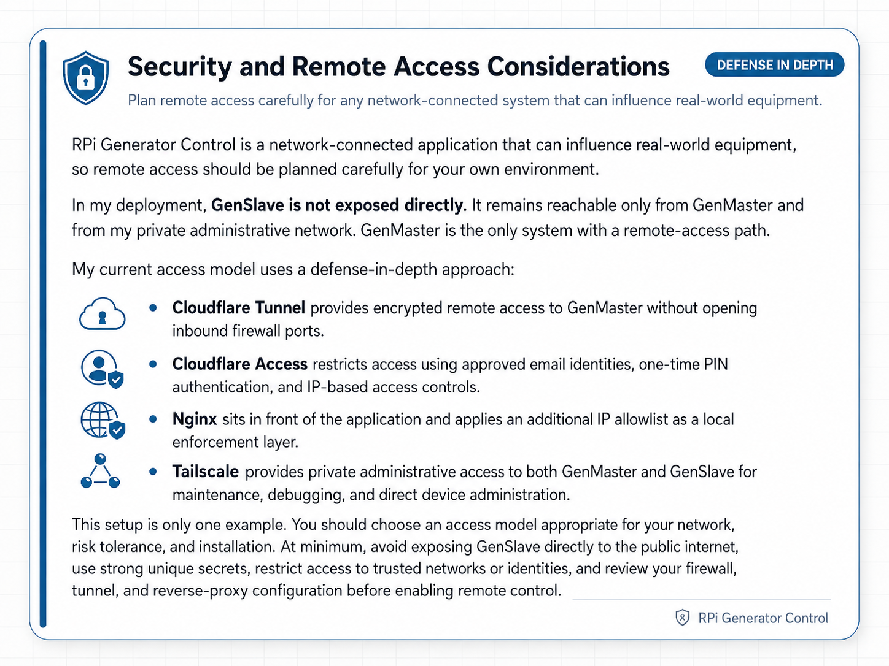

# Security Model & Configuration Guidelines

This document describes how RPi Generator Control protects itself, what it
trusts and why, and how to harden a deployment beyond the safe defaults.

If you only read one section, read [Threat model](#threat-model) and
[Hardening checklist](#hardening-checklist).



---

## Threat model

The system is designed for a **single owner-operator** running on their own
network, not a multi-tenant or untrusted environment. Within that scope, the
threats we explicitly defend against are:

| # | Threat | How we mitigate it |
|---|--------|---------------------|
| 1 | A random visitor to the public domain takes the generator offline or starts it | Nginx IP allow-list (Settings → Access Control), Cloudflare Tunnel as the only ingress, application-level admin authentication |
| 2 | A device on the LAN (compromised IoT, guest WiFi, etc.) talks to GenMaster's API directly | Network-level segmentation (your responsibility), API requires admin authentication, IP allow-list |
| 3 | A device on the LAN spoofs its source IP via `X-Forwarded-For` to bypass IP-based access control | We trust XFF only from the cloudflared sidecar; direct clients (LAN, Tailscale) cannot rewrite their `$remote_addr` |
| 4 | A compromised GenMaster reboots and the generator restarts unsupervised | Default `boot_arming_policy = fail_safe` disarms the relay on every boot; operator must explicitly re-arm |
| 5 | GenMaster crashes and the generator runs forever | GenSlave's independent failsafe forces the relay OFF after `failsafe_timeout` seconds without a heartbeat |
| 6 | Someone on the LAN replays or fakes API calls between GenMaster and GenSlave | GenSlave requires `API_SECRET` on every authenticated endpoint; defaults are auto-generated, never shipped |
| 7 | Secrets (DB password, Cloudflare token, Tailscale auth key, Twilio creds) leak via the repo or screenshots | `.env` files are gitignored; credentials live in named volumes; the manual screenshots are systematically pixelated |
| 8 | An attacker with physical access pulls the SD card | Out of scope — physical access to the GenSlave hardware means physical access to the generator |

Threats explicitly **outside** scope:
- Defending against the LAN owner / system operator themselves
- Multi-tenant isolation between two GenMaster users
- Resisting state-level adversaries
- Tamper-evidence for the controlled generator

---

## Hardware safety — two-layer EPO pattern

If the optional GenSlave EPO (the 22 mm mushroom E-stop at the generator) is installed, it provides a **hardware-enforced** safety guarantee that's independent of every line of code in this project. The pattern is deliberately two-layered:

| Layer | Mechanism | Purpose | What happens if it fails |
|-------|-----------|---------|--------------------------|
| **Hardware** (the guarantee) | An NC contact (`ZB4-BZ104` terminals 11/12) wired in series with the GenSlave start-relay output between the Pi Zero relay and the generator start input. | Physically interrupts the start circuit when the button is pressed. The generator **cannot** be started by any means while the EPO is engaged. | The relay-to-generator circuit is broken (the safe failure mode — exactly what an E-stop is supposed to do). The generator stays off. |
| **Software** (the signal) | A separate NO contact (terminals 13/14) wired through the Auto Hat Mini's 5V terminal to IN1, polled at 25 ms by `genslave/app/services/hardware_safety.py`. Surfaced via heartbeat to GenMaster, which dims the UI, blocks start commands, and fires notifications. | Keeps the software's understanding of state consistent with reality — UI banners, state-machine guards, notifications. | The hardware NC contact still works (physical guarantee). The operator may not see a banner or get a notification, but the generator cannot start while the EPO is pressed. |

**The hardware layer is the actual safety guarantee.** The software layer exists to keep state consistent and to tell the operator what's going on — it is not what protects the maintenance person at the generator. If GenMaster crashes, GenSlave crashes, the network goes down, the Pi Zero loses power, or every line of Python in this repo has a bug, the NC contact still opens the start circuit when the button is pressed.

This asymmetry — hardware enforcement for safety, software for everything else — is the same pattern used by the HOA selector at the operator side, but inverted: the HOA selector has *no* hardware enforcement because there is no physical risk if it fails (the worst case is "automation runs anyway", which is the system's behavior with no switch at all). Safety belongs at the generator with the person; convenience belongs with the operator.

Implications for threat modeling:

- A compromised GenMaster, GenSlave, or any combination of them cannot start the generator while the EPO is pressed. There is no software override.
- Disabling `HARDWARE_SAFETY_ENABLED=false` in GenSlave's `.env` only turns off the LCD/notification side. The NC contact in the start circuit is unaffected. This flag exists so the monitor doesn't error on systems where the EPO isn't wired yet — it cannot be used to "bypass" the EPO once installed.
- An attacker with physical access to the EPO can release it by twisting the head clockwise. Physical access to the EPO is equivalent to physical access to the generator itself, which is already explicitly out of scope (threat row 8).

The full operator-facing guide to the switches is at [Hardware Switches](manual/hardware-switches.md).

---

## Network architecture & trust boundaries

```
                       [ Public internet ]
                              |
                              v
                  [ Cloudflare edge ]   ← only path to public domain
                              |          ← TLS terminates here
                              v
                    cloudflared sidecar  ← only TRUSTED PROXY
                              |
                              v
                          nginx           ← TLS again (Let's Encrypt)
                              |
                              v
                      GenMaster API
                              |
              ┌───────────────┼───────────────┐
              v               v               v
           Postgres        Redis          GenSlave (over Tailscale)
                                              |
                                              v
                                          Pi Zero
```

The trust boundaries this enforces:

| Boundary | Trust level | What can/can't cross |
|----------|-------------|----------------------|
| Internet → Cloudflare edge | Untrusted → semi-trusted | Cloudflare strips client-supplied `CF-Connecting-IP`, applies its own DDoS/bot protection, and proxies through the tunnel |
| cloudflared → nginx | Trusted (the only proxy) | nginx accepts `CF-Connecting-IP` from the cloudflared container only |
| LAN/Tailscale → nginx | Direct client | Source IP is taken at face value; the IP access-control list applies; XFF from these is **not** trusted |
| nginx → GenMaster API | Internal | Behind the nginx layer; depends on app-layer auth |
| GenMaster → GenSlave (Tailscale) | Authenticated peer | Requires `API_SECRET`; runs over Tailscale's WireGuard mesh |
| GenSlave (TUN) → host GPIO | Privileged container | `privileged: true` is required for GPIO; mitigated by container being single-purpose |

---

## How nginx identifies the real client IP

This was a real vulnerability in earlier versions of this project. The fix
matters because IP-based access control is only meaningful if `$remote_addr`
cannot be spoofed.

### Quick-reference recipe

```nginx
# Trusted proxy: ONLY the pinned cloudflared sidecar.
set_real_ip_from 172.30.0.10;

# Cloudflare-set, client-unspoofable. Prefer this over X-Forwarded-For.
real_ip_header CF-Connecting-IP;

# CF-Connecting-IP is a single value (not a chain), so recursive lookup
# is unnecessary.
real_ip_recursive off;

# Alternative ONLY if your tunnel doesn't preserve CF-Connecting-IP and you've
# tested carefully:
# real_ip_header X-Forwarded-For;
# real_ip_recursive on;
```

### What `set_real_ip_from` actually does

`set_real_ip_from <CIDR>` tells nginx: "If a TCP connection arrives from
this CIDR, trust the value of the configured `real_ip_header` and overwrite
`$remote_addr` with it." The replacement happens **before** access control,
logging, or anything downstream sees `$remote_addr`.

It does NOT control who can connect to nginx. Connection-level access is
governed by:
- `listen` (which interfaces nginx binds to),
- the host firewall (iptables/nftables/ufw if any),
- the IP access-control list managed in **Settings → Access Control**.

### What we trust, and what we don't

| Source IP | Trust as a proxy? | Why |
|-----------|-------------------|-----|
| `172.30.0.10` (cloudflared sidecar — **pinned static IP**) | **Yes** | The cloudflared sidecar is the only legitimate proxy in this stack. Pinned to a static IP on a dedicated `/24` so the trust is a single host, not a wide subnet. |
| Anything else on `172.30.0.0/24` (other containers on the external network) | **No** | Only cloudflared is a proxy. Other containers on this network (nginx, etc.) are not. |
| `172.29.0.0/24` (internal Docker network — db, redis, app) | **No** | Internal services, not proxies. Their connections to nginx are intra-stack and don't need real-IP rewriting. |
| `10.0.0.0/8`, `192.168.0.0/16` (LAN) | **No** | Direct clients. Any device on the LAN could craft an XFF header and lie about its source IP to bypass access control. |
| `100.64.0.0/10` (Tailscale CGNAT) | **No** | Same reasoning — Tailscale clients hit nginx directly. Their source IP is the real Tailscale IP; trusting their XFF lets a compromised Tailnet device spoof. |
| `127.0.0.1` | **No** | Not used as a proxy in this stack. |

The pinning is enforced at the docker-compose level:

```yaml
networks:
  genmaster-external:
    driver: bridge
    ipam:
      config:
        - subnet: 172.30.0.0/24

services:
  cloudflared:
    networks:
      genmaster-external:
        ipv4_address: 172.30.0.10
```

That gives nginx a single, deterministic IP to trust — `set_real_ip_from 172.30.0.10`.

### Why `CF-Connecting-IP` instead of `X-Forwarded-For`

- `X-Forwarded-For` can be set by **any** HTTP client. Cloudflare appends to
  it but doesn't prevent earlier values. If you trust XFF from a proxy, the
  proxy must be diligent about sanitizing it.
- `CF-Connecting-IP` is set by Cloudflare's edge to a single IP — the real
  client. Cloudflare **strips any client-supplied `CF-Connecting-IP`** on
  ingress, so it cannot be spoofed by browsers or by other intermediaries.

For a tunnel-based deployment, `CF-Connecting-IP` is strictly safer.

### What this means in practice

| Client | What `$remote_addr` evaluates to |
|---|---|
| Random user via `https://your.domain` (through Cloudflare tunnel) | The user's real public IP, set by Cloudflare and forwarded by cloudflared |
| You from a Tailscale device | Your Tailscale IP (`100.x.y.z`) |
| You from a LAN browser | Your LAN IP (`192.168.x.y` etc.) |
| A malicious device on your LAN sending `X-Forwarded-For: 8.8.8.8` | Their real LAN IP — XFF is ignored from non-proxy sources |
| A malicious Tailnet device sending `X-Forwarded-For: 8.8.8.8` | Their real Tailscale IP — XFF is ignored from non-proxy sources |

### The two-list mental model

Keep these conceptually separate when you're editing config:

| List | Question it answers | Where it lives |
|---|---|---|
| **Trusted proxy list** (`set_real_ip_from`) | "Who is allowed to tell nginx the real client IP was somebody else?" | `nginx.conf.template` |
| **Access allowlist** (the geo/IP map and the Settings → Access Control list) | "Who is allowed to reach the app?" | nginx access map + DB-driven UI |

A given network often belongs in **one** of these, not both. For example,
`100.64.0.0/10` (Tailscale) belongs in the **access allowlist** so Tailnet
clients can hit the app — but it does **not** belong in the trusted proxy
list, because Tailscale clients aren't proxies.

### Verifying the trust chain after a config change

After editing the real-IP config, test from three paths and confirm the IP
that nginx actually logs:

| Test path | What you want to see in `nginx_logs/access.log` |
|---|---|
| Cloudflare-tunnel from an approved device (browser → public domain) | The browser's real public IP (e.g. your home ISP IP), **not** `172.30.0.10` |
| Cloudflare Access blocked attempt (try with VPN or unapproved device) | Either nothing (if blocked at Cloudflare's edge) or the attempt's public IP — **never** the cloudflared sidecar IP |
| Tailscale direct access (browser on a Tailnet device → `https://genmaster:443` or the Tailscale IP) | The Tailnet client's `100.x.y.z` address |

```bash
# Tail nginx logs while you make the test requests:
docker compose logs -f nginx
```

If any of those tests show `172.30.0.10` (the cloudflared IP) in the
`$remote_addr` field, the trust chain is broken — `set_real_ip_from` is
either missing the cloudflared host, the wrong header is configured, or
your client isn't reaching nginx through cloudflared at all. Investigate
before considering the change deployed.

---

## IP-based access control

Configured in the web UI under **Settings → Access Control** (and persisted
to nginx config + database). See also `docs/NGINX_ACCESS_CONTROL.md` for the
implementation details.

The list maps CIDRs to access levels. By default:

| CIDR | Level |
|------|-------|
| `127.0.0.1/32` | `Protected` (admin-only) |
| `10.0.0.0/8` | `internal` (authenticated user) |
| `172.16.0.0/12` | `internal` |
| `192.168.0.0/16` | `internal` |
| `100.64.0.0/10` | `internal` (Tailscale) |
| Your public IP (added during install) | `internal` |

Anything not on the list gets denied at nginx before the request hits the
backend.

**Add only IP ranges you can vouch for.** If you punch a `0.0.0.0/0` hole
to "make it work," you've defeated the access control entirely.

---

## Authentication and secrets

### GenMaster admin auth

- Default credentials on a fresh install: `admin` / `admin`. **Change them
  immediately** via Settings → Account.
- Sessions are token-based with configurable expiry (Settings → Security).
- Lockout-after-N-failures and lockout duration are configurable.
- The admin password is stored as a salted bcrypt hash.

### GenMaster ↔ GenSlave authentication

- **GenSlave's API authentication is mandatory.** Every endpoint requires
  the shared secret in the `X-API-Key` header. There is no opt-out flag,
  no "development mode" bypass, no environment-variable escape hatch.
- If GenSlave starts without a configured secret, it **refuses to boot**
  (logs a critical error and exits). The container will fail in `docker
  ps` until the secret is provided. This is intentional — silent
  unauthenticated mode is exactly the kind of misconfiguration that
  causes generator-control incidents in production.
- If the secret is somehow removed at runtime (DB rotation bug, manual
  edit), every API request returns `503 Service Unavailable` until the
  secret is restored — never a silent allow.
- The secret is auto-generated by `setup.sh` on both sides (`openssl
  rand -hex 32`, 32 bytes of entropy), or can be pasted in if you're
  syncing an existing GenMaster install.
- Both ends must hold the same secret. The Settings UI provides an
  atomic rotation flow that updates both sides at once.
- Heartbeat traffic also runs over this same authenticated channel and
  over Tailscale's WireGuard tunnel.

### Cloudflare Tunnel token

- The tunnel token is what authenticates the cloudflared sidecar to
  Cloudflare's network. **It is the only credential you need to set up the
  tunnel.**
- Stored in `.env` as `CLOUDFLARE_TUNNEL_TOKEN`. Never commit to git
  (`.env` is in `.gitignore`).
- Compromised? Revoke and rotate via the Cloudflare Zero Trust dashboard.

### Tailscale auth key

- One-time use to enroll the Pi into your tailnet. After enrollment, the
  device has its own ed25519 node key.
- Set in `.env` as `TAILSCALE_AUTH_KEY` only during install. Can be safely
  cleared after the device has connected.
- Use **ephemeral** auth keys for testing, and **reusable** for production
  installs you might rebuild.

### Notification credentials (Apprise URLs)

- Stored in the database (encrypted at rest only if Postgres is encrypted at
  rest).
- The most sensitive ones in this project are typically:
  - SMTP credentials in `mailto://` URLs
  - Twilio account SID + auth token in `twilio://` URLs
  - Telegram bot tokens in `tgram://` URLs
- The web UI hides them by default (eye-icon to reveal, copy-to-clipboard
  for rotation).
- **When sharing screenshots,** treat the Notification Settings tab as
  highly sensitive — pixelate or crop out any URL field before publishing.

---

## Container privilege model

| Container | Privileges | Why |
|-----------|------------|-----|
| `genmaster` | None special | Standard FastAPI app |
| `genmaster_db` | None special | Postgres |
| `genmaster_redis` | None special | Cache |
| `genmaster_nginx` | Listens on 80/443 of the host | Reverse proxy |
| `genmaster_cloudflared` | Outbound to Cloudflare only | Tunnel |
| `genmaster_certbot` | Read-write to `letsencrypt` volume | SSL renewal |
| `genmaster_portainer` | Docker socket access | Container management |
| `genmaster_tailscale` | `/dev/net/tun`, `NET_ADMIN`, `NET_RAW` | WireGuard kernel module |
| `genmaster_host_tools` | `privileged`, host network | nsenter, network tools, container recreate |
| `genslave` (on Pi Zero) | `privileged`, host network, `/dev/dbus` | GPIO access for the Automation Hat |

Two containers (`host-tools`, `genslave`) run with `privileged: true`
because they need direct hardware access (Docker socket, GPIO).
**Treat them as in-scope for hardening** — anything that compromises them
escalates beyond the container.

---

## CORS (Cross-Origin Resource Sharing)

**GenMaster ships with CORS disabled by default.** All production access
paths (Cloudflare Tunnel, LAN direct, Tailscale Serve) reach GenMaster
same-origin via nginx — the UI and API live on the same hostname, so the
browser's default same-origin policy is the only gate needed. The
`CORSMiddleware` is conditionally added only when `CORS_ALLOWED_ORIGINS`
is set in `.env`.

When `CORS_ALLOWED_ORIGINS` IS set (typically only for local dev with the
Vue dev server on `:5173`), the middleware uses an explicit allow-list of
origins and an explicit set of methods (`GET`, `POST`, `PUT`, `PATCH`,
`DELETE`, `OPTIONS`) and headers (`Content-Type`, `Authorization`,
`X-API-Key`) — never wildcards.

**GenSlave has no CORS middleware at all.** It is a server-to-server API;
browsers never call it directly. Adding CORS would be dead config that
serves no purpose.

---

## Hardening checklist

In rough order of impact:

### High-impact (do these)

- [ ] **Change the default `admin` password.** Settings → Account → change
      both username and password. Don't keep `admin/admin` even briefly on
      an internet-exposed install.
- [ ] **Confirm `boot_arming_policy = fail_safe`** unless you have a
      specific reason to enable `preserve_state`. Generator → Boot Arming
      Policy. See [GENERATOR.md → Boot Arming Policy](GENERATOR.md#boot-arming-policy).
- [ ] **Configure the `boot_disarmed_failsafe` notification** so you get
      pinged when the system disarms after a reboot (Notifications →
      Configure → Generator Events → assign a channel/group).
- [ ] **Restrict the IP access-control list** to ranges you actually trust.
      Don't add `0.0.0.0/0`. If you only need Tailscale + your home public
      IP, only allow those.
- [ ] **Use Cloudflare Access** in addition to the tunnel if you need
      device-level auth (e.g. require Google SSO). Configurable in the
      Cloudflare Zero Trust dashboard, no project changes required.
- [ ] **Rotate the GenSlave `API_SECRET`** if you ever shared it (logs,
      screenshots, support tickets). Use the rotate flow under GenSlave →
      Connection Settings.
- [ ] **Make sure `.env` is not in your git history.** It's already in
      `.gitignore`; if you ever committed it by accident, treat all
      contained credentials as compromised and rotate.

### Medium-impact

- [ ] **Tighten `set_real_ip_from`** to the exact cloudflared subnet
      instead of the broad `172.16.0.0/12` — `docker network inspect` to
      find the subnet, then narrow the directive.
- [ ] **Enable Postgres encryption at rest** (filesystem-level, e.g. LUKS
      on the host SD card / SSD) if your Apprise URLs include SMTP / Twilio
      credentials you can't afford to leak.
- [ ] **Set the session-lockout** to a low N (3–5) and reasonable lockout
      duration (15–60 min) under Settings → Security. Default values are
      already sensible but worth confirming.
- [ ] **Configure a firewall on the Pi host** (`ufw`/`nftables`) to only
      expose 80/443 to the LAN and 22 to admin IPs. Cloudflare Tunnel is
      outbound-only, so 80/443 don't strictly need to be open on the host
      firewall if you're tunnel-only.
- [ ] **Set up rate limiting** on notifications (Notifications → Configure
      → Rate Limiting) so a flapping container can't burn through your
      Twilio quota in an hour.

### Low-impact (defense in depth)

- [ ] **Mount the Docker socket read-only** on `host_tools` if you don't
      need container-recreate functionality from the UI. Trade-off: the
      UI's "Pull and Recreate" button stops working for self-recreate.
- [ ] **Use ephemeral Tailscale auth keys** for testing, reusable only for
      installs that need to rebuild.
- [ ] **Review your access-control list quarterly.** Old "temporary"
      allow-lists tend to stick around.
- [ ] **Keep the Docker images current.** `docker compose pull && up -d`
      monthly. The CI publishes new images automatically when source
      changes; pulling regularly catches CVE patches in upstream bases
      (alpine, postgres, redis, nginx).

---

## Reporting vulnerabilities

If you discover a security issue in this project, please **do not** open
a public GitHub issue. Instead:

- Email the maintainer: `richardjsears@protonmail.com`
- Include reproduction steps and affected version (image SHA or git commit)

The project is maintained by one person on a hobby schedule, but I take
security issues seriously and will respond as fast as I can.

---

## See also

- [`docs/NGINX_ACCESS_CONTROL.md`](NGINX_ACCESS_CONTROL.md) — the IP allow-list mechanism
- [`docs/CLOUDFLARE.md`](CLOUDFLARE.md) — tunnel setup
- [`docs/TAILSCALE.md`](TAILSCALE.md) — Tailscale install and auth-key handling
- [`docs/GENERATOR.md#boot-arming-policy`](GENERATOR.md#boot-arming-policy) — the safety-relevant boot policy and its notification
