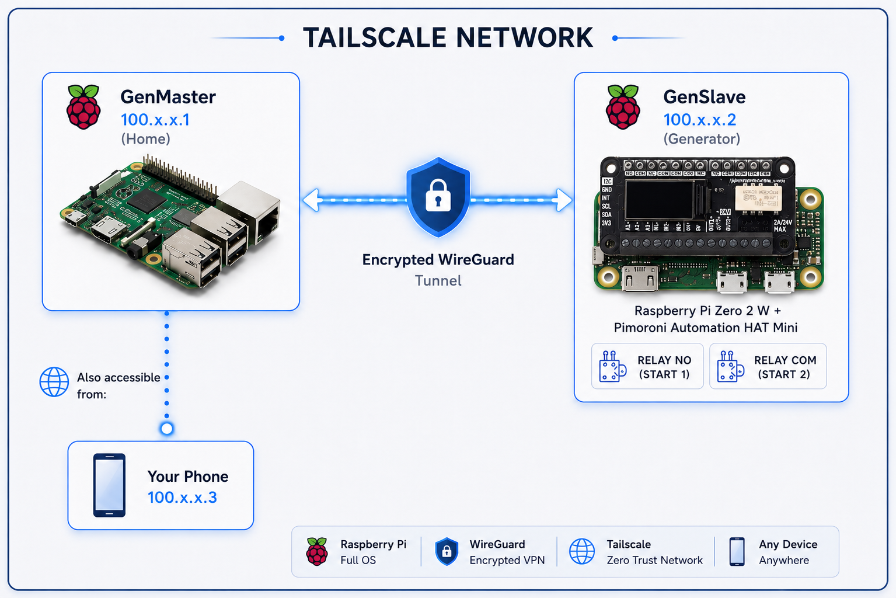

# Tailscale Setup Guide

This guide covers how to configure Tailscale VPN for secure communication between GenMaster and GenSlave.

## Table of Contents

- [Overview](#overview)
- [Why Tailscale](#why-tailscale)
- [Prerequisites](#prerequisites)
- [GenMaster Setup](#genmaster-setup)
- [GenSlave Setup](#genslave-setup)
- [Configuring Communication](#configuring-communication)
- [Access Control](#access-control)
- [Troubleshooting](#troubleshooting)

---

## Overview

Tailscale creates a secure mesh VPN network between your devices, allowing GenMaster and GenSlave to communicate securely regardless of their physical network location.

### Architecture



---

## Why Tailscale

| Feature | Benefit |
|---------|---------|
| **WireGuard-based** | Fast, modern encryption |
| **No port forwarding** | Works through NAT/firewalls |
| **Mesh networking** | Direct device-to-device connections |
| **Zero configuration** | No complex VPN setup |
| **MagicDNS** | Access devices by hostname |
| **Free tier** | 100 devices, 3 users |

### Use Cases

1. **GenSlave at remote location** - Generator shed with different network
2. **Mobile access** - Monitor from phone anywhere
3. **Multi-site** - Multiple generators across locations
4. **Secure by default** - All traffic encrypted

---

## Prerequisites

1. **Tailscale account** - Sign up at [tailscale.com](https://tailscale.com)
2. **Docker** on GenMaster
3. **Tailscale client** on GenSlave (can be Docker or native)

---

## GenMaster Setup

### Option 1: Docker (Recommended)

Add Tailscale to your GenMaster docker-compose:

```yaml
tailscale:
  image: tailscale/tailscale:latest
  container_name: genmaster_tailscale
  hostname: genmaster
  restart: unless-stopped
  environment:
    - TS_AUTHKEY=${TAILSCALE_AUTHKEY}
    - TS_STATE_DIR=/var/lib/tailscale
    - TS_USERSPACE=false
  volumes:
    - tailscale_state:/var/lib/tailscale
    - /dev/net/tun:/dev/net/tun
  cap_add:
    - NET_ADMIN
    - NET_RAW
  network_mode: host
  profiles:
    - tailscale
```

### Get an Auth Key

1. Go to [login.tailscale.com/admin/settings/keys](https://login.tailscale.com/admin/settings/keys)
2. Click **Generate auth key**
3. Options:
   - **Reusable:** Yes (for multiple devices)
   - **Ephemeral:** No (devices persist)
   - **Pre-approved:** Yes (no manual approval needed)
4. Copy the key (starts with `tskey-auth-...`)

### Configure Environment

Add to `.env`:

```bash
TAILSCALE_AUTHKEY=tskey-auth-xxxxx...
TAILSCALE_HOSTNAME=genmaster
```

### Start Tailscale

```bash
# Start with tailscale profile
docker compose --profile tailscale up -d

# Check status
docker compose exec tailscale tailscale status

# Get IP address
docker compose exec tailscale tailscale ip
```

### Option 2: Native Installation

If not using Docker:

```bash
# Install Tailscale
curl -fsSL https://tailscale.com/install.sh | sh

# Start and authenticate
sudo tailscale up

# Check status
tailscale status
```

---

## GenSlave Setup

### Option 1: Native on Pi Zero (Recommended)

Native installation is lighter for the Pi Zero's limited resources:

```bash
# Install Tailscale
curl -fsSL https://tailscale.com/install.sh | sh

# Authenticate
sudo tailscale up --authkey=tskey-auth-xxxxx

# Verify
tailscale status
tailscale ip
```

### Option 2: Docker Sidecar

If you prefer Docker:

```yaml
# In genslave docker-compose.yaml
tailscale:
  image: tailscale/tailscale:latest
  container_name: genslave_tailscale
  hostname: genslave
  restart: unless-stopped
  environment:
    - TS_AUTHKEY=${TAILSCALE_AUTHKEY}
    - TS_STATE_DIR=/var/lib/tailscale
    - TS_USERSPACE=false
  volumes:
    - /var/lib/tailscale:/var/lib/tailscale
    - /dev/net/tun:/dev/net/tun
  cap_add:
    - NET_ADMIN
    - NET_RAW
  network_mode: host
```

### Verify Connection

```bash
# On GenMaster
tailscale ping genslave

# On GenSlave  
tailscale ping genmaster
```

---

## Configuring Communication

### GenMaster Configuration

Update `.env` with GenSlave's Tailscale address:

```bash
# Use Tailscale hostname (MagicDNS)
GENSLAVE_HOST=genslave

# Or use Tailscale IP directly
GENSLAVE_HOST=100.x.x.x

# Port remains the same
GENSLAVE_PORT=8001

# API secret (must match GenSlave)
GENSLAVE_API_SECRET=your-shared-secret
```

### Testing Connection

```bash
# From GenMaster, test GenSlave API
curl http://genslave:8001/api/health \
  -H "X-API-Key: your-shared-secret"

# Should return health status
```

### DNS Resolution

With MagicDNS enabled (default), you can use hostnames:
- `genmaster` → GenMaster's Tailscale IP
- `genslave` → GenSlave's Tailscale IP

To verify MagicDNS:
```bash
# Should resolve to Tailscale IP
nslookup genslave
```

---

## Access Control

### Tailscale ACLs

Control which devices can communicate via [ACL policies](https://login.tailscale.com/admin/acls):

```json
{
  "acls": [
    {
      "action": "accept",
      "src": ["tag:genmaster"],
      "dst": ["tag:genslave:8001"]
    },
    {
      "action": "accept",
      "src": ["tag:admin"],
      "dst": ["*:*"]
    }
  ],
  "tagOwners": {
    "tag:genmaster": ["autogroup:admin"],
    "tag:genslave": ["autogroup:admin"],
    "tag:admin": ["autogroup:admin"]
  }
}
```

### Applying Tags

```bash
# On GenMaster
sudo tailscale up --advertise-tags=tag:genmaster

# On GenSlave
sudo tailscale up --advertise-tags=tag:genslave
```

### Exit Nodes

If you want to route all traffic through a specific device:

```bash
# Advertise as exit node (on a server)
sudo tailscale up --advertise-exit-node

# Use exit node (on client)
sudo tailscale up --exit-node=genmaster
```

---

## Subnet Routing

To access devices on GenSlave's local network:

### Enable on GenSlave

```bash
# Advertise local subnet
sudo tailscale up --advertise-routes=192.168.1.0/24
```

### Approve in Admin Console

1. Go to [Tailscale Admin](https://login.tailscale.com/admin/machines)
2. Find GenSlave
3. Click **...** → **Edit route settings**
4. Enable the advertised subnet

---

## Troubleshooting

### Devices Not Connecting

1. **Check authentication:**
   ```bash
   tailscale status
   ```
   Should show both devices.

2. **Check key validity:**
   - Auth keys expire after set time
   - Generate new key if needed

3. **Check firewall:**
   ```bash
   # Tailscale uses UDP 41641
   sudo ufw allow 41641/udp
   ```

### High Latency

1. **Check relay usage:**
   ```bash
   tailscale netcheck
   ```
   Direct connections are faster than relayed.

2. **Check DERP region:**
   Use closest region for best performance.

### DNS Not Working

1. **Verify MagicDNS enabled:**
   - Check in Admin Console
   - DNS settings should show Tailscale nameserver

2. **Restart Tailscale:**
   ```bash
   sudo systemctl restart tailscaled
   ```

3. **Check resolv.conf:**
   ```bash
   cat /etc/resolv.conf
   # Should include 100.100.100.100 (Tailscale DNS)
   ```

### Connection Drops

1. **Check for IP conflicts:**
   - Ensure Tailscale IPs don't conflict with local network

2. **Check keepalive:**
   ```bash
   # Lower keepalive for mobile networks
   sudo tailscale up --netfilter-mode=nodivert
   ```

3. **Check logs:**
   ```bash
   journalctl -u tailscaled -f
   ```

---

## Security Best Practices

### 1. Use Auth Key Expiration

Set auth keys to expire:
- Single-use keys for one-time setup
- Time-limited keys for automated deploys

### 2. Enable Key Expiry

In Admin Console, enable key expiry so devices need to re-authenticate periodically.

### 3. Use ACLs

Restrict which devices can communicate:
- GenMaster ↔ GenSlave only
- Admin devices have full access

### 4. Monitor Access

Check the Machines page regularly for:
- Unknown devices
- Unused devices
- Last seen timestamps

### 5. Disable Unused Features

If not needed:
- Disable subnet routing
- Disable exit nodes
- Restrict MagicDNS to your devices

---

## Comparison with Cloudflare Tunnel

| Feature | Tailscale | Cloudflare Tunnel |
|---------|-----------|-------------------|
| **Best for** | Device-to-device | Public web access |
| **Protocol** | WireGuard VPN | HTTPS proxy |
| **Latency** | Lower (direct) | Higher (via Cloudflare) |
| **Setup** | Per-device client | Single container |
| **Authentication** | Tailscale SSO | Cloudflare Access |
| **Use case** | GenMaster ↔ GenSlave | Remote web UI |

**Recommendation:** Use both!
- Tailscale for GenMaster ↔ GenSlave communication
- Cloudflare Tunnel for public web access

---

## Next Steps

- [Cloudflare Setup](CLOUDFLARE.md) - Public web access
- [GenSlave Setup](GENSLAVE.md) - Configure GenSlave networking
- [Network Configuration](manual/network-configuration.md) - WiFi profiles, static IPs, when to choose Tailscale vs local IPs for the GenMaster↔GenSlave link
- [Troubleshooting](TROUBLESHOOTING.md) - Common issues
