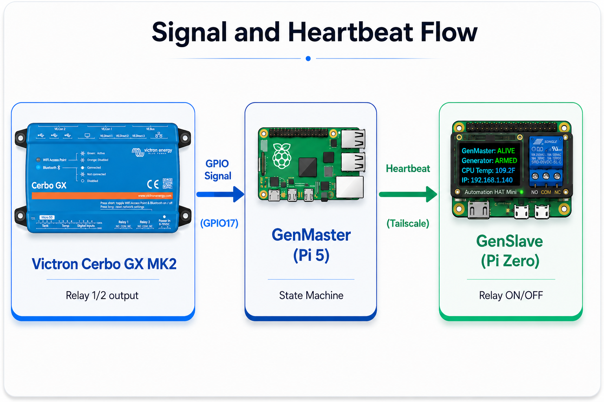
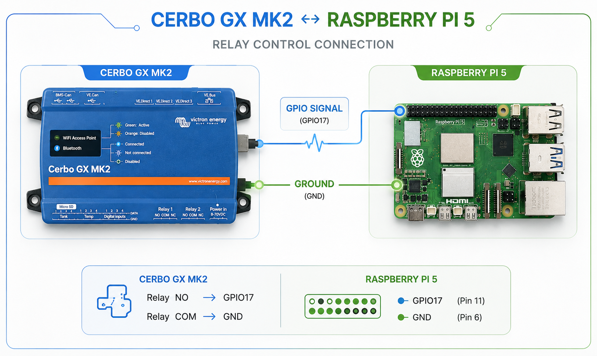

# Victron Integration Guide

This guide covers how to configure the Victron Cerbo GX integration for automatic generator control.

## Table of Contents

- [Overview](#overview)
- [Hardware Setup](#hardware-setup)
- [Cerbo GX Configuration](#cerbo-gx-configuration)
- [GenMaster Configuration](#genmaster-configuration)
- [Signal Behavior](#signal-behavior)
- [Override System](#override-system)
- [Troubleshooting](#troubleshooting)

---

## Overview

The RPi Generator Control system integrates with Victron Cerbo GX to automatically start and stop your generator based on battery state of charge (SOC).

### How It Works

1. **Cerbo GX monitors battery SOC** via your BMS or SmartShunt
2. **When SOC drops** below your configured threshold, Cerbo GX closes a relay
3. **GenMaster detects** the relay signal on GPIO17
4. **GenMaster tells GenSlave** to start the generator
5. **When SOC recovers**, Cerbo GX opens the relay
6. **GenMaster stops** the generator



---

## Hardware Setup

### Required Equipment

- **Victron Cerbo GX** (or Venus GX)
- **Raspberry Pi 5** running GenMaster
- **Wire** to connect Cerbo relay to Pi GPIO

### Wiring

Connect Cerbo GX Relay 1 or 2 to the Raspberry Pi:



- **NO** = Normally Open contact
- **COM** = Common contact
- Use GPIO17 (physical pin 11) and any GND pin (e.g., pin 9)

> **Note:** The signal uses a pull-up resistor internally. When the relay closes, GPIO17 goes LOW (active-low logic).

### Optional: Relay Module

If your Cerbo relay output is incompatible with GPIO voltage levels, use an optocoupler or relay module:

```
Cerbo GX Relay → Opto/Relay Module → GPIO17 + GND
```

---

## Cerbo GX Configuration

### Access VRM or Local Console

1. **Via VRM Portal:** Log in at [vrm.victronenergy.com](https://vrm.victronenergy.com)
2. **Via Local Console:** Connect display to Cerbo, or use the web interface at `http://cerbo-ip-address`

### Configure Generator Start/Stop

Navigate to **Settings > Generator Start/Stop**:

#### Generator Start/Stop Settings

| Setting | Recommended Value |
|---------|-------------------|
| **Auto start enabled** | On |
| **On loss of communication** | Stop (safety first) |

#### Battery SOC Conditions

| Setting | Description | Suggested Value |
|---------|-------------|-----------------|
| **Start on SOC** | SOC below which generator starts | 30-40% |
| **Start after condition reached for** | Delay before starting | 60 seconds |
| **Stop on SOC** | SOC above which generator stops | 80-90% |
| **Stop after condition reached for** | Delay before stopping | 60 seconds |

#### Relay Assignment

1. Go to **Settings > Relay**
2. Select **Relay 1** or **Relay 2**
3. Set **Function** to **Generator**

### Example Configuration

```
Generator Start/Stop:
├── Auto start: On
├── Start on SOC: 35%
├── Start delay: 60 seconds
├── Stop on SOC: 85%
├── Stop delay: 60 seconds
└── Relay: Relay 1 = Generator
```

---

## GenMaster Configuration

### Environment Variables

Set in your `.env` file:

```bash
# GPIO pin for Victron signal (default: 17)
VICTRON_GPIO_PIN=17

# Mock GPIO for development (set true on non-Pi systems)
MOCK_GPIO=false
```

### Docker Configuration

GenMaster requires GPIO access. In `docker-compose.yaml`:

```yaml
genmaster:
  # Required for GPIO access on Pi 5
  privileged: true
  user: root
  
  # Alternative: device mappings
  devices:
    - /dev/gpiochip0:/dev/gpiochip0
    - /dev/gpiomem4:/dev/gpiomem4  # Pi 5 specific
```

### Verifying Signal Detection

Check GPIO monitor status:

```bash
# View logs
docker compose logs genmaster | grep -i gpio

# Check current state via API
curl https://your-genmaster/api/health \
  -H "Authorization: Bearer YOUR_TOKEN"
```

The `victron_signal` field shows current state (`active`/`inactive`).

---

## Signal Behavior

### State Transitions

| Victron Signal | Generator State | Action |
|----------------|-----------------|--------|
| Goes ACTIVE | Stopped | Start generator (if armed and no override) |
| Goes INACTIVE | Running (victron trigger) | Stop generator |
| Goes INACTIVE | Running (manual trigger) | No action (manual run continues) |
| Any | N/A | Override active - ignored |

### Important Notes

1. **Arming required:** The relay must be armed for automatic starts
2. **Override priority:** Force-stop override blocks automatic starts
3. **Trigger tracking:** System remembers what triggered each run
4. **Manual runs continue:** A Victron stop signal won't stop a manually-started run

### Debouncing

The GPIO monitor includes 100ms debounce to prevent false triggers from electrical noise.

---

## Override System

Overrides let you control the generator regardless of Victron signals.

### Override Types

| Type | Effect | Use Case |
|------|--------|----------|
| **force_run** | Generator runs, ignores Victron "stop" signal | Keep generator running for maintenance/testing |
| **force_stop** | Blocks automatic starts from Victron | Prevent generator during maintenance window |

### Using Overrides

**Via Web UI:**

1. Navigate to Generator dashboard
2. Find the **Victron Override** section
3. Toggle override ON
4. Select type (Force Run or Force Stop)

**Via API:**

```bash
# Enable force_run override
curl -X POST https://your-genmaster/api/override/enable \
  -H "Authorization: Bearer YOUR_TOKEN" \
  -H "Content-Type: application/json" \
  -d '{"override_type": "force_run"}'

# Enable force_stop override
curl -X POST https://your-genmaster/api/override/enable \
  -H "Authorization: Bearer YOUR_TOKEN" \
  -H "Content-Type: application/json" \
  -d '{"override_type": "force_stop"}'

# Disable override (return to automatic)
curl -X POST https://your-genmaster/api/override/disable \
  -H "Authorization: Bearer YOUR_TOKEN"

# Check current status
curl https://your-genmaster/api/override/status \
  -H "Authorization: Bearer YOUR_TOKEN"
```

### Override Behavior Details

**force_run:**
- Generator starts immediately (if not running)
- Victron "stop" signal is ignored
- Generator continues until override is disabled
- Useful for testing or extended charging

**force_stop:**
- Generator stops immediately (if running)
- Victron "start" signal is ignored
- Manual and scheduled starts **still work**
- Useful during maintenance windows

---

## API Reference

### Victron Status

**GET /api/health**

Returns system health including Victron signal state:

```json
{
  "status": "healthy",
  "victron_signal": "inactive",
  "generator_running": false,
  "slave_connected": true
}
```

### Override Endpoints

| Method | Endpoint | Description |
|--------|----------|-------------|
| GET | `/api/override/status` | Get current override status |
| POST | `/api/override/enable` | Enable override |
| POST | `/api/override/disable` | Disable override |

### Mock Signal (Development)

For testing on non-Pi systems:

```bash
# Set mock signal to active
curl -X POST https://your-genmaster/api/dev/victron/active \
  -H "Authorization: Bearer YOUR_TOKEN"

# Set mock signal to inactive
curl -X POST https://your-genmaster/api/dev/victron/inactive \
  -H "Authorization: Bearer YOUR_TOKEN"

# Toggle mock signal
curl -X POST https://your-genmaster/api/dev/victron/toggle \
  -H "Authorization: Bearer YOUR_TOKEN"
```

---

## Timing Considerations

### Startup Delay

When Victron signal activates:
1. GenMaster detects signal change (~100ms debounce)
2. State machine processes request
3. Heartbeat syncs to GenSlave (up to 10s)
4. GenSlave activates relay
5. Generator cranks and starts

**Total delay:** 1-15 seconds typical

### Shutdown Delay

When Victron signal deactivates:
1. GenMaster detects signal change
2. Generator stop command sent
3. Generator runs down

**Total delay:** 1-5 seconds typical

### Cerbo Delays

Add Cerbo's configured delays:
- **Start delay:** Prevents starting on brief SOC dips
- **Stop delay:** Ensures battery is sufficiently charged

**Recommended:** 60 seconds each for stable operation

---

## Troubleshooting

### Generator Not Starting on Low SOC

1. **Check Victron signal:**
   ```bash
   curl https://your-genmaster/api/health \
     -H "Authorization: Bearer YOUR_TOKEN" | jq .victron_signal
   ```

2. **Check if armed:**
   - Generator must be armed to auto-start
   - Look for "not armed" in logs

3. **Check override:**
   - Force-stop override blocks auto-starts
   - Check `/api/override/status`

4. **Check Cerbo configuration:**
   - Verify relay is assigned to Generator function
   - Verify SOC thresholds are correct
   - Check relay is closing (LED indicator)

5. **Check GPIO:**
   ```bash
   docker compose logs genmaster | grep -i victron
   ```

### Generator Won't Stop After Charging

1. **Check trigger type:**
   - Only victron-triggered runs stop on signal
   - Manual runs continue regardless

2. **Check override:**
   - Force-run override keeps generator running
   - Disable override to allow stop

3. **Check Cerbo:**
   - Verify stop SOC threshold
   - Verify relay is opening

### Signal Stuck Active/Inactive

1. **Check wiring:**
   - Verify connections to GPIO17 and GND
   - Check for loose connections

2. **Check relay:**
   - Listen for relay click on Cerbo
   - Check relay LED indicator

3. **Test with multimeter:**
   - Measure voltage between relay contacts
   - Closed = near 0V, Open = floating

### Mock Mode Warnings

If you see "Mock GPIO mode" in logs:
- **On development machine:** Expected behavior
- **On Raspberry Pi:** Check GPIO access permissions and device mappings

---

## Best Practices

### 1. Set Appropriate Thresholds

- Don't set start SOC too high (frequent short runs)
- Don't set stop SOC too low (generator runs too long)
- Leave 40-50% gap between start and stop SOC

### 2. Use Delays

Configure Cerbo delays to prevent:
- Starting on brief SOC fluctuations
- Stopping before battery is adequately charged

### 3. Monitor Battery Health

The generator protects your battery, but monitor:
- Cycle count
- Battery temperature
- Charge/discharge rates

### 4. Test Periodically

1. Manually trigger low-SOC condition
2. Verify generator starts
3. Verify generator stops at target SOC
4. Check all notifications were sent

---

## Next Steps

- [Generator Controls](GENERATOR.md) - Manual control options
- [Scheduling Guide](SCHEDULING.md) - Scheduled runs alongside Victron
- [Notifications](NOTIFICATIONS.md) - Get alerts for Victron events
- [Troubleshooting](TROUBLESHOOTING.md) - More debugging tips
