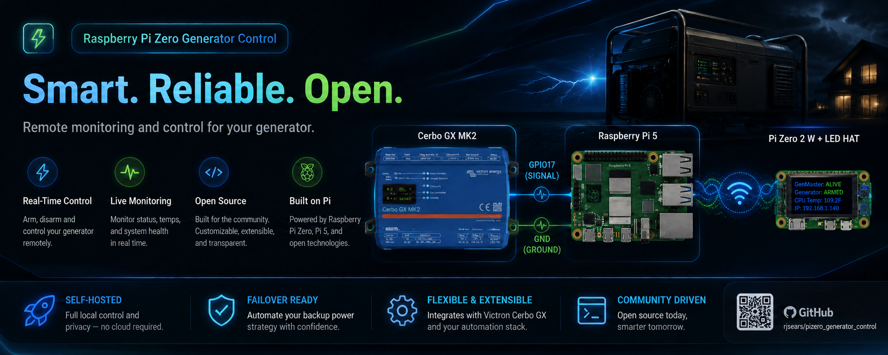
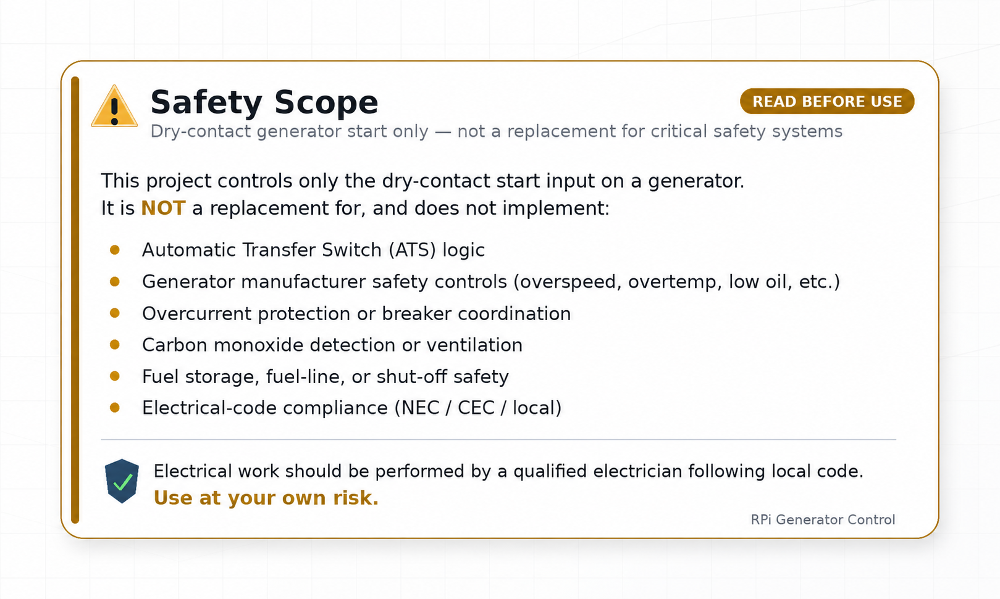
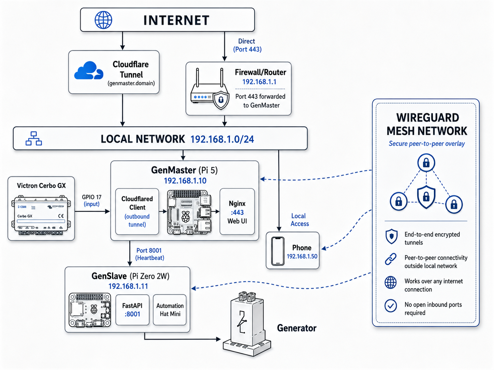

# RPi Generator Control

A working (in production in my system), distributed generator control system designed for off-grid solar installations with Victron energy systems. Built on a master-slave architecture using Raspberry Pi devices, it provides automated generator management with manual override capabilities, scheduling, and real-time monitoring through a modern web interface.

<p align="center">
  
</p>

<p align="center">
  
</p>

<p align="center">
  
</p>

---

## Overview

The RPi Generator Control system automates generator management for off-grid solar installations. When your Victron Cerbo GX determines that battery levels are low and generator power is needed, it sends a signal to GenMaster, which coordinates with GenSlave to physically start the generator.

<div class="grid cards" markdown>

-   :material-lightning-bolt:{ .lg .middle } __Automated Control__

    ---

    Automatic generator start/stop based on Victron signals, schedules, and manual commands.

    [:octicons-arrow-right-24: Generator Controls](GENERATOR.md)

-   :material-shield-check:{ .lg .middle } __Safety First__

    ---

    Arming system, failsafe watchdog, and heartbeat monitoring ensure safe operation.

    [:octicons-arrow-right-24: GenSlave Setup](GENSLAVE.md)

-   :material-calendar-clock:{ .lg .middle } __Scheduling__

    ---

    Automated exercise runs and scheduled operations keep your generator healthy.

    [:octicons-arrow-right-24: Scheduling Guide](SCHEDULING.md)

-   :material-bell:{ .lg .middle } __Notifications__

    ---

    Get alerts via Telegram, Slack, email, and 80+ other services via Apprise.

    [:octicons-arrow-right-24: Notifications](NOTIFICATIONS.md)

</div>

---

## Architecture

The system uses a **master-slave architecture** with two Raspberry Pi devices:



[:octicons-arrow-right-24: Full Architecture Documentation](ARCHITECTURE.md)

---

## Key Features

### Automated Control

- **Victron Integration** - Monitors GPIO signal from Cerbo GX relay
- **Scheduled Runs** - APScheduler-based scheduling with flexible timing
- **Exercise Runs** - Regular maintenance runs to keep generator healthy
- **Manual Override** - Force start/stop from web UI regardless of signals

### Reliability & Safety

- **Arming System** - Explicit arm/disarm prevents accidental operations
- **Heartbeat Monitoring** - Continuous health checks between devices
- **Independent Failsafe** - GenSlave auto-stops generator if communication lost
- **Hardware EPO** *(optional)* - Mushroom E-stop at the generator. NC contact physically interrupts the start circuit — a maintenance lockout that works even if every Pi is offline. See [Hardware Switches](manual/hardware-switches.md).
- **HOA Selector** *(optional)* - 3-position rotary at the operator location for Quiet / Auto / Run modes — operator-side mode control without touching the web UI
- **State Persistence** - PostgreSQL database survives reboots

### Modern Interface

- **Real-time Dashboard** - Live status updates via WebSocket
- **Dark/Light Mode** - System preference detection
- **Mobile Responsive** - Works on any device
- **Container Management** - Portainer integration

### Fuel Tracking

- **Per-Run Tracking** - Automatic fuel consumption calculation
- **Generator Profile** - Store manufacturer, model, serial number
- **Usage History** - Track runtime and fuel over time

---

## Quick Start

Both GenMaster and GenSlave install via interactive `setup.sh` scripts.
The scripts handle Docker installation, environment configuration, secret
generation, and systemd integration — they are the recommended install
path. Manual install is possible but not covered here.

### 1. Deploy GenMaster (on the Pi 5)

```bash
# Single-command install — pulls and runs the setup script
curl -fsSL https://raw.githubusercontent.com/rjsears/pizero_generator_control/main/genmaster/install.sh | sudo bash
```

The setup script will install Docker, generate a `.env` file, prompt for
the values it can't infer (timezone, generator info, optional notification
URLs), pull the GenMaster image from Docker Hub, and start all containers.

When it finishes, you'll have a working GenMaster on `https://<pi-ip>` with
the API secret already generated. **Note the displayed `SLAVE_API_SECRET`
value — you'll need it on the GenSlave side in step 2.**

### 2. Deploy GenSlave (on the Pi Zero 2W)

```bash
# SSH into the Pi Zero
ssh pi@genslave.local

# Download and run the setup script
curl -fsSL https://raw.githubusercontent.com/rjsears/pizero_generator_control/main/genslave/setup.sh -o setup.sh
chmod +x setup.sh
sudo ./setup.sh
```

The setup script will install Docker, prompt you for the API secret
(press Enter to **auto-generate** a new one, or paste GenMaster's
`SLAVE_API_SECRET` from step 1 to use that), pull the GenSlave ARM image,
configure systemd, and start the container.

If you auto-generated the secret on this side, copy the displayed value
back into GenMaster's `SLAVE_API_SECRET` (in `genmaster/.env` or via the
GenMaster UI under **Settings → GenSlave Configuration**).

### 3. Configure Tailscale (recommended)

```bash
# Install on both devices
curl -fsSL https://tailscale.com/install.sh | sh
sudo tailscale up
```

### 4. Access Web UI

Open `https://your-genmaster-ip` and log in.

---

## Documentation

| Guide | Description |
|-------|-------------|
| [Generator Controls](GENERATOR.md) | Start, stop, arm/disarm, overrides |
| [Scheduling](SCHEDULING.md) | Scheduled and exercise runs |
| [Victron Integration](VICTRON.md) | GPIO signal monitoring, overrides |
| [GenSlave Setup](GENSLAVE.md) | Hardware, installation, configuration |
| [Tailscale VPN](TAILSCALE.md) | Secure device communication |
| [Cloudflare Tunnel](CLOUDFLARE.md) | Remote web access |
| [Notifications](NOTIFICATIONS.md) | Alerts via 80+ services |
| [Troubleshooting](TROUBLESHOOTING.md) | Common issues and solutions |

---

## Technology Stack

=== "Backend"

    - Python 3.11+
    - FastAPI 0.109+
    - SQLAlchemy 2.0+ (async)
    - PostgreSQL 16
    - APScheduler 3.10+
    - gpiozero + lgpio

=== "Frontend"

    - Vue.js 3.4+ (Composition API)
    - Pinia state management
    - Tailwind CSS 3.4+
    - Chart.js + vue-chartjs
    - Vite 5.1+

=== "Infrastructure"

    - Docker + Docker Compose
    - Nginx reverse proxy
    - Redis caching
    - Tailscale VPN
    - Cloudflare Tunnel

---

## License

MIT License - See [LICENSE](https://github.com/rjsears/pizero_generator_control/blob/main/LICENSE) for details.

## Author

Richard J. Sears - [GitHub](https://github.com/rjsears)
