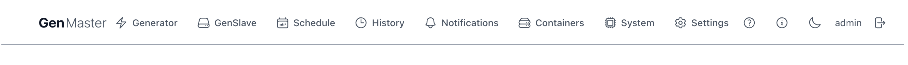
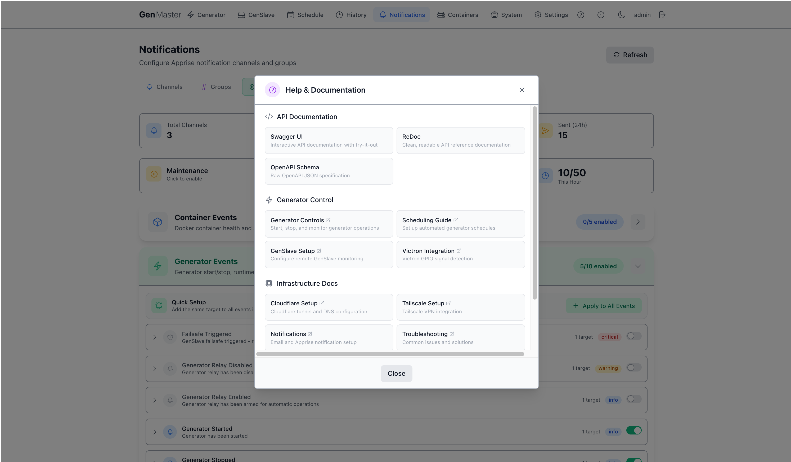
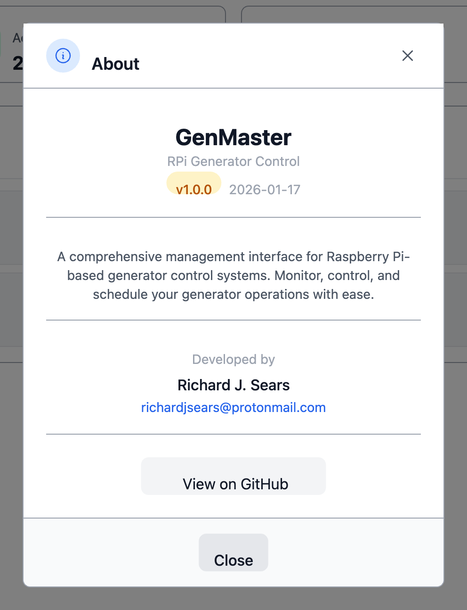

# Common UI

A handful of header-bar elements appear on every page. This section documents what each one does and how to use it.

## GenMaster wordmark

In the top-left corner. Clicking it always returns you to the **Generator Control** home page, regardless of which page you're currently on.

## Top navigation tabs

Eight tabs that route to the major sections of the app. The currently active tab is highlighted (color and icon style).

| Tab | Page in this manual |
|-----|---------------------|
| Generator | [Generator Control](generator.md) |
| GenSlave | [GenSlave](genslave.md) |
| Schedule | [Schedule](schedule.md) |
| History | [Run History](history.md) |
| Notifications | [Notifications](notifications.md) |
| Containers | [Containers](containers.md) |
| System | [System](system.md) |
| Settings | [Settings](settings.md) |

The header is **sticky** — it stays visible at the top of the viewport even as you scroll long pages.

## Help & Documentation (?)

The question-mark icon in the right portion of the header opens the Help & Documentation dialog.

The dialog is organized into four sections:

| Section | Links |
|---------|-------|
| **API Documentation** | Swagger UI (interactive API explorer), ReDoc (clean API reference), OpenAPI Schema (raw JSON spec). |
| **Generator Control** | Generator Controls, Scheduling Guide, GenSlave Setup, Victron Integration. |
| **Infrastructure Docs** | Cloudflare Setup, Tailscale Setup, Notifications, Troubleshooting. |
| **Project Resources** | Full Documentation (this site), GitHub Repository (source + issues). |

External links open in a new tab.

## About (i)

The info-circle icon opens the About dialog.

Shows:

- GenMaster wordmark and version (e.g. `v1.0.0 - Beta-2026`).
- A short description of the project.
- Developer (Richard J. Sears) and contact email.
- A "View on GitHub" link to the source repository.

## Theme toggle (sun / moon)

Switches between Modern Light and Modern Dark themes. Same effect as picking the active theme on [Settings → Appearance](settings.md#appearance), just one click instead of three.

The icon you see is for the **target** theme, not the current one — i.e. when you're in light mode, you see a moon (click to go dark), and vice versa.

## User badge (admin)

Shows the username of the currently logged-in user. Clicking it (in some builds) jumps to [Settings → Account](settings.md#account). Otherwise it's display-only.

## Logout (door icon)

Ends the current session immediately. You'll be redirected to the login page.

!!! tip "Auto-logout"
    Sessions also expire automatically after the **Session Timeout** configured in [Settings → Security](settings.md#security). The default is 30 minutes of idle time.

## Login page

When you're not signed in, GenMaster redirects you to a simple username + password form. Default credentials are `admin / admin` on a fresh install — change them immediately under [Settings → Account](settings.md#account).

After three failed login attempts (configurable in [Security](settings.md#security)), the account locks for the configured Lockout Duration.

## Keyboard shortcuts

| Shortcut | Action |
|----------|--------|
| `Esc` | Close any open modal / dialog. |
| `Tab` / `Shift+Tab` | Navigate form fields. |
| `Enter` | Submit the focused form. |

(Custom shortcuts may vary by build — most pages do not register any.)

## Background indicators

A few persistent visual cues you may notice:

- **Sticky header tint** — when GenSlave goes offline, the GenSlave nav tab tints red/yellow to flag the issue across pages.
- **In-page badges** (e.g. `Online`, `Armed`, `Disabled`) — color-coded: green for healthy/active, orange for warning/armed, red for error/danger, gray for inactive.

## Error toasts

When an action fails (e.g. starting the generator while disarmed, saving with invalid input), a toast notification appears at the bottom-right corner with the error message. Toasts auto-dismiss after a few seconds; click the X to dismiss immediately.
