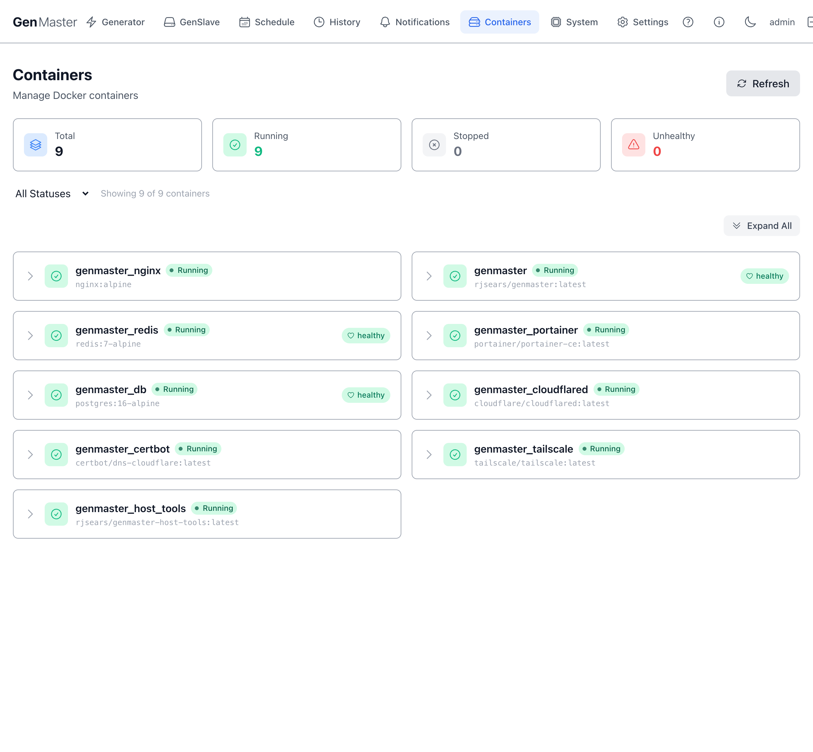
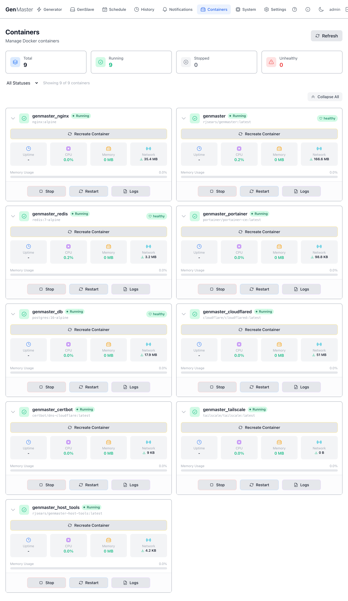
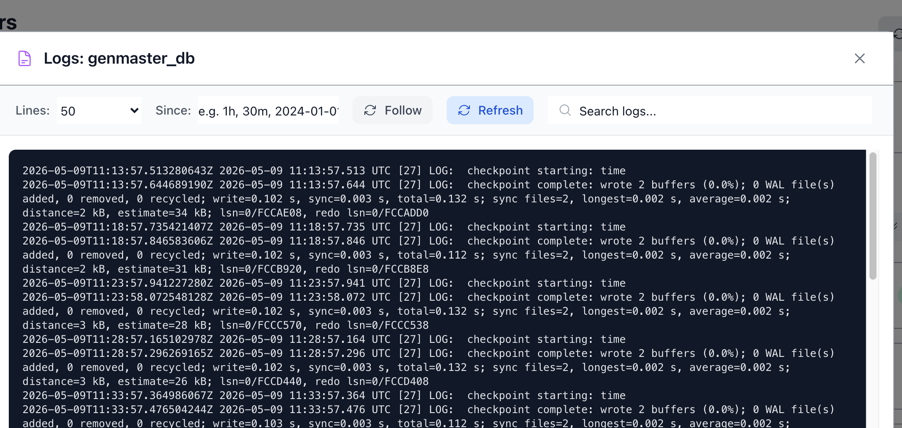
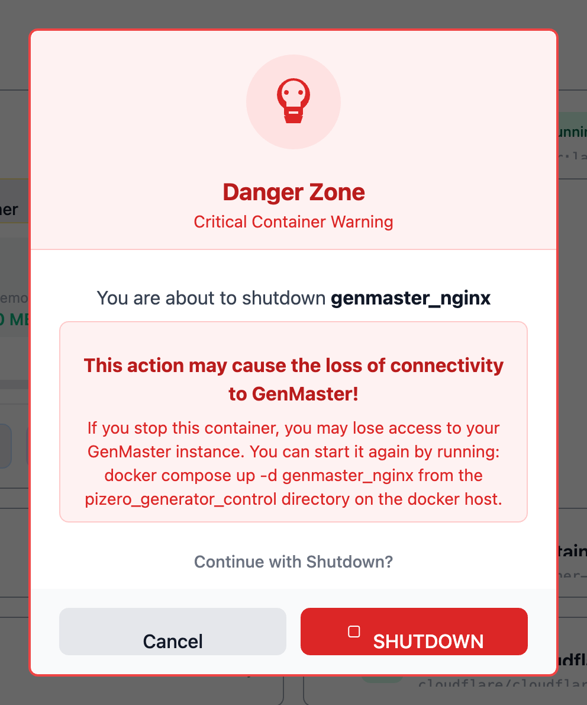
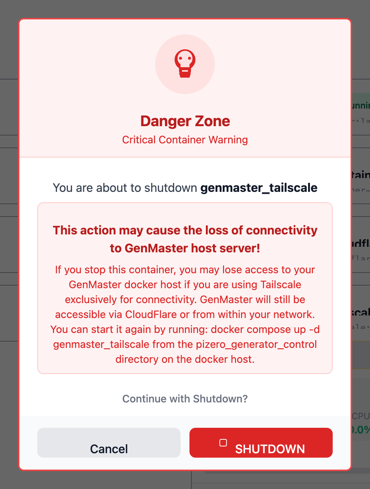

# Containers

The Containers page surfaces the Docker containers running on the GenMaster host so you can see their state at a glance and take basic actions (start, restart, view logs) without dropping into a terminal. It's a lightweight Portainer-style UI scoped to just GenMaster's stack.

!!! note "Initial load can take 10–15 seconds"
    On first navigation, the page shows a "Taking attendance..." (then "Shaking the containers to see what rattles...") spinner while it queries the Docker daemon. If the list is still empty after 30 seconds, click **Refresh** in the top-right.

## Top stat row

| Card | Meaning |
|------|---------|
| **Total** | All containers visible to the Docker daemon. |
| **Running** | Currently up. |
| **Stopped** | Defined but not running. |
| **Unhealthy** | Running but a healthcheck is failing. |

## Filter bar

- **Status filter dropdown** — `All Statuses`, `Running Only`, `Stopped Only`.
- **Refresh** (top-right) — re-polls the Docker daemon. The page also auto-refreshes on a timer.
- **Expand All** (right side, above the list) — opens the detail panel on every row at once.

The "Showing X of Y containers" label tells you how many match your current filter.

## The container list

A two-column grid of containers. Each row shows:

- The chevron (>) on the left — click to expand the detail panel inline.
- A **status icon** (green checkmark for healthy, red triangle for unhealthy).
- The **container name** (e.g. `genmaster_nginx`) and **image tag** (e.g. `nginx:alpine`) below it.
- **Status badges**: `Running` / `Stopped` plus optionally `healthy` / `unhealthy`.

For the GenMaster stack, the containers you'll typically see are:

| Container name | Image | Role |
|----------------|-------|------|
| `genmaster` | `rjsears/genmaster:latest` | Backend API (FastAPI). State machine, scheduler, Victron GPIO listener. |
| `genmaster_nginx` | `nginx:alpine` | Reverse proxy, TLS termination. |
| `genmaster_db` | `postgres:16-alpine` | PostgreSQL — state, run history, config. |
| `genmaster_redis` | `redis:7-alpine` | Cache and websocket pub/sub. |
| `genmaster_host_tools` | `rjsears/genmaster-host-tools:latest` | Privileged sidecar for whitelisted host commands (reboot, shutdown, network changes). |
| `genmaster_tailscale` | `tailscale/tailscale:latest` | Optional Tailscale daemon. |
| `genmaster_cloudflared` | `cloudflare/cloudflared:latest` | Optional Cloudflare Tunnel. |
| `genmaster_portainer` | `portainer/portainer-ce:latest` | Optional Portainer UI. |
| `genmaster_certbot` | `certbot/dns-cloudflare:latest` | Let's Encrypt certificate renewal (DNS-01 challenge). |

## Expanded container detail

Click a row's chevron (or **Expand All**) to see live stats and action buttons for that container.

The expanded panel shows:

| Element | Meaning |
|---------|---------|
| **Recreate Container** | Tears down and re-creates the container from the same image. Use after pulling a new image tag or after changing `.env` values that aren't picked up by a simple restart. |
| **Uptime** | Time since the container last started. |
| **CPU** | Current CPU usage as a percentage. |
| **Memory** | Current RAM usage in MB. |
| **Network** | Cumulative network I/O since container start (download + upload). |
| **Memory Usage bar** | Visual indicator of memory percentage relative to the host's RAM. |
| **Stop / Start** | Graceful stop or start. The label switches based on current state. |
| **Restart** | `docker restart` — issues a stop, then a start. |
| **Logs** | Opens the Logs dialog (see below). |

## Logs dialog

Clicking **Logs** opens a modal with live container output.

| Control | Behavior |
|---------|----------|
| **Lines** | How many recent log lines to show (default 200; common picks: 50, 100, 200, 500, 1000). |
| **Since** | Restrict to lines newer than this duration or timestamp (`1h`, `30m`, `2024-01-01`, etc.). |
| **Follow** | Toggle live tail — new lines stream in as the container produces them. |
| **Refresh** | Re-fetch logs immediately. |
| **Search logs...** | Filter the displayed lines client-side. |
| **Showing N lines** (footer) | How many lines are currently rendered. |
| **Close** | Dismiss the dialog. |

The log content area is monospaced and scrollable. Application logs, access logs (for `nginx`), and stderr all appear here interleaved.

!!! example "Sensitive data"
    Container logs frequently include IP addresses, request paths, and occasionally tokens or session IDs. Mask before sharing screenshots externally.

## Critical Container Warnings

Stopping certain containers can take down the GenMaster web UI or sever your remote access. To prevent accidental shutdown, GenMaster intercepts the **Stop** action on any container deemed critical and shows a **Danger Zone** confirmation dialog. The dialog spells out exactly what you'll lose and how to bring it back.

### Connectivity-loss warning (e.g. genmaster_nginx)

When you click **Stop** on a container that hosts the web UI itself (such as `genmaster_nginx`), the warning explains:

- **What happens**: "This action may cause the loss of connectivity to GenMaster!" — you'll lose access to this very page.
- **How to recover**: SSH to the docker host and run `docker compose up -d genmaster_nginx` from the `pizero_generator_control` directory.
- **Cancel** safely returns you to the container list with no action taken.
- **SHUTDOWN** (red, destructive) confirms the stop.

### Remote-access warning (e.g. genmaster_tailscale)

When you click **Stop** on the Tailscale container, the warning is more nuanced — you may still be able to reach GenMaster via Cloudflare or your local network, but Tailscale-only access will go away:

> "This action may cause the loss of connectivity to GenMaster host server! If you stop this container, you may lose access to your GenMaster docker host if you are using Tailscale exclusively for connectivity. GenMaster will still be accessible via CloudFlare or from within your network. You can start it again by running: `docker compose up -d genmaster_tailscale` from the `pizero_generator_control` directory on the docker host."

### Which containers trigger this dialog

| Container | Why it's critical |
|-----------|-------------------|
| `genmaster` | Stops the API — UI loses its data source. |
| `genmaster_nginx` | Stops the web server — UI becomes unreachable from any path. |
| `genmaster_db` | Backend will error on the next DB query; closing in-flight requests. |
| `genmaster_redis` | Cache loss; websocket events stop firing. |
| `genmaster_cloudflared` | Public Cloudflare-Tunnel access goes away. |
| `genmaster_tailscale` | Tailscale-VPN access goes away. |

Non-critical containers (e.g. `genmaster_certbot`, `genmaster_portainer`, `genmaster_host_tools`) typically stop without a confirmation dialog.

!!! danger "Don't stop genmaster_db while genmaster is running"
    The API will error and close in-flight requests. Stop `genmaster` first, then `genmaster_db`, and reverse the order to restart.

## When to use this page vs. SSH

The Containers tab is great for:

- Quick health checks ("is everything green?").
- Restarting a specific service after a config change.
- Tailing logs without opening a shell.
- Recreating a container after a `docker pull`.

For deeper work — `docker compose down`, image rebuilds, mounting different volumes, or changing the compose file — SSH into the host and use `docker compose` directly.

## What's next

- See host-level health (CPU, memory, disk, SSL): [System](system.md).
- Configure environment variables that affect container behavior: [Settings → Environment](settings.md#environment).
