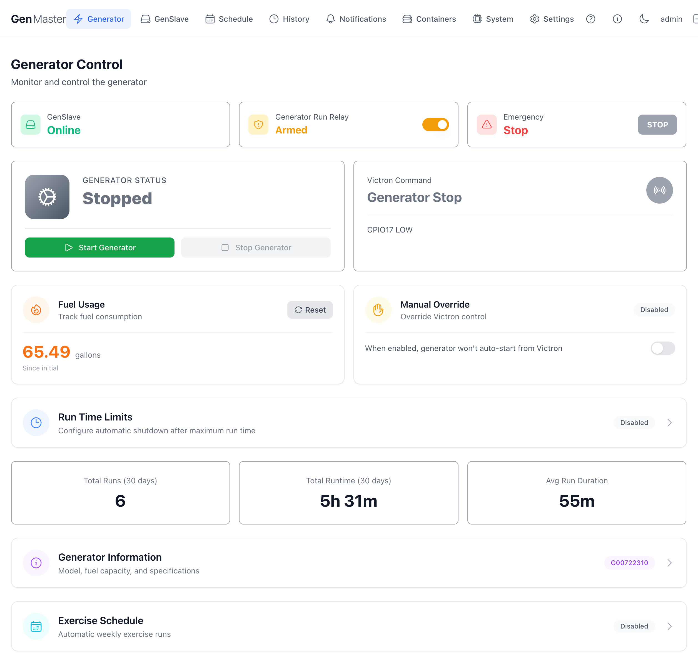
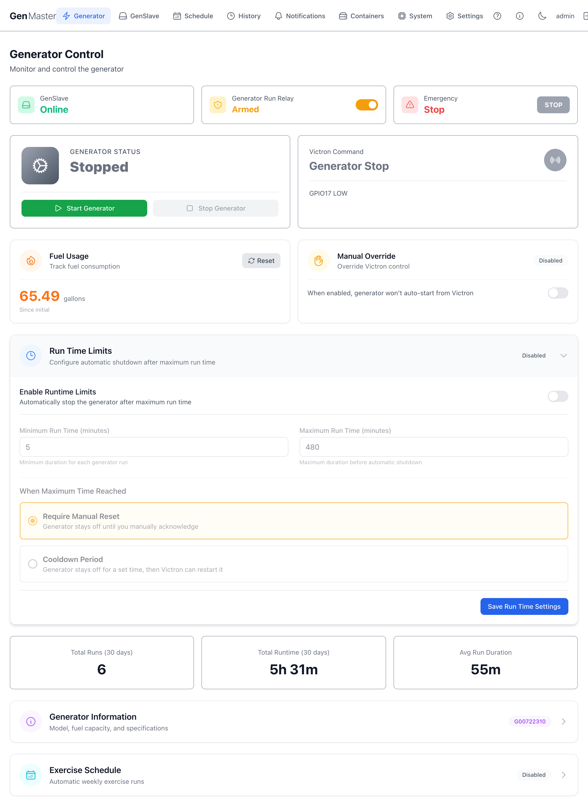
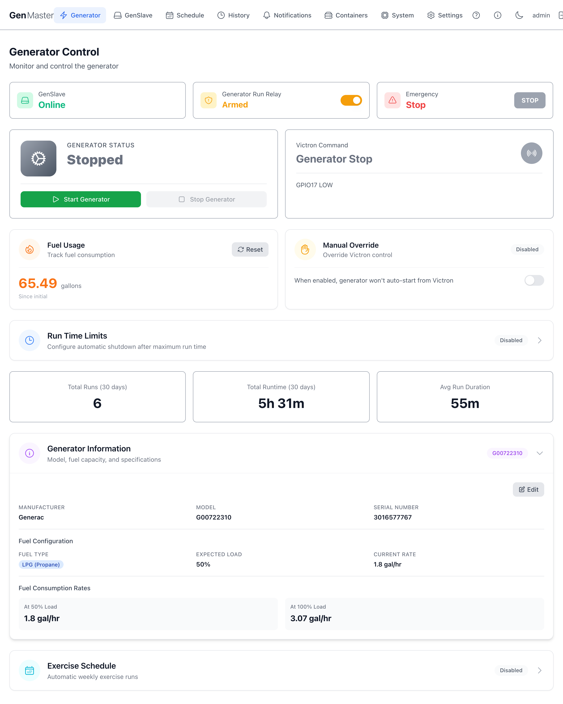
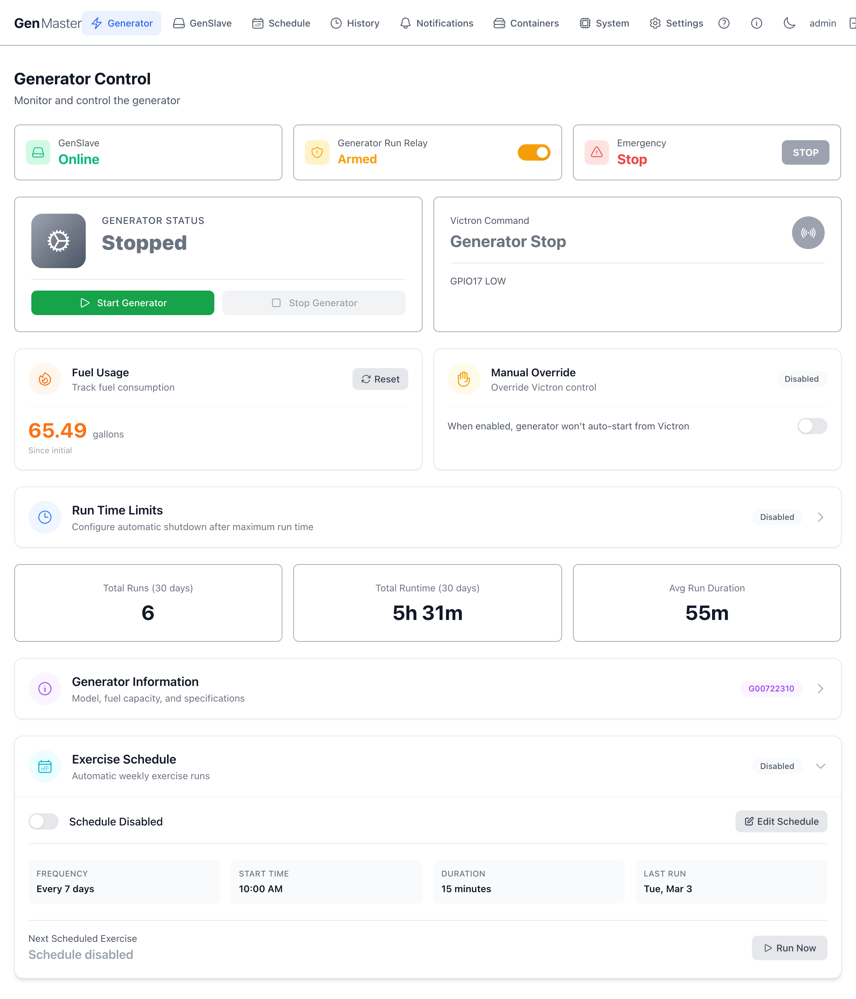
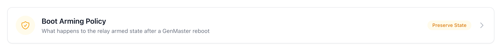
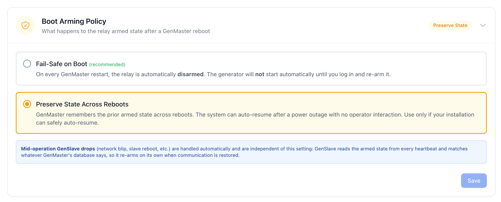
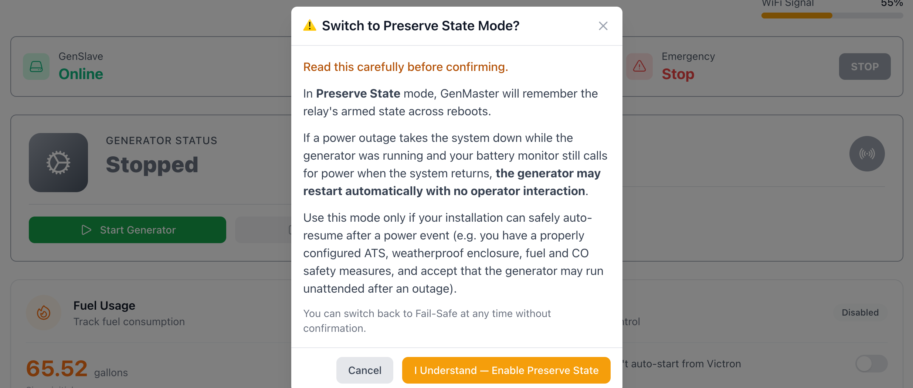

# Generator Control

The Generator Control page is GenMaster's home screen — it's where you monitor generator state in real time, manually start or stop the generator, configure fuel tracking, set runtime limits, and view recent run statistics. Whenever you log in or click the **GenMaster** logo, you land here.

## Top status row

Three at-a-glance status cards span the top of the page.

| Card | What it shows |
|------|---------------|
| **GenSlave** | Whether the remote relay controller is currently reachable. `Online` (green) means GenMaster received a recent heartbeat. `Offline` means the slave has missed its expected check-ins — until it comes back, GenMaster cannot start or stop the generator. |
| **Generator Run Relay** | The arming switch. When **Armed** (orange), GenMaster will respond to Victron signals, scheduled runs, and manual start commands. When disarmed, all automated actions are blocked. Click the toggle to flip the state. See [Arming behavior](#arming-behavior) below for details. |
| **Emergency Stop** | A large red **STOP** button. Pressing it sends an immediate shutdown command directly to GenSlave, regardless of arming state or current trigger. Use it any time you need the generator off **right now**. |

### Arming behavior

Under the default **Fail-Safe** boot policy, GenMaster ships **disarmed** every time it boots — this is intentional safety behavior. After a reboot, the operator must explicitly arm the system before automated actions can resume, and the `boot_disarmed_failsafe` notification is fired so you know to do it.

| State | Victron signal | Scheduled runs | Manual start |
|-------|----------------|----------------|--------------|
| **Disarmed** | Logged but ignored | Skipped (logged) | Blocked |
| **Armed** | Triggers start/stop | Execute normally | Allowed |

!!! warning "Disarming does NOT stop a running generator"
    If the generator is currently running, flipping the arming switch off only blocks **future** automated actions. Use the **Stop Generator** button or **Emergency Stop** to halt a running generator.

!!! info "Boot Arming Policy is configurable"
    The "always disarm on boot" behavior is the default (`fail_safe`) policy and is what most operators want. Power users with the right physical safety setup can switch to `preserve_state` (under the **Boot Arming Policy** collapsible on this page), which keeps the armed state across reboots so the system can auto-resume after a power outage. Switching to `preserve_state` requires confirming a warning modal — read it carefully before enabling.

## Generator status and Victron command

The two large panels below the status row show what the generator is currently doing and what signal Victron is sending.

### Generator Status

- Shows the current state — typically **Stopped** or **Running**, with intermediate states like `Starting`, `Stopping`, and `Cooldown` during transitions.
- **Start Generator** — green button. Sends a manual start command. Requires GenSlave online and the system armed.
- **Stop Generator** — sends a manual stop command.

!!! tip "Manual vs. Victron-driven control"
    Manual start/stop commands work even when the Victron signal is in the opposite state — but if Victron is asking for the generator to run and you stop it manually, the next state machine tick will start it again unless you also enable **Manual Override** (see below).

### Victron Command

Tells you what signal the Victron Cerbo GX is currently sending via GPIO17. The big text reads either `Generator Stop` (signal LOW) or `Generator Run` (signal HIGH). The smaller `GPIO17 LOW`/`GPIO17 HIGH` line below confirms the raw GPIO state.

This panel is read-only — it reflects what GenMaster is detecting. To override what GenMaster does in response to the Victron signal, use **Manual Override** (next section).

## Fuel Usage and Manual Override

### Fuel Usage

Tracks cumulative fuel consumption since the last reset. The number is calculated from runtime × your configured `fuel_consumption_50` and `fuel_consumption_100` rates (set under [Generator Information](#generator-information)).

- **Reset** button — zeroes the counter. Useful after a fuel fill-up so the running total reflects only what's been burned since the tank was last topped off.
- The "Since initial" line is the elapsed time since the counter was last reset.

### Manual Override

A toggle that decouples GenMaster from the Victron signal:

- **Disabled** (default): GenMaster will auto-start the generator whenever Victron raises the signal.
- **Enabled**: GenMaster ignores the Victron signal entirely. The generator will only run when started manually or by a scheduled run.

!!! tip "When to use Manual Override"
    Enable this temporarily during maintenance, when testing wiring, or when Victron is misreporting battery state and you need to take direct control.

## Run Time Limits

A collapsible section. Click anywhere on the row to expand it.

When **Disabled** (default), GenMaster lets every run continue indefinitely until something else (Victron, schedule, manual stop) ends it.

When enabled, the section exposes:

| Field | Purpose |
|-------|---------|
| **Enable Runtime Limits** | Master toggle for the feature. |
| **Minimum Run Time (minutes)** | Minimum a run must continue, even if Victron releases the signal early. Prevents short cycling. Default `5`. |
| **Maximum Run Time (minutes)** | Hard ceiling — GenMaster auto-stops the generator after this many minutes regardless of trigger. Default `480` (8 hours). |
| **When Maximum Time Reached** | What to do after hitting the max. **Require Manual Reset** keeps the generator off until you manually re-arm. **Cooldown Period** keeps it off for a set time, then allows Victron to restart it. |
| **Save Run Time Settings** | Persists your changes. |

!!! warning "Maximum run time is a safety net, not a control mechanism"
    Use Victron SOC thresholds and schedules for normal operation. Maximum run time is meant to catch runaway scenarios (Victron stuck high, wiring fault), not to define your everyday runtime.

## 30-day statistics

A row of three cards summarizing the last 30 days of runs.

| Card | Meaning |
|------|---------|
| **Total Runs (30 days)** | Number of distinct generator runs (scheduled, manual, or Victron-triggered) in the past 30 days. |
| **Total Runtime (30 days)** | Total clock time the generator was running, summed across all runs. |
| **Avg Run Duration** | Average length of a single run over the 30-day window. |

For a complete log with filters, see [Run History](history.md).

## Generator Information

A collapsible panel that stores your generator's identity and fuel-consumption profile. Click the row to expand.

When expanded you'll see (or be able to edit):

- **Manufacturer** — e.g. `Generac`
- **Model Number** — e.g. `G00722310`
- **Serial Number**
- **Fuel Type** — `LPG`, `Natural Gas`, or `Diesel`
- **Expected Load** — `50` or `100` (percent)
- **Fuel Consumption at 50%** — gallons per hour at 50% load
- **Fuel Consumption at 100%** — gallons per hour at 100% load

The **Edit** button opens an inline form. Save commits your changes; the next run will use the new consumption rates for fuel tracking.

!!! tip "Where to find these numbers"
    Manufacturer specs sheets list fuel consumption in gallons/hour or BTU/hour. For LPG generators, divide BTU/hour by 91,547 (BTU per gallon of propane) to get gal/hour.

## Exercise Schedule

A collapsible panel for configuring **automated exercise runs** — short scheduled runs that keep the generator healthy when it isn't being used.

When expanded:

- **Enabled / Disabled** — master toggle.
- **Frequency** — how often (weekly, bi-weekly, monthly, or custom number of days).
- **Day of week** and **Start time** — when to run.
- **Duration (minutes)** — how long to run.
- **Last exercise date** and **Next exercise date** — read-only, calculated from your settings.
- **Run Now** — fires an immediate exercise run regardless of schedule.

!!! tip "Recommended cadence"
    Most generator manufacturers recommend a 15–30 minute run at least once every two weeks. If your generator gets regular Victron-triggered runs, you may not need an explicit exercise schedule.

## Boot Arming Policy

Controls what happens to the **arming state** when GenMaster reboots. The current policy is shown as a badge on the collapsible header.

Click the row to expand and choose between two policies.

| Option | Behavior |
|--------|----------|
| **Fail-Safe on Boot** *(recommended, default)* | Every time GenMaster restarts, the relay is automatically **disarmed**. The generator will **not** start automatically until you log in and re-arm it. A `boot_disarmed_failsafe` notification is fired so you know to do it. |
| **Preserve State Across Reboots** | GenMaster remembers the prior armed state across reboots. After a power outage the system can auto-resume operation with **no operator interaction**. |

!!! warning "Switching to Preserve State requires explicit confirmation"
    Selecting **Preserve State Across Reboots** opens a confirmation modal. Read it carefully — auto-resuming operation after an outage means the generator can run unattended. Only enable it if your installation has a properly configured ATS, weatherproof enclosure, fuel and CO safety measures, and you accept the consequences.

You can switch back to **Fail-Safe** at any time without a confirmation prompt.

!!! info "GenSlave drops are handled automatically"
    Mid-operation GenSlave drops (network blips, slave reboots, etc.) are independent of this setting. GenSlave reads the armed state from every heartbeat and matches whatever GenMaster's database says, so it re-arms on its own when communication is restored. Boot Arming Policy applies **only** to GenMaster's own reboots.

## What's next

- Set up **scheduled runs** for predictable maintenance windows: see [Schedule](schedule.md).
- Watch GenSlave health and network state: see [GenSlave](genslave.md).
- Browse the full run log with filters: see [Run History](history.md).
