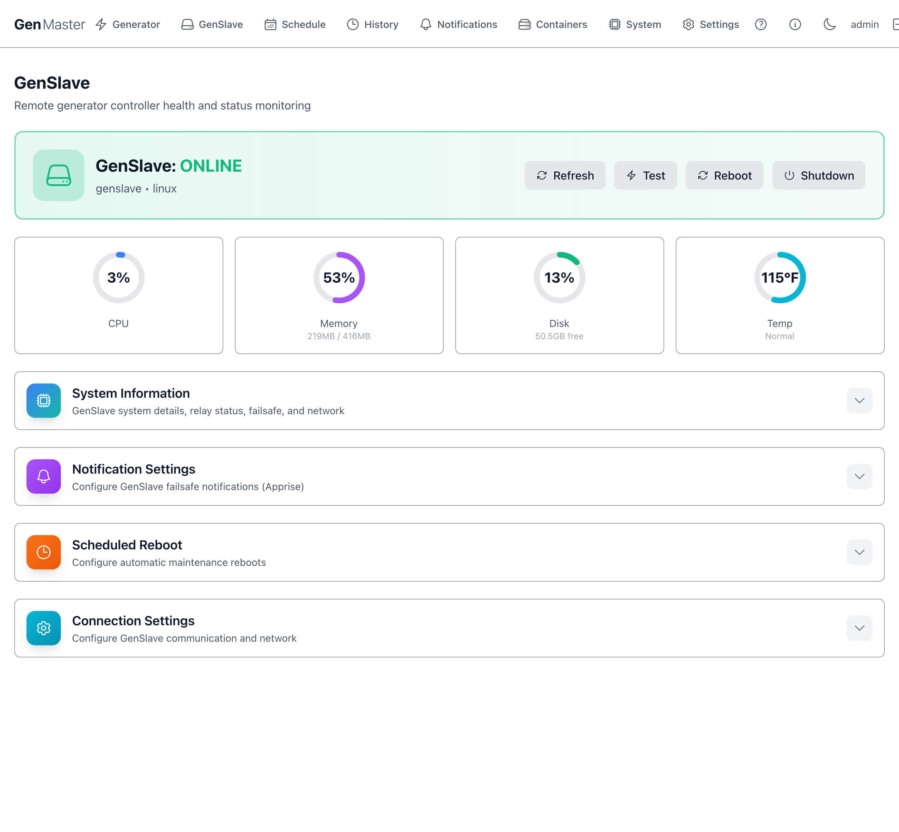
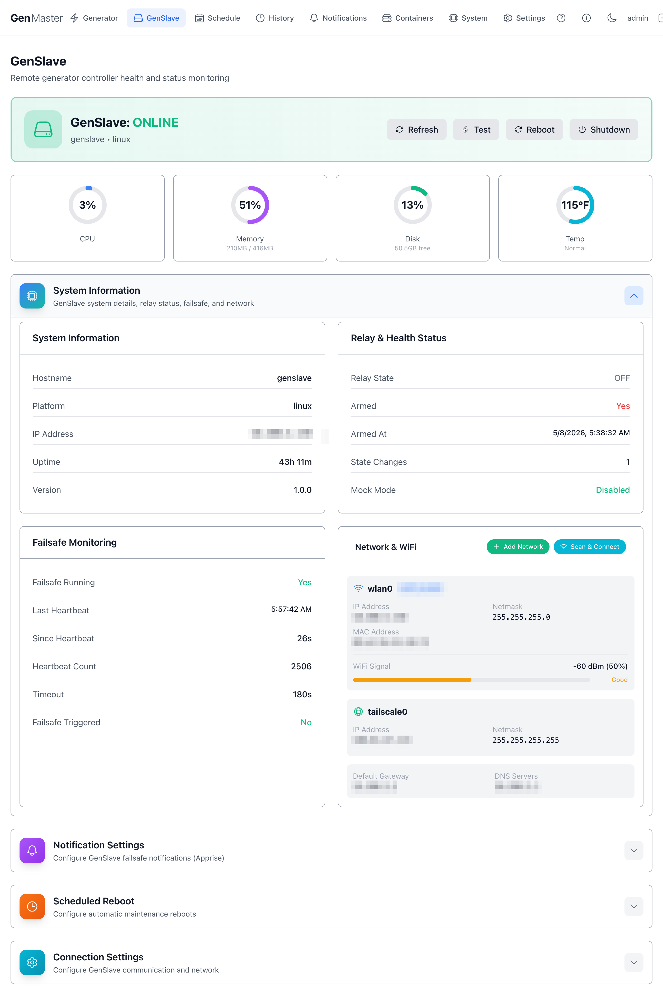
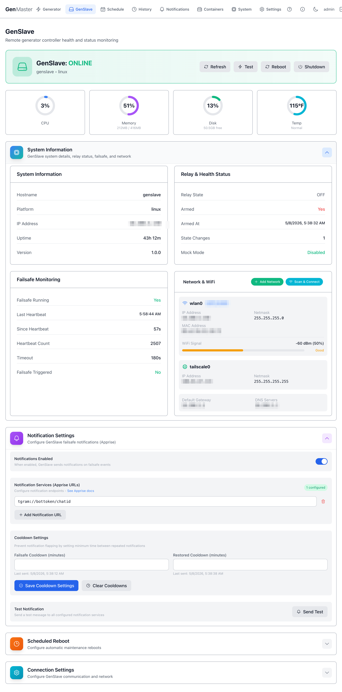
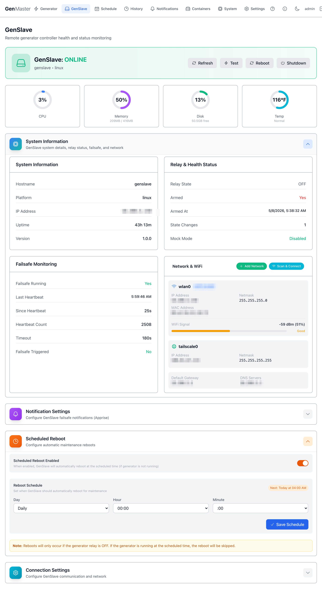
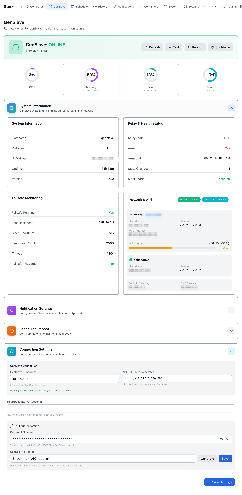

# GenSlave

The GenSlave page shows the live status of the remote relay controller — the Pi Zero 2W that physically opens and closes the generator's start contact. Use this page to confirm the slave is healthy, view its network configuration, change the API secret used between GenMaster and GenSlave, configure failsafe notifications, and schedule maintenance reboots.

## Header summary

The top of the page shows whether GenSlave is currently reachable, plus four action buttons:

| Field / Button | Meaning |
|----------------|---------|
| **GenSlave: ONLINE / OFFLINE** | Live status badge. Green ONLINE means GenMaster has received recent heartbeats. |
| **Hostname / Platform** (e.g. `genslave • linux`) | Identifies the slave device. |
| **Refresh** | Forces an immediate re-poll of the slave. |
| **Test** | Sends a ping to the slave's API to verify connectivity. |
| **Reboot** | Reboots the GenSlave host. Only allowed when the relay is OFF. |
| **Shutdown** | Powers off the GenSlave host. Only allowed when the relay is OFF. Use with care — you'll need physical access to power it back on. |

!!! danger "Reboot/Shutdown affect a remote device"
    Both buttons act on the GenSlave Pi, not on GenMaster. After a Reboot the slave will return on its own; after a Shutdown someone must physically restore power.

## At-a-glance health (CPU, Memory, Disk, Temp)

A row of four cards immediately below the header shows the slave's current resource usage. Numbers update on the refresh cadence (typically every 60 seconds).

| Metric | What it tells you |
|--------|-------------------|
| **CPU** | Percentage of CPU in use. Spikes during reboots and software updates. Sustained high values suggest a runaway process. |
| **Memory** | RAM in use vs. total. The Pi Zero 2W has only 416MB usable, so anything above ~80% should be investigated. |
| **Disk** | Free space on the SD card / SSD. |
| **Temp** | Core temperature. Above ~167°F (75°C) the Pi will throttle. **Normal**, **Warm**, **Hot** badges flag the current zone. |

## System Information

A collapsible panel showing the slave's identity and hostname, IP address (LAN), platform string, uptime, and software version. Click the row to expand.

When expanded you'll see:

- **Hostname** — the slave's network name (default `genslave`).
- **Platform** — `linux` (or `linux-mock` in dev mode).
- **IP Address** — LAN IP.
- **Uptime** — time since the slave's last boot.
- **Version** — slave software version.

The same panel also surfaces **Relay & Health Status** and **Failsafe Monitoring** sub-sections (documented in their own headings below).

!!! example "Sensitive data"
    The IP address shown in this panel is your slave's local LAN address. If you publish screenshots externally, mask the third and fourth octets.

## Relay & Health Status

Shows what the slave's automation relay is currently doing.

| Field | Meaning |
|-------|---------|
| **Relay State** | `OFF` or `ON`. This is the actual GPIO state on the Pimoroni Automation Hat Mini. |
| **Armed** | `Yes` / `No`. Mirrors the GenMaster arming state via heartbeat. The slave will refuse `relay/on` commands when disarmed. |
| **Armed At** | Timestamp the slave's local arm flag was last set true. |
| **State Changes** | Counter — how many times the relay has flipped since last reboot. |
| **Mock Mode** | Whether the slave is running with simulated GPIO. `Disabled` means real hardware. |

## Failsafe Monitoring

The independent watchdog that protects you if GenMaster goes silent.

| Field | Meaning |
|-------|---------|
| **Failsafe Running** | The watchdog thread is active. Should be `Yes` at all times. |
| **Last Heartbeat** | Wall-clock time of the most recent heartbeat received from GenMaster. |
| **Since Heartbeat** | Seconds since the last heartbeat. |
| **Heartbeat Count** | Lifetime counter (resets on slave reboot). |
| **Timeout** | How long the slave will wait without a heartbeat before forcing the relay OFF and (optionally) sending an Apprise alert. Calculated as 3× the GenMaster heartbeat interval — default `30s` with the default 10s interval. |
| **Failsafe Triggered** | If shown, the failsafe has fired since the last reset — clear it manually after diagnosing. |

!!! warning "Failsafe is your last line of defense"
    If GenMaster crashes, loses its database, or its network goes down, the failsafe ensures the generator does not run unattended forever. Don't disable it without good reason.

## Network & WiFi

Shows interface configuration for both the LAN/WiFi interface (`wlan0`) and the Tailscale interface (`tailscale0`).

For each interface you'll see IP address, netmask, MAC address, default gateway, DNS servers. The WiFi panel additionally shows signal strength (RSSI / percentage) with a `Good` / `Fair` / `Poor` badge.

Action buttons:

- **Add Network** — manually enter SSID + password to add a new known WiFi network to the slave's wpa_supplicant config.
- **Scan & Connect** — scan for nearby SSIDs and pick one to join.

!!! example "Sensitive data"
    The SSID and IP addresses on this panel identify your local network. Mask before sharing externally.

## Notification Settings

Click the row to expand. This is the slave's **independent** notification channel — separate from GenMaster's notifications. It fires when the failsafe trips, ensuring you get alerted even if GenMaster itself is unreachable.

| Field | Purpose |
|-------|---------|
| **Notifications Enabled** | Master toggle. |
| **Notification Services (Apprise URLs)** | One or more Apprise URLs (Telegram, Slack, email, ntfy, ...). Format examples: `tgram://bottoken/chatid`, `slack://...`, `mailto://...`. See the [Apprise wiki](https://github.com/caronc/apprise/wiki) for the full list. |
| **Add Notification URL** | Adds another row. |
| **Failsafe Cooldown (minutes)** | Minimum delay between failsafe alerts to avoid flapping. Default `15`. |
| **Restored Cooldown (minutes)** | Same idea for "GenMaster came back" notifications. Default `15`. |
| **Save Cooldown Settings** | Persist the two cooldown values. |
| **Send Test** | Sends a test notification to all configured URLs. Use after adding a new URL to confirm it works. |
| **Clear cooldown timers** | Lets the next event fire immediately, ignoring the cooldown. |

## Scheduled Reboot

A planned maintenance reboot — useful for keeping the slave fresh on long-running deployments.

| Field | Purpose |
|-------|---------|
| **Scheduled Reboot Enabled** | Master toggle. |
| **Day** | Day of week (or `Daily`). |
| **Hour / Minute** | Time-of-day to reboot (24-hour). |
| **Save Schedule** | Persist. |

!!! warning "Reboots only run when the relay is OFF"
    GenSlave will skip a scheduled reboot if the generator is currently running. The next attempt will be at the next scheduled time.

## Connection Settings

The most sensitive section on this page — it controls how GenMaster talks to GenSlave. Click the row to expand.

| Field | Purpose |
|-------|---------|
| **GenSlave IP Address** | IP that GenMaster uses. Edit and save to update both ends. |
| **API URL (auto-generated)** | Read-only — built from the IP and the fixed slave port `8001`. |
| **Heartbeat Interval (seconds)** | How often GenMaster pings the slave with the heartbeat. Default `10` — failsafe trips at 3× this interval (30s by default). Higher = less network noise; lower = faster failsafe. |
| **Current API Secret** | Hidden by default. Click the eye to reveal, the clipboard to copy. |
| **Change API Secret** | Type a new secret, or click the dice button to generate a random one. The Save action propagates the new key to both GenMaster and GenSlave at once. |

!!! danger "API secret rotation"
    Both ends MUST use the same key. The Save Settings flow is designed to rotate atomically — but if you ever update the key only on one side, GenMaster will start failing heartbeats and the failsafe will trigger.

!!! example "Sensitive data"
    Don't reveal the API secret in any screenshot you share externally.

## What's next

- Confirm the matching GenSlave-side `.env` is current: see [GenSlave Setup](../GENSLAVE.md).
- Configure independent failsafe alerts with [Notifications](notifications.md).
- Locked yourself out with a bad static-IP profile? See [Network Recovery](network-recovery.md).
