# Hardware Switches — EPO and HOA Selector

GenMaster supports two physical control switches that sit alongside the web UI: an **Emergency Power Off** mushroom button at the generator (GenSlave EPO), and a **Hand-Off-Auto** rotary selector at the operator location (GenMaster HOA). Both are optional — the system runs fine without either — but together they provide the kind of physical safety and operator control you expect from a production-grade generator setup.

This page is the operator reference for both switches: what they do, how to wire them, and what to expect when you use them.

## Why two switches in two different places?

The two switches solve different problems and live in different places on purpose.

| Switch | Location | Purpose | Enforcement |
|--------|----------|---------|-------------|
| **GenSlave EPO** | At the generator (with GenSlave) | Maintenance lockout — physical guarantee no one starts the generator while someone is servicing it. | **Hardware** — physically interrupts the start-relay circuit. Works even if the network is down or every Pi crashes. |
| **GenMaster HOA Selector** | At the operator location (with GenMaster) | Day-to-day mode selector: silence the generator overnight (Quiet), let automation run it (Auto), or run it manually (Run). | **Software** — GenMaster reads the switch position and adjusts behavior. |

The asymmetry is intentional. The EPO protects the **person** at the generator: a stuck contact or a software bug cannot start the generator while the EPO is engaged because the contact physically opens the circuit. The HOA helps the **operator** make routine choices, and its worst-case failure is "automation runs anyway" — which is exactly what happens today with no switch at all.

## Quick reference

| Situation | What to do |
|-----------|------------|
| Need to service the generator | Press the EPO mushroom button at the generator. Twist clockwise to release when done. |
| Want quiet hours overnight | Turn the HOA selector to **Quiet**. Manual web starts still work; everything else is suppressed. |
| Want quiet hours but need automation to fire just this once | Use the **Override** button on the Quiet banner — pick a duration, automation fires normally until it expires. |
| Want to run the generator manually for an hour | Turn the HOA selector to **Run**. Return it to Auto when done. |
| Want to test the wiring without parts attached | Set `HARDWARE_SAFETY_ENABLED=false` (GenSlave) and `HOA_SWITCH_ENABLED=false` (GenMaster). The monitors will skip startup. |

---

## Part 1 — The GenSlave EPO (Emergency Power Off)

The EPO is a 22 mm red mushroom button mounted near the generator. Pressing it does three things, all at once:

1. **Physically opens** the start-relay circuit. The generator cannot be started by any means until the button is released.
2. **Signals GenSlave** that the safety is engaged, via a separate NO contact on the same button block.
3. **Tells GenMaster** the next time a heartbeat happens (≤60 seconds).

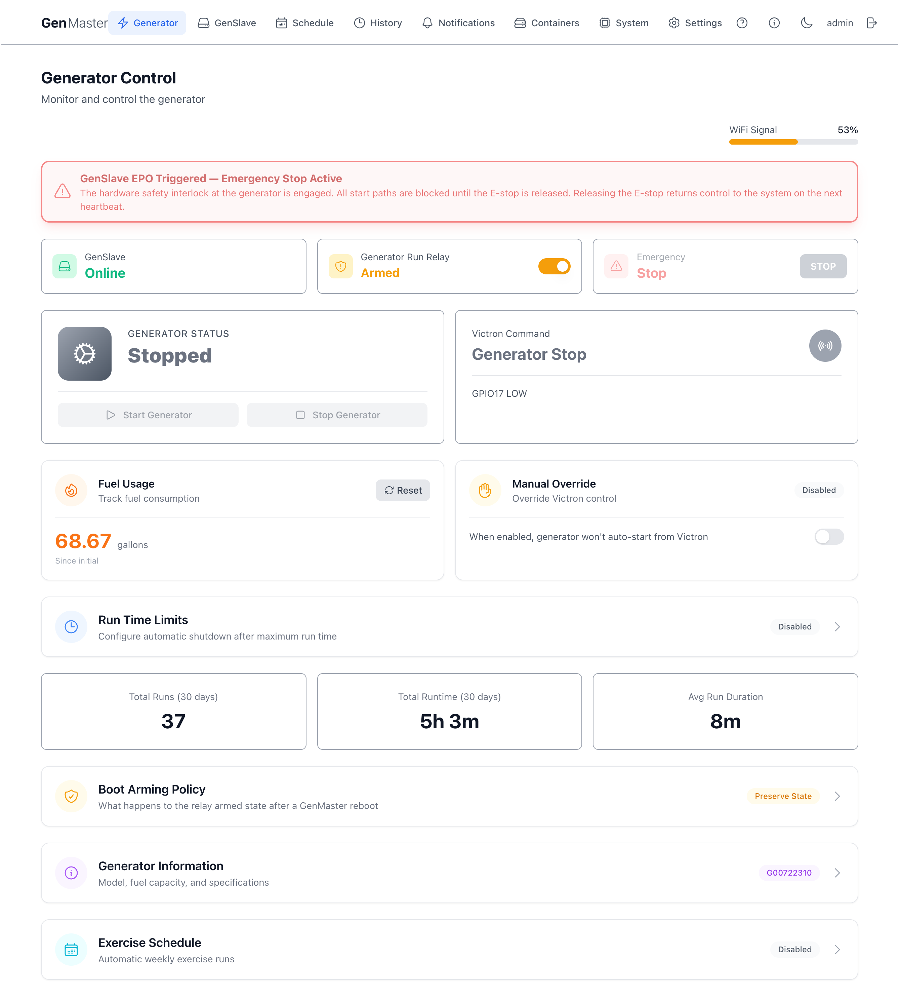

When the EPO is engaged you'll see a pulsing red banner across the top of the Generator page, the Emergency Stop button is dimmed (it can't do anything useful — the relay is already physically open), and both the **Start Generator** and **Stop Generator** buttons are visibly disabled. No clicks go through while the EPO is up — there's nothing to start, and the generator is already physically prevented from running.

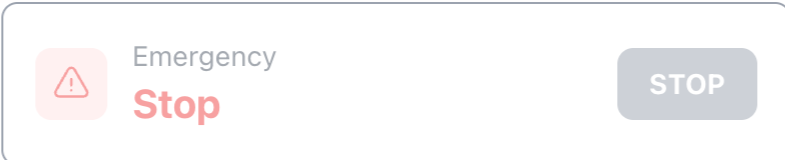{ width="420" }

The GenSlave LCD also changes — the line that normally reads "Generator: ARMED" is replaced with **"EPO SAFETY ON"** so anyone looking at the panel sees the state at a glance.

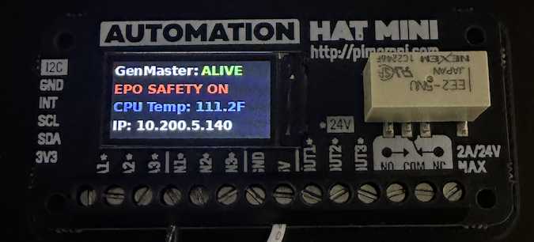{ width="360" }

### Bill of materials

| Part | Schneider P/N | Function |
|------|---------------|----------|
| Actuator | **XB4-BS542** | 22 mm red mushroom E-stop. Push to engage, twist clockwise to release. IP66 from the front. |
| Contact block | **ZB4-BZ104** | One NC + one NO contact in a single block, mechanically linked to the actuator. The NC contact carries the relay circuit; the NO contact signals GenSlave. |

Order from AutomationDirect, Mouser, or Digikey. Avoid no-name Amazon listings — counterfeit Schneider parts are common and defeat the point of paying for rated safety hardware.

### Wiring

The single button drives two contacts simultaneously.

**NC contact (terminals 11/12)** — wires in series with the GenSlave start-relay output, between the Pi Zero relay and the generator start input. When the EPO is released the NC contact is closed (circuit complete); when pressed it opens (circuit broken). This is the physical guarantee.

**NO contact (terminals 13/14)** — wires from the Auto Hat Mini's 5V terminal through the contact to the **IN1** input. When the EPO is pressed the NO contact closes, 5V appears at IN1, and the GenSlave hardware-safety monitor sees a HIGH input.

!!! warning "Auto Hat Mini polarity is the opposite of raw GPIO"
    The Pimoroni Auto Hat Mini inputs are opto-isolated and trigger on **applied voltage**, not on being grounded. Wire 5V through the NO contact to IN1 — the input reads HIGH when the contact is closed. This is the opposite of how raw Pi GPIO with internal pull-ups normally works.

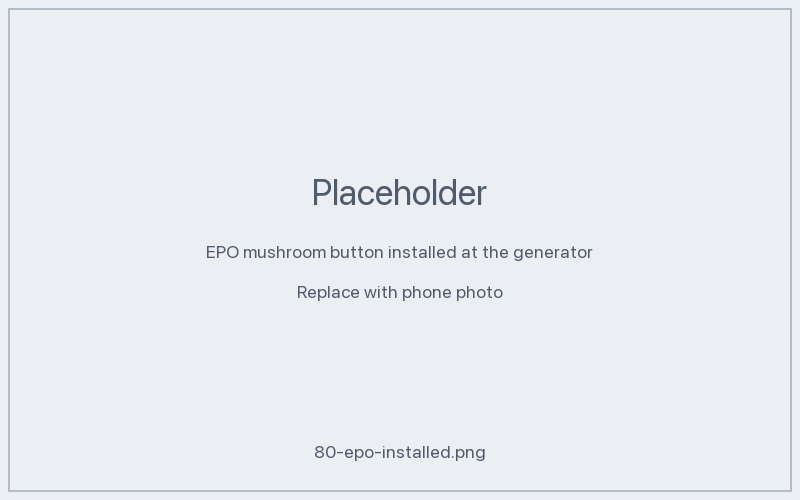
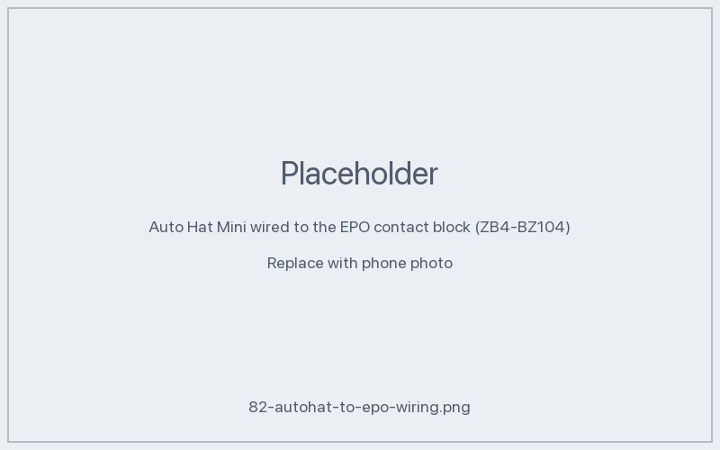

### What happens when you press the EPO

1. The NC contact in the start-relay circuit opens. The generator cannot start.
2. The NO contact closes. The GenSlave hardware-safety monitor (running at 25 ms poll, two-read debounce) notices within ~50 ms and:
   - Drops the relay if it was holding it on.
   - Sets `physical_safety_engaged = true` in the GenSlave state.
   - Updates the LCD to show `EPO SAFETY ON`.
3. The next heartbeat from GenMaster (within 60 s) carries the new state back to GenMaster, which:
   - Updates `system_state.slave_physical_safety_engaged = true`.
   - Pushes a `hardware_safety_engaged_genslave` notification.
   - Shows the red banner on the Generator page and dims the Emergency Stop card.
   - Refuses any new `start_generator()` call.

GenMaster's fast-poll loop (every ~5 s) also reads the EPO state from the relay-status endpoint, so the UI updates faster than 60 s in practice — the heartbeat is the slower of the two paths.

### Releasing the EPO

Twist the mushroom head clockwise. The button pops back up and:

1. The NC contact closes — the start-relay circuit is restored.
2. The NO contact opens — the GenSlave monitor sees the engagement clear.
3. GenSlave clears its `physical_safety_engaged` flag and the LCD goes back to `Generator: ARMED`.
4. On the next heartbeat (≤60 s, often sooner via fast-poll), GenMaster clears the same flag, the banner disappears, and the `hardware_safety_released_genslave` notification fires.

**Important: automation does not wait for you to "rearm" anything.** If Victron was still calling for the generator while the EPO was engaged, GenMaster will start it on the next heartbeat cycle once the EPO clears. This is by design — the EPO is a maintenance lockout, not a "stop automation" button.

!!! info "Auto-resume can take up to ~60 seconds"
    The EPO release is detected almost instantly on GenSlave, but GenMaster only learns about it on the next heartbeat. If you released the EPO and the generator doesn't restart for a minute, that's expected — wait for the next heartbeat. If it's been more than ~90 s and nothing has happened, check the GenSlave heartbeat is still flowing (Settings → External Services).

### Failure modes

| Failure | Behavior |
|---------|----------|
| EPO contact block goes bad (NC stuck open) | Relay circuit is broken even with the button released. The generator can't start. This is the **safe** failure mode — exactly what an E-stop is supposed to do. |
| EPO contact block goes bad (NO stuck closed) | GenSlave thinks EPO is engaged permanently. Generator can't be started until the contact is replaced. Also safe — fails toward "off". |
| Cable cut between EPO and Pi Zero | Both contacts open. NC open → relay circuit broken → generator can't start. NO open → GenSlave thinks EPO is released. The physical interrupt is what matters here, and it fails safe. |
| Auto Hat Mini IN1 fails | GenSlave hardware-safety monitor can't read the input. The NC contact still works (physical guarantee), so the generator still can't start while the EPO is pressed — you just won't see the state on the LCD or the GenMaster banner. |

The hardware path is the safety guarantee. The software path is for telling everyone else what's going on.

---

## Part 2 — The GenMaster HOA Selector

The HOA is a 22 mm 3-position rotary selector mounted near GenMaster, typically at the operator's main workspace. Three positions, three modes:

| Position | Label | Behavior |
|----------|-------|----------|
| Position 1 (CCW / left) | **Quiet** | Suppresses automatic generator runs (Victron, scheduled, exercise). Manual web starts still work. |
| Position 2 (center) | **Auto** | Normal automation behavior — Victron and scheduled runs fire as configured. Default position. |
| Position 3 (CW / right) | **Run** | Operator is explicitly requesting the generator. Behaves like a held manual start. Generator runs as long as the selector is in Run. |

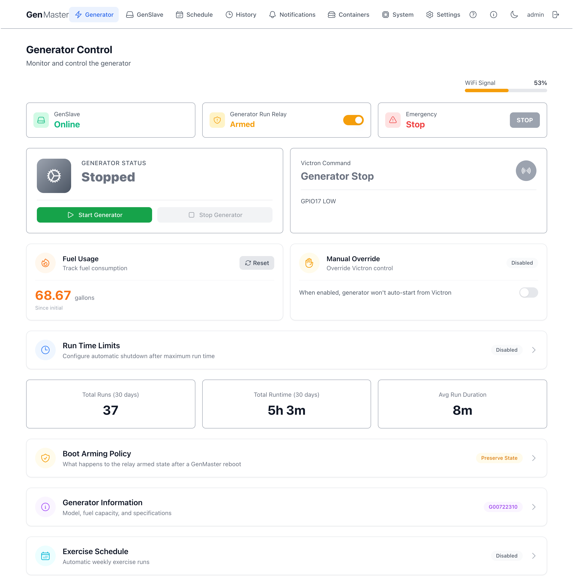

In Auto position you see no HOA banner — automation is running normally and there's nothing to call out. Quiet, Run, and a fault state each get a distinct banner.

### Bill of materials

| Part | Schneider P/N | Function |
|------|---------------|----------|
| Actuator | **XB4-BD33** | 22 mm 3-position rotary, stay-put in all positions. |
| Contact block | **ZB4-BZ103** | Two NO contacts in a single block, mechanically linked to the actuator's cam. Quiet position closes contact A; Run position closes contact B; center closes neither. |
| Legend plate (optional) | ZBY2-series | Printed QUIET / AUTO / RUN labels around the knob. |

### Wiring

GenMaster reads the two NO contacts on Pi 5 **GPIO22** (Quiet) and **GPIO27** (Run), both configured with internal pull-ups, active LOW. The third operator-side input (Victron, on GPIO17) has been on the Pi 5 header since the project's first release; placing HOA on GPIO22 and GPIO27 keeps all three signals on a tight block of header pins so a single ribbon cable from the Pi can drive the whole switch panel.

| Pi 5 header pin | BCM GPIO | Connects to |
|-----------------|----------|-------------|
| Pin 9 | GND | Common for all switch contacts (HOA block A, HOA block B, Victron contact). |
| Pin 11 | GPIO17 | Victron / Cerbo GX generator-request relay (pre-existing). |
| Pin 13 | GPIO27 | HOA contact B NO — closes when the selector is in **Run**. |
| Pin 15 | GPIO22 | HOA contact A NO — closes when the selector is in **Quiet**. |

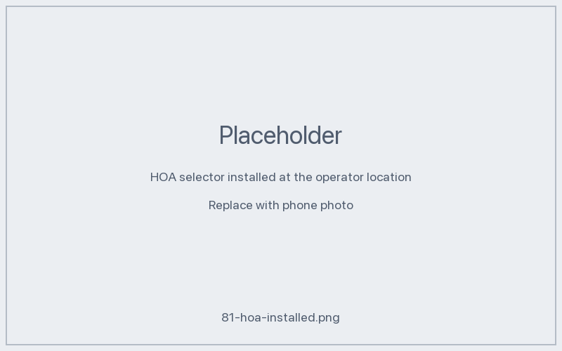
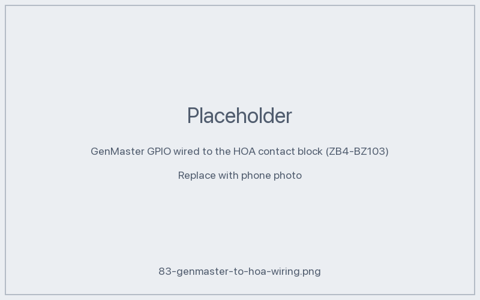

If you want to change the pin assignments, the **GPIO Assignments** panel under **System → Hardware** writes the values to `.env` and takes effect on the next GenMaster restart (the pins are bound when the monitors start, so they can't be hot-reassigned).

Validation runs live as you type:

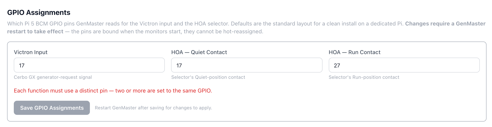
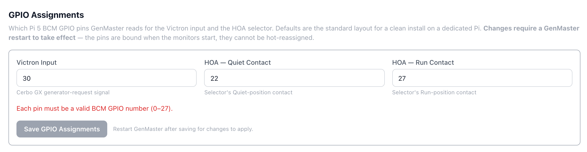

After a successful save, the panel shows the running pins until the restart applies the change:

### Boot delay

When GenMaster starts up, the HOA monitor waits **30 seconds** before honoring the selector position. This avoids spurious state transitions during boot — if the selector is sitting in Quiet when the container starts, the monitor reads "Auto" for the first 30 s, then transitions to "Quiet" once boot stabilizes. Without the delay you'd get a useless "boot-time HOA changed to Quiet" notification on every restart.

The delay is configurable via `HOA_BOOT_DELAY_SECONDS` in `.env`. Set it to `0` for bench testing.

### What each position does

#### Quiet

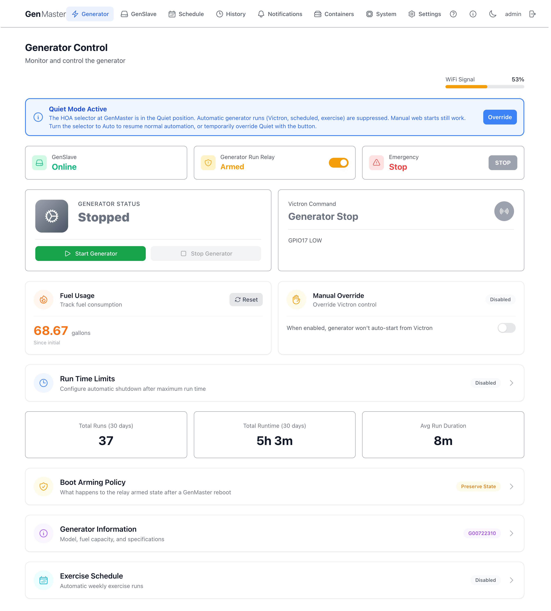

While the selector is in Quiet:

- Victron generator-request signals are **ignored**.
- Scheduled runs are **skipped** (logged as skipped, not run).
- The exercise schedule is **suppressed**.
- Manual web starts (the green Start Generator button) still work.
- A blue banner appears on the Generator page with an **Override** button for one-off overrides (see below).

The intended use is "I don't want the generator running tonight, but I still want to be able to start it manually if something happens." When you turn the selector back to Auto, automation resumes immediately — no separate confirmation needed.

#### Run

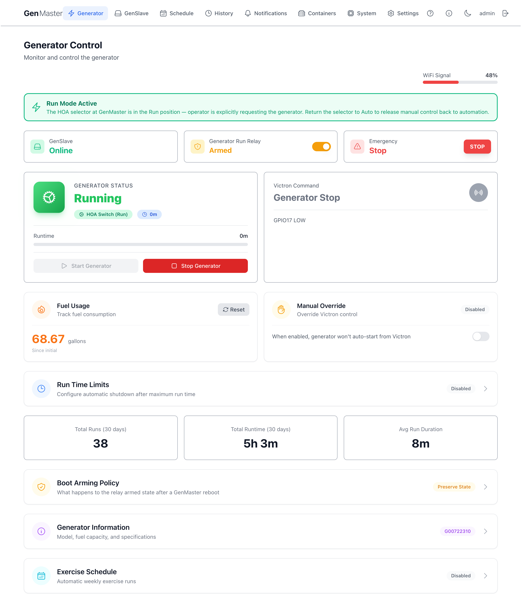

The Run position behaves like a held manual start. When you turn the selector to Run:

- GenMaster issues a start command immediately (subject to the usual guards — EPO not engaged, GenSlave online, etc.).
- The run is logged with the `local_switch_genmaster` trigger so the History page shows it came from the physical selector.
- As long as the selector stays in Run, the generator stays running. Victron, schedule, and exercise commands are ignored because the operator is explicitly driving things.
- When you turn the selector back to Auto, the run ends with the `local_switch_genmaster_end` stop reason.

If a Victron-triggered or scheduled run is already in progress and you turn the selector to Run, GenMaster reclassifies the existing run to `local_switch_genmaster` rather than restarting — the generator stays on, the trigger attribution just gets updated.

In the History page, HOA-triggered runs show with their own badge so you can tell physical-switch runs apart from automation-triggered ones:

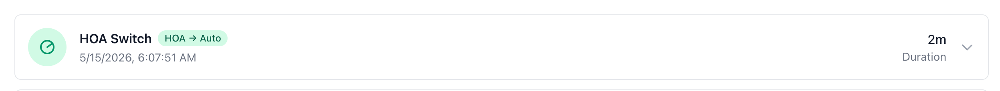

#### Fault

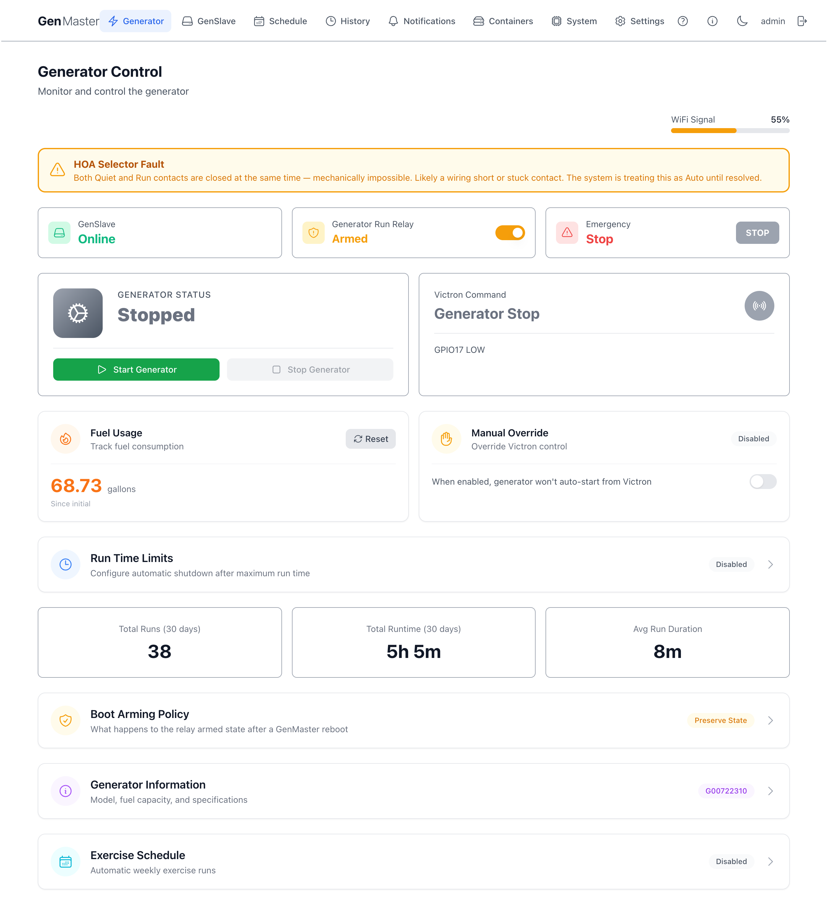

If both contacts read closed at the same time, that's mechanically impossible — the rotary cam closes one at a time. The HOA monitor reports this as a **fault** and treats the selector as if it were in Auto until the condition clears. You'll see an amber banner explaining what's happened. The likely cause is a wiring short or a stuck contact; check the block and the cable.

The same fault is also visible on the **System → Hardware** tab — the HOA Selector card flips to an amber FAULT badge:

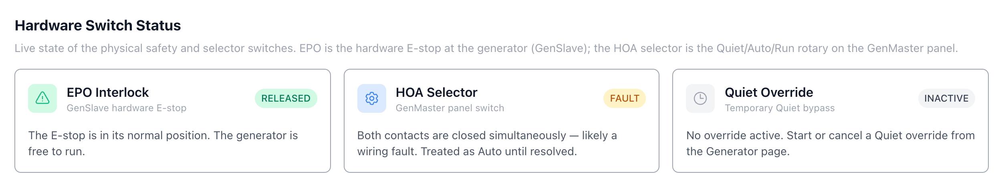

### Failure modes

| Failure | Behavior |
|---------|----------|
| HOA cable cut | Both contacts read open → monitor reads "Auto". Automation runs normally. **Fails toward operating** — which is correct here because HOA is convenience, not safety. |
| HOA contact A (Quiet) stuck closed | Monitor permanently reads Quiet. Automation is suppressed. Operator can override or fix the contact. |
| HOA contact B (Run) stuck closed | Monitor permanently reads Run. Generator runs continuously until the contact is fixed. The EPO at the generator is the way out of this if you can't reach the switch quickly. |
| Both contacts closed | Reported as fault, treated as Auto. |
| GenMaster boots with the selector in Quiet | First 30 s reads as Auto; transitions to Quiet at 30 s. One Quiet notification fires, as expected. |

---

## Quiet override

The **Quiet override** lets you temporarily ignore the HOA selector being in Quiet without having to physically turn the knob. Useful when the selector is in Quiet for the night but Victron decides the batteries need a 15-minute top-up.

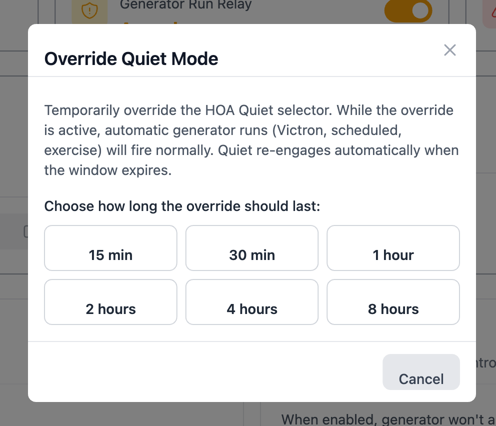

### Starting an override

Click the **Override** button on the blue Quiet banner. The modal asks for a duration in minutes — pick whatever makes sense for the use case (10 minutes for a quick top-up, 2 hours for a longer run). There's no default; the operator chooses every time.

While an override is active:

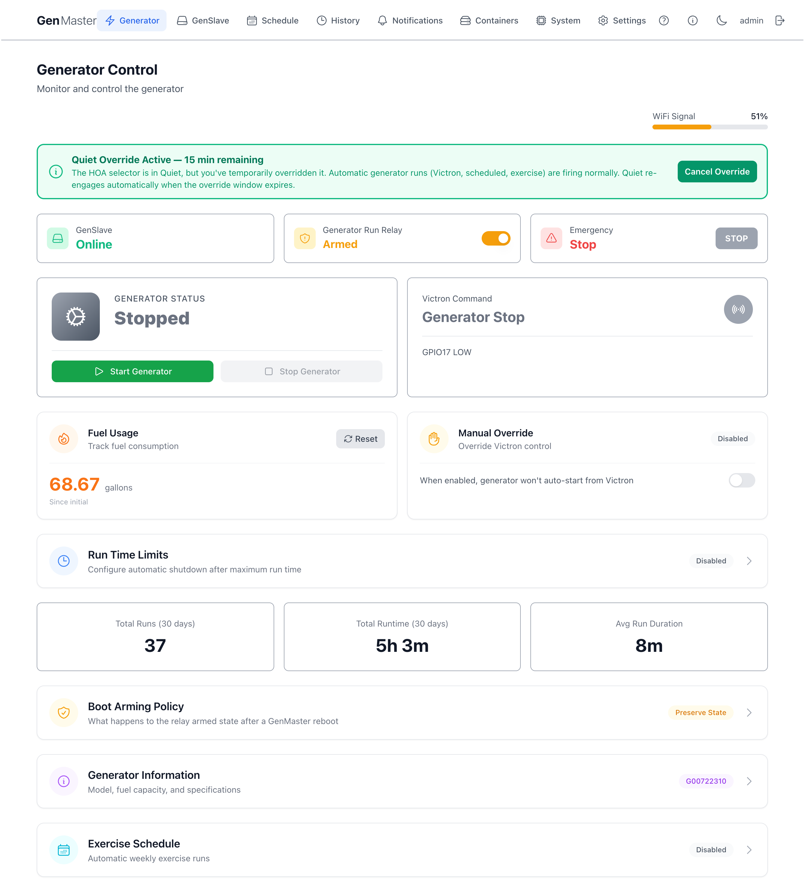

- The banner turns green and shows the time remaining.
- A **Cancel Override** button appears in place of Override.
- Automation fires normally as if the selector were in Auto.
- The selector itself is still physically in Quiet — the override doesn't move the knob.

### Cancelling an override

The override clears automatically in three ways:

1. **Timer expires.** Quiet re-engages immediately, the banner returns to blue.
2. **You click Cancel Override.** Same effect, immediately.
3. **You turn the HOA selector out of Quiet.** Because the override only exists to bypass Quiet, leaving Quiet clears the override. If you turn the selector to Run, Run takes over and the override goes away.

The override survives a GenMaster restart — if the container is killed mid-window, the remaining time is reconciled on boot. If the selector was moved out of Quiet during the downtime, the override is cleared.

---

## Combined states — when EPO meets HOA

The two switches are independent and either can be active without the other. When **both** are active, the EPO always wins (the generator physically cannot start) and the HOA banner adjusts its wording to acknowledge it.

### EPO engaged while HOA is in Run

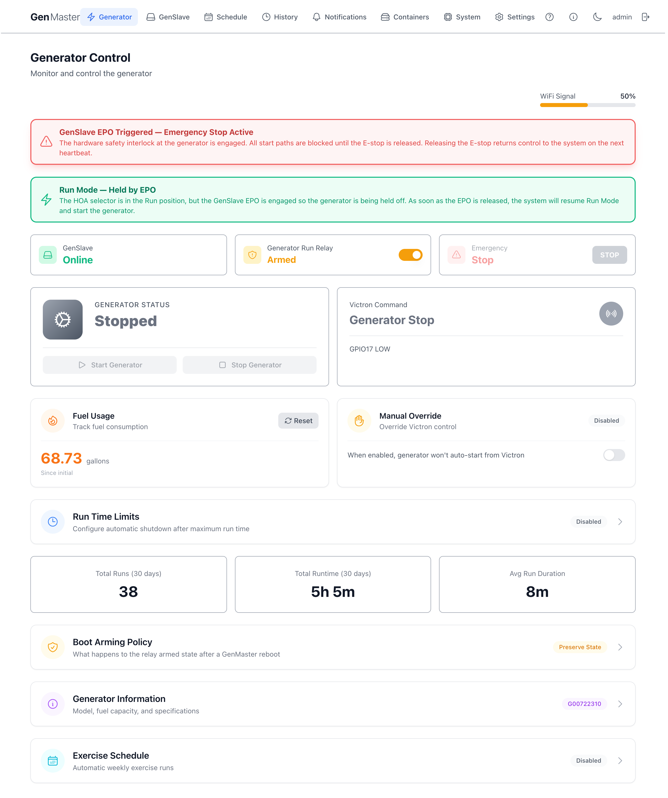

The Run banner changes from "Run Mode Active" to **"Run Mode — Held by EPO"** with body text explaining that the selector is still requesting the generator but the EPO is holding it off. As soon as the EPO is released, GenMaster resumes Run mode and starts the generator on the next heartbeat.

### EPO engaged while HOA is in Quiet

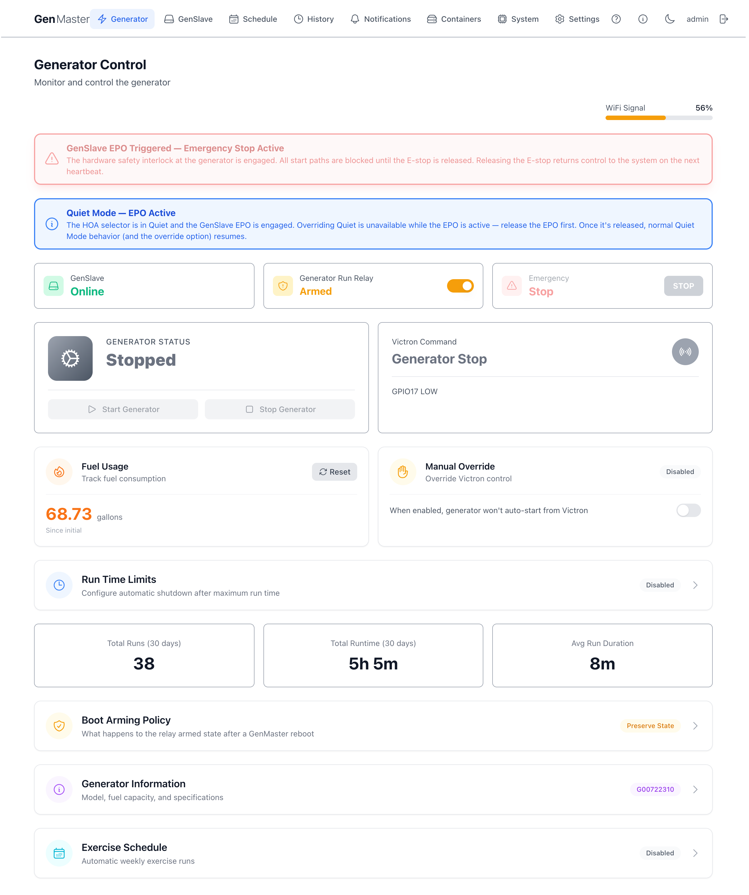

The Quiet banner changes to **"Quiet Mode — EPO Active"** and the **Override** button is hidden — you can't override Quiet while the EPO is engaged, because overriding Quiet only matters if the generator could otherwise run, and the EPO has already made that impossible. Release the EPO first, then override Quiet if you still want to.

---

## System → Hardware tab — at-a-glance status

The **Hardware** tab on the System page mirrors the live state of both switches plus the Quiet override in one place. When everything is normal you see three quiet cards (EPO Interlock RELEASED, HOA Selector AUTO, Quiet Override INACTIVE):

When something is active, the cards change colour and badge:

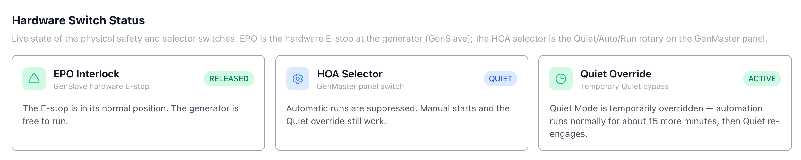

This view is the fastest way to confirm what the system thinks the hardware is doing — useful when the Generator page banners aren't quite telling you what you expected.

---

## Troubleshooting

### "I released the EPO but the generator didn't restart"

Give it 60 seconds. GenMaster only learns the EPO state from the GenSlave heartbeat, which runs once a minute. The fast-poll loop usually catches it sooner, but in the worst case you'll wait for the next heartbeat. If it's been more than 90 seconds:

- Check the GenSlave LCD — does it still show `EPO SAFETY ON`? If yes, the EPO is still detected as engaged. Check the NO contact block and the cable to the Auto Hat Mini.
- Check GenSlave connectivity in System → External Services. If heartbeats have stopped, GenMaster won't know about the release until the connection is restored.

### "The HOA banner says 'Selector Fault'"

Both Quiet and Run contacts are reading closed at the same time. Mechanical the rotary can't do that — the cam only closes one position. Likely causes:

- A wire pinched or shorted between the contact block and the Pi 5 header.
- A stuck contact inside the ZB4-BZ103 block (rare, but possible if the block has been abused).
- Wiring crossed — Quiet wire connected to Run terminal and vice versa, with both contacts genuinely closed (unlikely but worth a sanity check on first install).

While the fault is active, the monitor treats the selector as Auto. Automation continues to work. Fix the wiring or replace the block and the banner will clear on the next state-change event.

### "I turned the HOA to Run but nothing happened"

A few possible reasons in priority order:

1. **EPO is engaged.** Check for the red EPO banner — Run can't start the generator while the EPO physically holds the start circuit open. The Run banner will say "Run Mode — Held by EPO". Release the EPO.
2. **Boot delay is still active.** If GenMaster restarted within the last 30 seconds, the HOA monitor is in its boot grace window. Wait.
3. **GenSlave is offline.** Run, like all start paths, needs GenSlave to be reachable.
4. **Wiring.** Test the Run contact with a multimeter — does it actually close when the selector is in Run?

### "The notification spam is too much"

The system has a global rate limit (default 25 notifications per hour) and per-event cooldowns to prevent flapping. If you're hitting the limit:

- Check the cooldown settings in **System → Notifications**. Each event type has its own cooldown — increase the cooldown on noisy events like `hardware_safety_engaged_genslave` if you're testing the EPO a lot.
- The "Rate Limit Exceeded" alert itself is sent **at most once per hour** so it doesn't pile on. If you got it, the system was actively suppressing other notifications — that's working as intended.

### "I want to disable a switch entirely"

Both monitors have an enable flag:

- `HARDWARE_SAFETY_ENABLED=false` in the GenSlave `.env` disables the EPO monitor. The NC contact still physically opens the start circuit (it's hardware) — disabling the monitor just stops the LCD/notification side. Set to `false` only if the EPO isn't wired yet.
- `HOA_SWITCH_ENABLED=false` in the GenMaster `.env` disables the HOA monitor. The selector position is no longer read; the system behaves as if it were always in Auto.

Restart the affected container for the change to take effect.

---

## Notifications fired by these switches

Each state change pushes a corresponding notification event so you can route them to whatever channel you prefer (SMS, Discord, email, Pushover, etc.). The new events are visible in **Notifications → Configure**, split between the Generator and GenSlave sections.

The Generator section holds the HOA, Quiet override, and manual-run events:

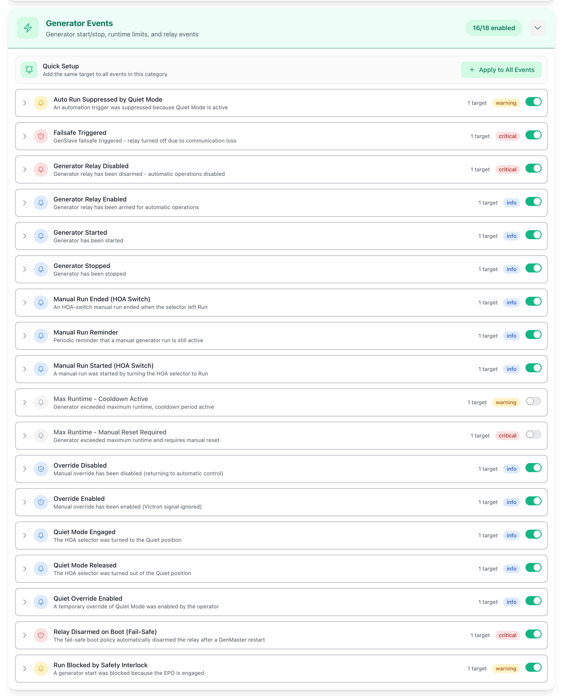

The GenSlave section holds the two EPO events:

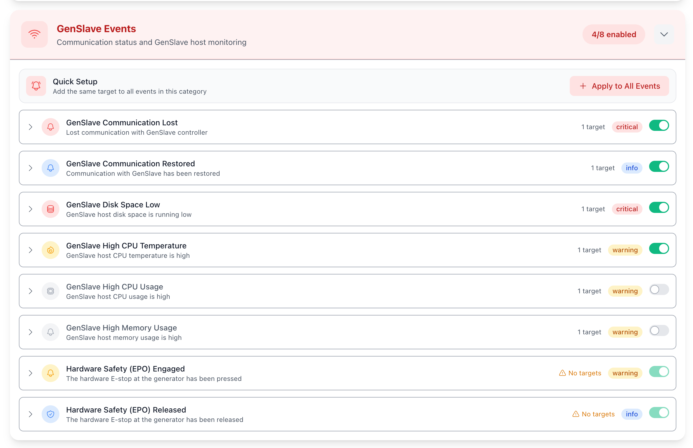

By default each new event has no routing target — assign one or more channels to the events you actually want to be notified about. See [Notifications](notifications.md) for the full routing workflow.

---

## Cross-references

- **Wiring details and design rationale** — `.claude/failsafe.md` (developer-internal master design doc).
- **Generator page behavior** — [Generator Control](generator.md).
- **System page Hardware tab + GPIO Assignments** — [System](system.md).
- **Notification routing for these events** — [Notifications](notifications.md).
- **What to do if the network goes down** — [Network recovery](network-recovery.md). The EPO still works without the network; the HOA selector position is read locally on GenMaster and doesn't require network connectivity either.
