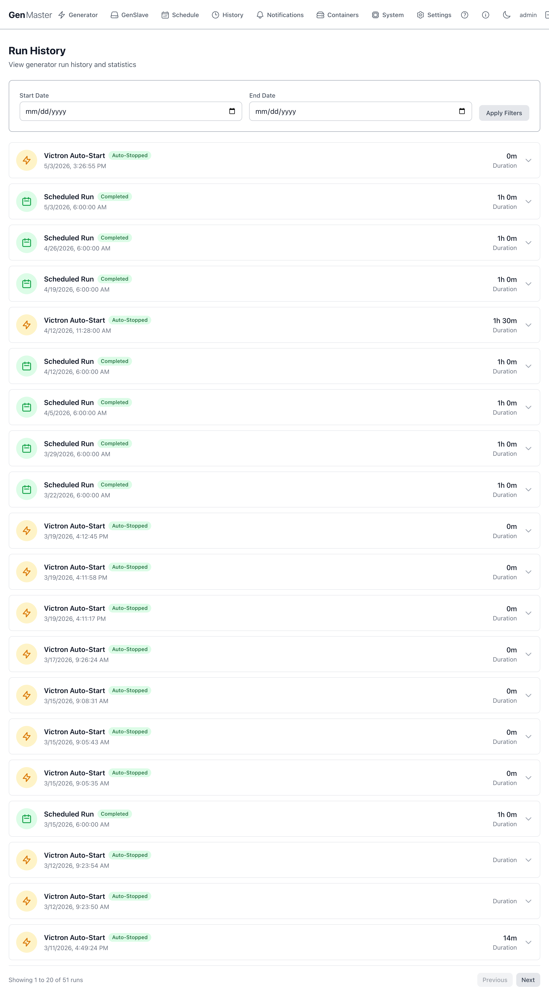

# Run History

The Run History page is the audit log for your generator. Every start and stop event — whether triggered by Victron, a schedule, or a manual action — is recorded here with its trigger source, status, start time, and duration.



## Filters

Two date pickers let you narrow the list:

| Field | Behavior |
|-------|----------|
| **Start Date** | Earliest start time to include. Leave blank for no lower bound. |
| **End Date** | Latest start time to include. Leave blank for no upper bound. |
| **Apply Filters** | Refreshes the list with the new bounds. |

The filters apply to the start time of each run — runs that began before the start date but ended after will be excluded.

## Run rows

Each row in the list represents a single run with the following information:

| Field | Meaning |
|-------|---------|
| **Trigger** | What caused the run to start: |
| | • **Victron Auto-Start** — Cerbo GX raised the GPIO signal. |
| | • **Scheduled Run** — a cron schedule fired. |
| | • **Manual Start** — operator clicked Start in the UI. |
| | • **Exercise Run** — automated weekly/biweekly maintenance run. |
| **Status** | What happened: |
| | • **Completed** — ran to its planned duration without issue. |
| | • **Auto-Stopped** — Victron released the signal or the schedule duration expired. |
| | • **Manual Stop** — operator clicked Stop. |
| | • **Failed** — start or stop command returned an error. |
| | • **Power Loss** — GenMaster reboot orphaned the run record. |
| **Start time** | Wall-clock timestamp the run began. |
| **Duration** | Total elapsed time between start and stop. Empty if the run is still in progress or was orphaned. |

!!! tip "Reading the trigger column"
    A long sequence of short Victron Auto-Start runs (under 5 minutes each) often means your battery SOC is right at the trigger threshold and Victron is bouncing. Consider widening the deadband on the Cerbo GX, or enabling [Run Time Limits → Minimum Run Time](generator.md#run-time-limits).

## Pagination

20 runs per page. Use **Previous** / **Next** at the bottom to navigate. The "Showing X to Y of Z runs" label tells you how many records match your current filters.

## Interpreting common patterns

| Pattern | Likely meaning |
|---------|----------------|
| Many short Victron runs in a tight window | SOC bouncing across threshold — adjust Cerbo deadband. |
| Scheduled runs in **Failed** state | GenSlave was offline or disarmed at trigger time. Check [GenSlave](genslave.md) for connection issues. |
| Long gaps between any runs | Generator hasn't run for a while — consider adding an [Exercise Schedule](generator.md#exercise-schedule). |
| **Power Loss** entries | GenMaster crashed mid-run. The state machine recovers safely on reboot but you should check `docker compose logs genmaster` for the underlying cause. |

## Fuel consumption (per-run)

If you've configured the [Generator Information](generator.md#generator-information) section with fuel rates, each completed run also includes an estimated fuel-used figure visible when you expand the row (UI permitting). The cumulative total is shown on the Generator page in the Fuel Usage card.

## Exporting

The Run History page itself doesn't ship an export-to-CSV button in this version. To extract the raw data:

```bash
docker compose exec genmaster_db psql -U genmaster -d genmaster \
  -c "COPY (SELECT * FROM generator_runs ORDER BY start_time) TO STDOUT WITH CSV HEADER;" > runs.csv
```

## What's next

- Add new schedules from [Schedule](schedule.md).
- Tune Victron behavior in [Victron Integration](../VICTRON.md).
