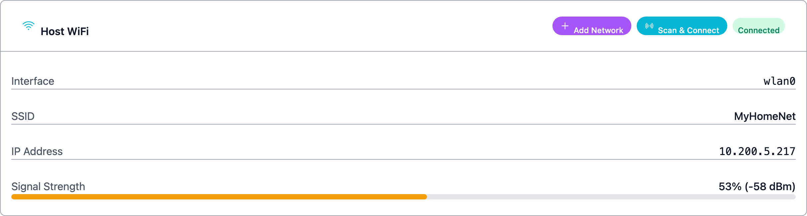
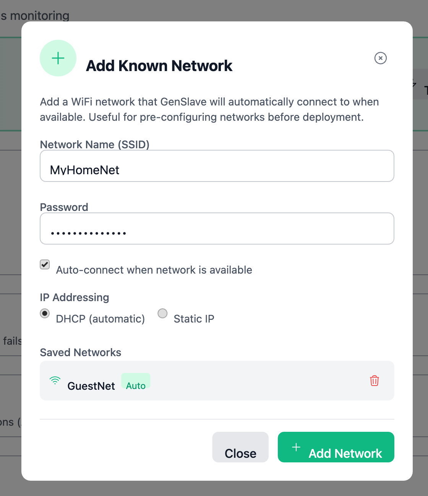
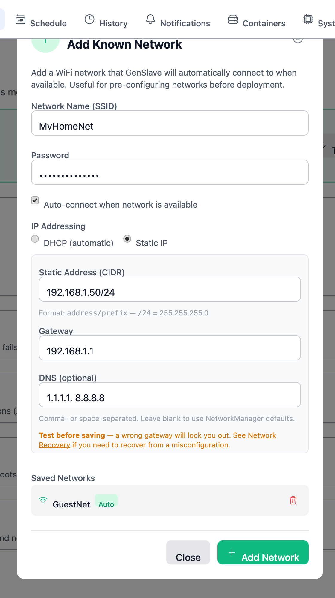
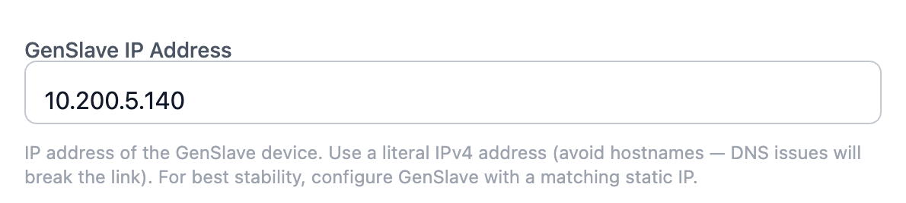
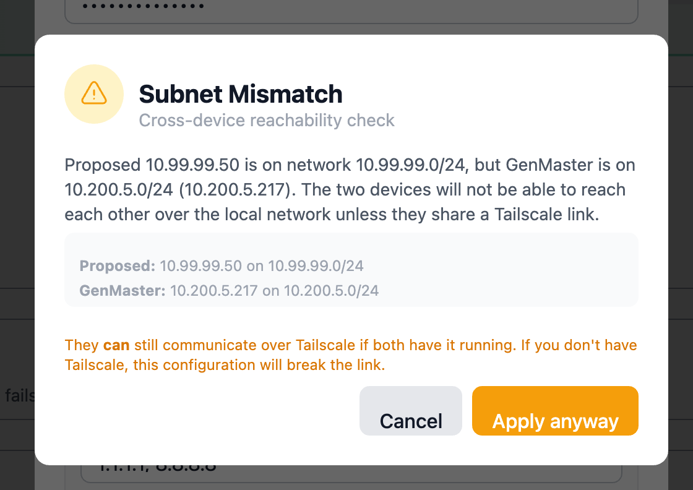
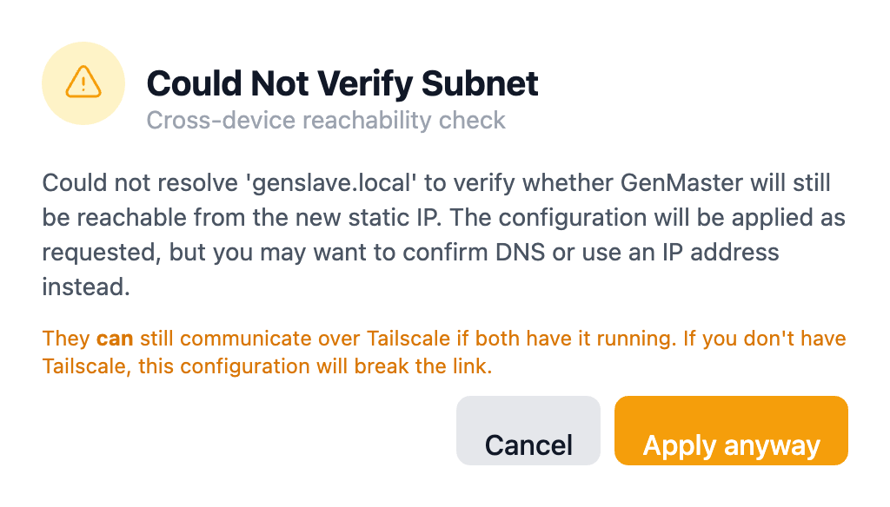
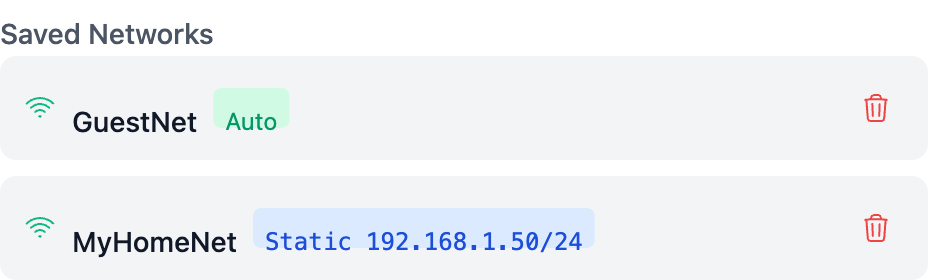

# Network Configuration

This page covers everything related to setting up the network connections that GenMaster and GenSlave use — both their own WiFi profiles and the link between them. If you've just locked yourself out by saving a bad configuration, jump straight to [Network Recovery](network-recovery.md).

<!-- TODO: capture network-config-00-overview.png — wide shot of the System page Network sub-tab with the Add Known Network button visible -->

## Where to configure

There are three places network configuration lives in the UI:

| Where | What it controls |
|-------|------------------|
| **System → Network → Add Known Network** | GenMaster's own WiFi profiles. Used when GenMaster needs to remember additional networks (a backup hotspot, a different SSID at a second site, etc.). |
| **GenSlave → Add Network** | GenSlave's WiFi profiles. The GenMaster UI sends these to the slave over the API, then the slave's NetworkManager saves them. |
| **Settings → GenSlave Configuration → GenSlave IP Address** | The IP GenMaster uses to reach GenSlave. Discussed in detail [further down](#how-genmaster-reaches-genslave). |

All three flows go through the same backend pattern (NetworkManager + `nmcli`) and share the same field set.

## DHCP vs static — when to choose which

| You should pick... | When |
|--------------------|------|
| **DHCP** (default) | You don't have a strong reason to assign a fixed IP. Your router hands out an address; the device uses it. Most home installs. |
| **Static IP** | You need a stable, predictable address — typically because the GenSlave IP field on GenMaster needs to point at it consistently across reboots, your router's DHCP lease pool is small or unreliable, or you've reserved part of the subnet for fixed devices. |

The two devices don't have to match — GenMaster can be DHCP while GenSlave is static, or vice versa. What matters for GenMaster→GenSlave communication is whether the **address GenMaster has saved for GenSlave** stays correct.

!!! tip "DHCP reservations are an alternative to static IPs"
    Most home routers let you reserve a specific IP for a specific MAC address. The Pi gets the same IP every time but the assignment lives on the router, not the Pi. If your router supports it, this is often easier than configuring a static IP on the Pi itself — and you can't lock yourself out with a typo in the gateway.

## Field reference

When you click **Add Network**, the modal looks like this in DHCP mode:

<!-- TODO: capture network-config-01-add-network-dhcp.png — Add Network modal in default (DHCP) state, on either System or GenSlave page -->

Switching the IP Addressing toggle to **Static IP** reveals three more fields:

<!-- TODO: capture network-config-02-add-network-static.png — same modal with Static IP selected, showing CIDR/Gateway/DNS fields filled in -->

| Field | Required? | Notes |
|-------|-----------|-------|
| **Network Name (SSID)** | Yes | The WiFi network's broadcast name. Max 32 characters. |
| **Password** | Yes | WPA/WPA2 passphrase. 8–63 characters. |
| **Auto-connect** | No (default on) | If enabled, the device connects to this network automatically whenever it's in range. Disable for "backup-only" profiles. |
| **IP Addressing** | Yes | `DHCP` (router assigns the IP) or `Static IP` (you assign it). |
| **Static Address (CIDR)** | When static | e.g. `192.168.1.50/24`. CIDR format — see the table below. |
| **Gateway** | When static | The router's IP on this subnet. e.g. `192.168.1.1`. |
| **DNS** (optional) | When static | Comma- or space-separated list of DNS server IPs. e.g. `1.1.1.1, 8.8.8.8`. Leave blank to inherit NetworkManager's defaults. |

### CIDR cheat sheet

| CIDR | Netmask | Hosts per subnet | Use when |
|------|---------|------------------|----------|
| `/24` | `255.255.255.0` | 254 | Default for most home networks (e.g. `192.168.1.0/24`). |
| `/23` | `255.255.254.0` | 510 | Two adjacent /24s combined. |
| `/16` | `255.255.0.0` | 65,534 | Larger flat networks. |
| `/22` | `255.255.252.0` | 1022 | Mid-size flat networks. |

If you don't know what your router uses, log into its admin page and look at the LAN configuration. Don't guess.

## How GenMaster reaches GenSlave

GenMaster talks to GenSlave over a single TCP connection, configured in **Settings → GenSlave Configuration → GenSlave IP Address**.

<!-- TODO: capture network-config-05-genslave-ip-helper.png — close-up of the GenSlave IP Address field with the new helper text visible -->

The IP you put there can be one of two kinds, and the choice has consequences.

### Option A — Local LAN IP

- Looks like `192.168.1.50` (or whatever your local subnet uses)
- Works when both Pis sit on the same local network: same router, same /24
- Lowest latency, no third-party dependency
- Breaks the moment the two Pis are on different networks the local router can't bridge

### Option B — Tailscale IP

- Looks like `100.x.y.z` — Tailscale's CGNAT range
- Works regardless of where each Pi is: different rooms, different houses, different countries
- Adds the Tailscale daemon as a moving part (auth refresh, occasional relay hops)
- Requires both Pis joined to the same tailnet

### Which should I use?

| Situation | Recommendation |
|-----------|----------------|
| Both Pis on the same WiFi router, same subnet | Either works. Local IP is simpler. |
| Both at home but on different VLANs / SSIDs that don't route to each other | Tailscale |
| Pis at different sites (different ISPs, different properties) | Tailscale |
| You also want to reach GenMaster remotely from off-site | Tailscale (it gives you both local-link and admin remote access for free) |

!!! tip "Advanced users: routed RFC 1918 subnets"
    If you control your own router and know what a static route is, you *can* put GenMaster on `192.168.1.0/24` and GenSlave on `192.168.2.0/24` and add routing entries on your router so the two subnets reach each other directly. Both subnets are RFC 1918 (private), so this works without NAT or a VPN.

    **This is not the recommended path.** If the terms "static route," "next-hop," or "RFC 1918" aren't familiar, ignore this option and either put both Pis on the same subnet or use Tailscale. The configuration UI will warn you about cross-subnet setups — the warning is *overridable*, but only override it if you genuinely know how packets get from one subnet to the other on your network.

### Always use a literal IP, never a hostname

The **GenSlave IP Address** field accepts anything, but you should always type a literal IPv4 address (e.g. `192.168.1.50` or `100.x.y.z`). Hostnames like `genslave.local` work *until* DNS breaks — and when DNS breaks, GenMaster loses its slave, the heartbeat stops, and the failsafe trips.

Using an IP also makes the [subnet sanity check](#subnet-sanity-check) below more accurate — it can compare addresses without a DNS round-trip.

## Subnet sanity check

When you save a static-IP profile, the form checks whether the address you're assigning would put the two devices on different networks. The check is **only run for static assignments** — DHCP-configured profiles skip it. There are two possible warnings:

### Subnet mismatch

<!-- TODO: capture network-config-03-subnet-warning.png — the Subnet Mismatch modal with proposed/other-device IPs visible -->

Triggered when:

- The proposed IP and the other device's current IP fall in different networks (computed using the *prefix you chose* for the new assignment), AND
- The other device is **not** already reachable on a Tailscale address (`100.64.0.0/10`)

If you see this and don't have Tailscale running, **Cancel** and check your numbers — most likely you typo'd the subnet. If you understand exactly what you're doing (e.g. you're the routed-subnets operator above, or you're moving GenSlave to a new network and Tailscale is going to handle the link), click **Apply anyway**.

### Could not verify subnet

<!-- TODO: capture network-config-04-could-not-verify.png — the Could Not Verify modal (rare; surfaces only when SLAVE_API_URL contains an unresolvable hostname) -->

Triggered when GenMaster couldn't resolve the configured **GenSlave IP Address** to an actual IP — usually because someone put a hostname in there and DNS is broken or slow.

This is your cue to fix the GenSlave IP Address field (use a literal IP — see above), then retry. The current configuration will be applied if you click **Apply anyway**, but you're flying blind on the subnet check.

## Reading the saved networks list

After you add a network, it appears in the **Saved Networks** list inside the same modal. Static-IP profiles are tagged with the address they're configured for, so you can tell them apart from DHCP profiles at a glance.

<!-- TODO: capture network-config-06-saved-networks-list.png — list with at least one DHCP and one Static profile, ideally with auto-connect mix -->

| Badge | Meaning |
|-------|---------|
| (no badge) | DHCP — IP assigned by the router |
| `Static 192.168.1.50/24` | Static IP — address shown is what NetworkManager will assign when connecting to this network |
| `Auto` | Auto-connect is enabled |

Delete an unwanted profile with the trash icon. To change a profile, delete it and re-add it — there's no in-place edit (yet).

## Worked scenarios

### Scenario 1 — Single home, same WiFi (most common)

Both Pis on `MyHomeNet` (`192.168.1.0/24`). Router is `192.168.1.1`.

1. **GenSlave's WiFi:** GenSlave page → Add Network. SSID `MyHomeNet`, password, IP Addressing **Static**, address `192.168.1.50/24`, gateway `192.168.1.1`. Save.
2. **GenMaster's settings:** Settings → GenSlave Configuration → GenSlave IP Address → `192.168.1.50`. Save.
3. **GenMaster's own WiFi:** typically already configured during initial setup; if you need a backup network, System → Add Known Network with auto-connect off.

The subnet check sees both on `192.168.1.0/24` — no warning fires.

### Scenario 2 — Two sites, Tailscale link

GenMaster at home (`192.168.1.x`), GenSlave at a remote cabin (`192.168.50.x`). Both joined to the same tailnet.

1. **Tailscale on both Pis:** see [Tailscale VPN setup](../TAILSCALE.md). Note GenSlave's Tailscale IP — something like `100.105.42.7`.
2. **GenSlave's WiFi:** configure normally for the cabin's local network (DHCP is fine — it's a stable home network at the cabin).
3. **GenMaster's settings:** GenSlave IP Address → `100.105.42.7` (the Tailscale IP, **not** the local IP). Save.

The subnet check exempts Tailscale-range addresses, so no warning fires even though the two devices are on completely different LANs.

### Scenario 3 — Same building, different VLANs (advanced)

GenMaster on the management VLAN (`192.168.10.0/24`), GenSlave on the IoT VLAN (`192.168.20.0/24`), with a router that routes between the two via static routes.

1. **GenSlave's WiFi:** Add Network with static IP `192.168.20.50/24`, gateway `192.168.20.1`.
2. **GenMaster's settings:** GenSlave IP Address → `192.168.20.50`.
3. **The subnet check will warn you** that `192.168.10.x` and `192.168.20.x` are different networks. If you've correctly set up the router-side static routes, click **Apply anyway**. If you haven't, your router needs work first — see your router's docs.

## What's next

- Locked out by a bad change? [Network Recovery](network-recovery.md).
- Setting up Tailscale for the first time: [Tailscale VPN](../TAILSCALE.md).
- Where the GenSlave IP Address field lives in context: [GenSlave page](genslave.md).
