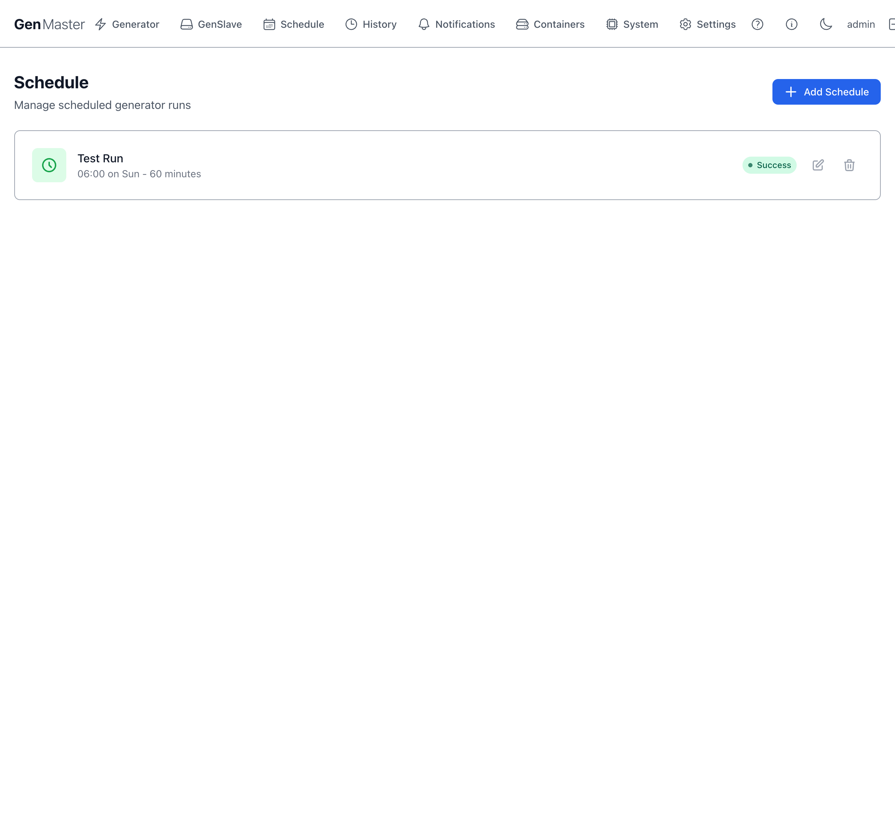

# Schedule

The Schedule page lists all of your generator's scheduled runs and lets you create, edit, and delete them. Schedules use a simple **start time + day picker + duration** format and run automatically as long as the system is **armed** (see [Generator Control → Arming behavior](generator.md#arming-behavior)).

## Schedule list

Each schedule appears as a row with:

| Element | Meaning |
|---------|---------|
| **Name** | A friendly label you choose (e.g. `Test Run`, `Sunday Exercise`). |
| **Time / day summary** | Plain-English version of the schedule (e.g. `06:00 on Sun - 60 minutes`). |
| **Status badge** | `Success` (last run completed normally), `Failed`, or `Pending` (never run yet). |
| **Edit** (pencil) | Open the schedule editor. |
| **Delete** (trash) | Remove the schedule. |

## Add Schedule

The **Add Schedule** button opens a Create Schedule dialog where you fill in:

| Field | Format / example |
|-------|------------------|
| **Name** | Free-form text (e.g. `Morning run`). Used as the label in the schedule list and run history. |
| **Start Time** | 24-hour time-of-day picker. The time the run will begin on each selected day. |
| **Duration (minutes)** | How long the run should last after start. The state machine will issue a stop command after this many minutes. |
| **Days of Week** | Pill buttons for `Sun` `Mon` `Tue` `Wed` `Thu` `Fri` `Sat`. Click each day you want the schedule to run. Selected days are highlighted blue. |
| **Enable schedule** | Toggle. When off, the schedule is kept in the list but skipped. Useful for temporarily pausing a schedule without losing its config. |
| **Cancel / Create** | Discard or save. |

!!! tip "Multi-day vs. single-day schedules"
    Pick multiple days for a schedule that should run repeatedly (e.g. weekday mornings: select Mon, Tue, Wed, Thu, Fri). Pick a single day for a once-a-week run (e.g. Sunday exercise).

!!! warning "Schedules respect the arming state"
    A scheduled run will be **logged but skipped** if GenMaster is disarmed when the trigger fires. Under the default Fail-Safe boot policy, a reboot leaves the system disarmed until the operator re-arms — so a schedule that fires within that window will be skipped. The skipped run shows up in the Notification History with the "disarmed" reason.

## Editing and deleting

- **Edit** opens the same Create Schedule dialog with current values pre-filled. Saving recalculates the next-run time immediately.
- **Delete** removes the schedule. There is no undo. Past run history for that schedule remains in [Run History](history.md).

## Recommended setups

| Use case | Time | Days | Duration | Notes |
|----------|------|------|----------|-------|
| Weekly exercise | `06:00` | Sun | `15` | Standard maintenance run, Sunday early morning. |
| Bi-weekly | `06:00` | Sun (manually disable on alternate weeks) | `30` | Or use the [Exercise Schedule](generator.md#exercise-schedule) panel which has built-in bi-weekly support. |
| Monthly load test | `12:00` | Sun (1st Sunday — toggle manually) | `60` | Pairs well with monthly load draw. |
| Weekday morning warm-up | `06:00` | Mon–Fri | `30` | All five weekdays. |

If your generator already runs frequently from Victron triggers, an explicit exercise schedule may be unnecessary; check [Run History](history.md) over a 30-day window to confirm.

## Difference vs. the Exercise Schedule on the Generator page

The **Schedule** page is for ad-hoc, repeated schedules — you can create as many as you want and they're independent. The **Exercise Schedule** on the [Generator Control](generator.md#exercise-schedule) page is a single, dedicated schedule designed specifically for periodic generator exercise runs (with built-in support for `Daily`, `Weekly`, `Bi-weekly`, `Monthly`, and a "Run Now" button).

Use **Schedule** for: morning warm-ups, scheduled load tests, recurring scheduled draws.
Use **Exercise Schedule** for: routine maintenance exercise runs.

## What's next

- View past scheduled runs in [Run History](history.md).
- Use the dedicated maintenance scheduler at [Generator Control → Exercise Schedule](generator.md#exercise-schedule).
