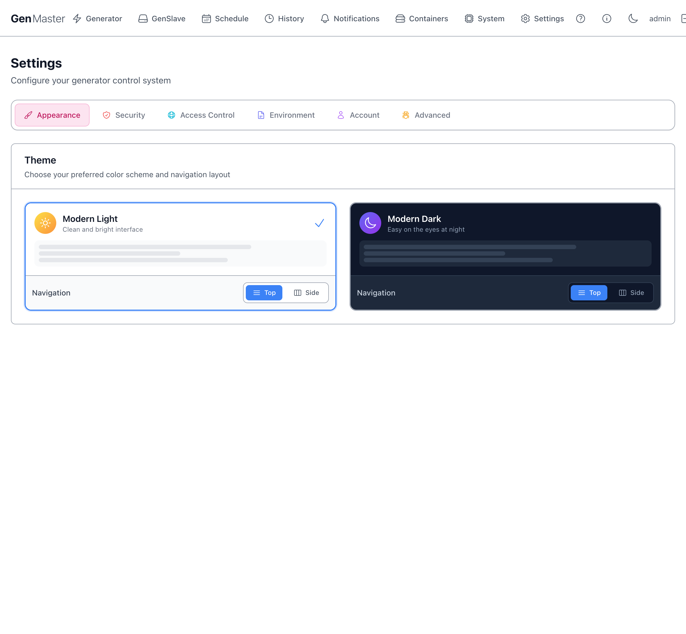
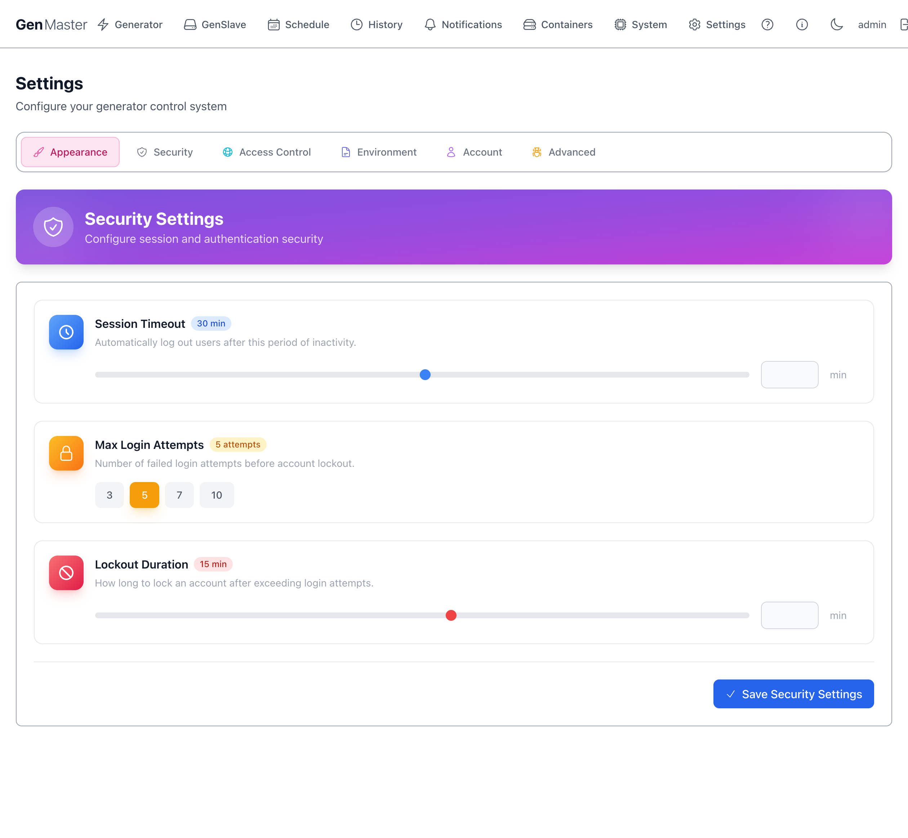
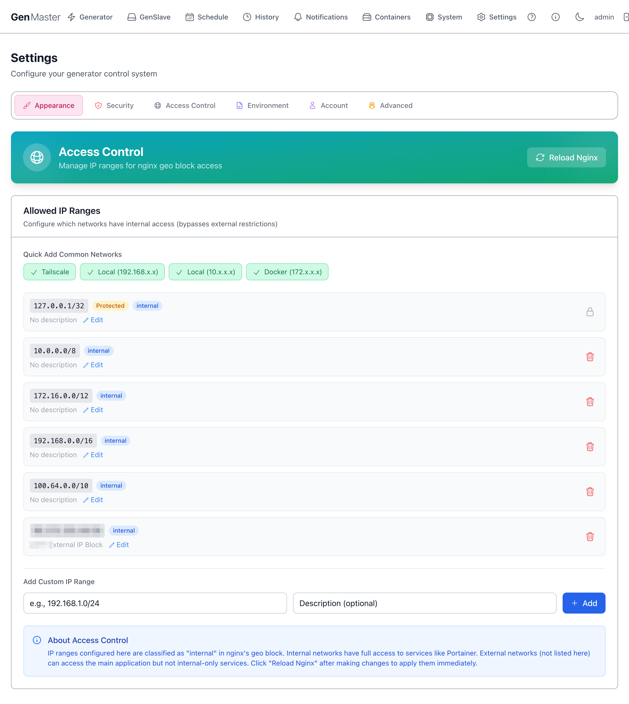
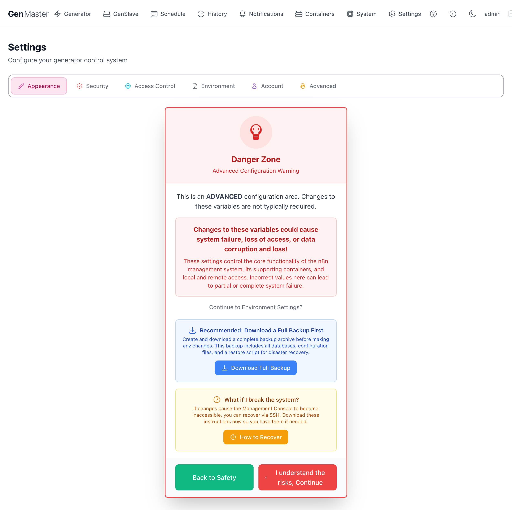
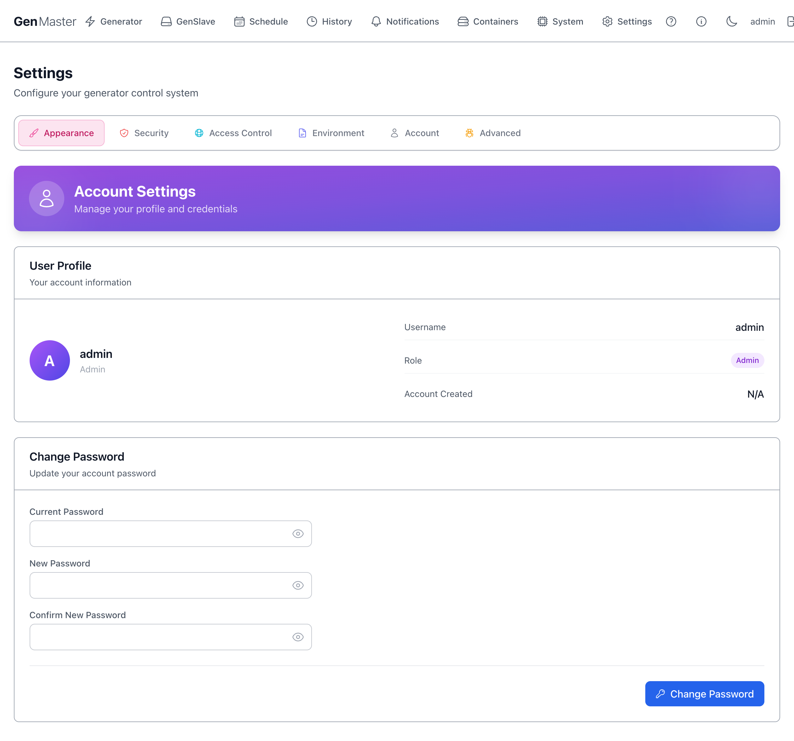
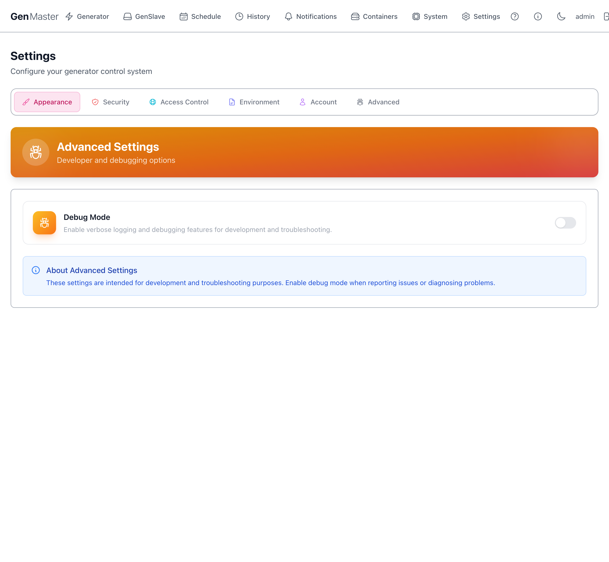

# Settings

The Settings page is divided into six sub-tabs. Most operators only ever touch **Appearance**, **Account**, and possibly **Access Control**. The **Environment** tab is intentionally gated behind a Danger Zone confirmation because incorrect values can take the system down.

## Appearance



Controls the visual theme.

| Option | Effect |
|--------|--------|
| **Modern Light** | Clean, bright color palette. The default. |
| **Modern Dark** | Easy-on-the-eyes dark palette. |
| **Navigation: Top / Side** | Where the main nav lives. **Top** (default) puts it as a horizontal bar at the very top. **Side** moves it into a vertical sidebar — useful on wider monitors with more vertical space. |

Each theme has its own Top/Side toggle so you can pair them differently (e.g. Light + Top during the day, Dark + Side at night).

The check mark indicates the currently active combination.

!!! tip "System preference detection"
    The browser's `prefers-color-scheme` setting is detected on first visit. If you change OS-level appearance, GenMaster will follow on next reload unless you've explicitly picked a theme.

## Security



Session and authentication policy.

| Field | Meaning |
|-------|---------|
| **Session Timeout (min)** | Idle minutes before a logged-in user is automatically signed out. Default `30`. Slider range typically `5`–`240`. |
| **Max Login Attempts** | Failed-password attempts allowed before the account is locked. Quick-pick buttons: `3`, `5`, `7`, `10`. |
| **Lockout Duration (min)** | Minutes the account stays locked after exceeding Max Login Attempts. Default `15`. |
| **Save Security Settings** | Persist changes. |

!!! tip "Setting these for unattended kiosk use"
    If GenMaster is displayed on a wall-mounted dashboard you log into once and walk away from, set Session Timeout to a high value (or `0` if your build supports it) so the dashboard doesn't drop you mid-day.

## Access Control



Manages the IP ranges that Nginx treats as **internal**. This list is the master allowlist for the entire GenMaster web interface on the public 443 listener: only clients whose source IP falls inside one of these ranges can reach the UI (`/`), backend API (`/api/`), websocket (`/ws/`), health endpoint (`/healthz`), or Portainer (`/portainer/`). Anything not in the list is denied with HTTP 403.

The default ranges already cover loopback, RFC1918 private networks, Docker bridges, and Tailscale's CGNAT range, so on-LAN and Tailscale clients work out of the box. To allow a public IP (e.g., your phone's mobile carrier address, a remote site), add it as a custom range below. To lock things down further, leave only what you trust here and reach the UI exclusively over Tailscale.

### Quick Add Common Networks

Pre-built buttons for the standard ranges most setups need:

| Button | CIDR added |
|--------|------------|
| **Tailscale** | `100.64.0.0/10` |
| **Local (192.168.x.x)** | `192.168.0.0/16` |
| **Local (10.x.x.x)** | `10.0.0.0/8` |
| **Docker (172.x.x.x)** | `172.16.0.0/12` |

Click a button to add the range with one click. The check mark indicates the range is already in your list.

### IP Ranges list

Each row shows: CIDR, classification badge (`internal`, `Protected`), description, Edit, Delete.

`Protected` ranges (like `127.0.0.1/32`) cannot be removed — they're hardcoded as essential for the system to operate.

### Add Custom IP Range

A small form to add an arbitrary CIDR with optional description. Useful for adding your office IP, a friend's home IP for emergency access, etc.

### Reload Nginx

Changes to access rules take effect after Nginx reloads its config. Click **Reload Nginx** in the top right to apply changes immediately. Without a reload, changes are saved to the database but not enforced.

!!! example "Sensitive data"
    External IP CIDRs (your home/office public IP) identify your real-world network. Mask before sharing screenshots.

## Environment



The most powerful — and most dangerous — settings tab. Shows a Danger Zone warning page first, requiring you to acknowledge the risk before continuing.

The warning page offers:

- **Download Full Backup** — strongly recommended before changing any environment variable. Creates a tar.gz of the database, configs, and a restore script.
- **How to Recover** — opens a panel with SSH-based recovery instructions in case the changes break the web UI.
- **Back to Safety** — returns to the previous settings tab without continuing.
- **I understand the risks, Continue** — proceed to the actual environment variable editor.

Once past the gate, you'll see a categorized list of every `.env` variable: domain config, database credentials, GenSlave connection, heartbeat tuning, webhook URLs, generator info, Cloudflare tunnel token, Tailscale auth key, etc.

!!! danger "Read this before editing anything"
    Changing the database password without also updating the GenSlave-side config will break communication. Changing the domain without updating Cloudflare DNS will lock you out. Most variables here are set during setup and rarely need to change. **Always download a backup first.**

## Account



Manage the logged-in user.

### User Profile

Read-only summary: avatar, username, role badge (`Admin` / `Operator`), account creation date.

### Change Password

| Field | Notes |
|-------|-------|
| **Current Password** | Required for verification. |
| **New Password** | Strong password recommended (16+ chars, mixed case, numbers, symbols). |
| **Confirm New Password** | Must match New Password. |
| **Change Password** | Saves the new credential. |

After changing your password, you'll typically be signed out and need to log back in.

!!! tip "Forgot the admin password?"
    There's no email-recovery flow. SSH into the GenMaster host and reset via:
    ```bash
    docker compose exec genmaster python -m app.cli reset_password admin
    ```

## Advanced



Developer and debugging options.

| Option | Effect |
|--------|--------|
| **Debug Mode** | Toggle to enable verbose logging across all backend services. Logs become noisy fast — leave off in normal operation. Useful when reporting an issue or diagnosing an obscure bug. |

The blue note at the bottom reminds you these settings are intended for development and troubleshooting, not normal operation.

## What's next

- Manage who can sign in: [Account](#account).
- Configure where alerts go: [Notifications](notifications.md).
- Restrict who can reach the UI: [Access Control](#access-control).
