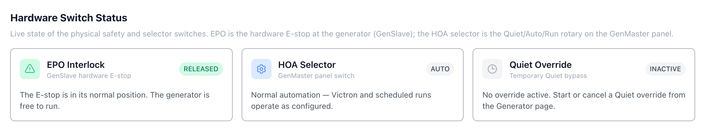
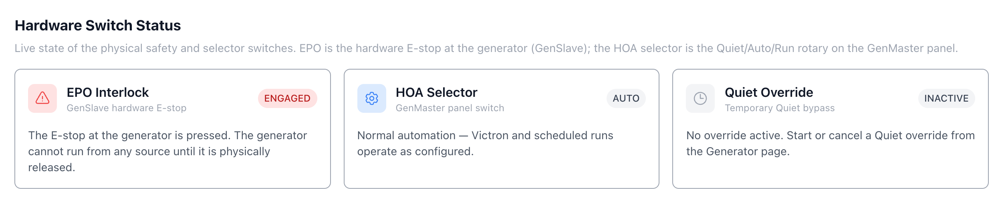
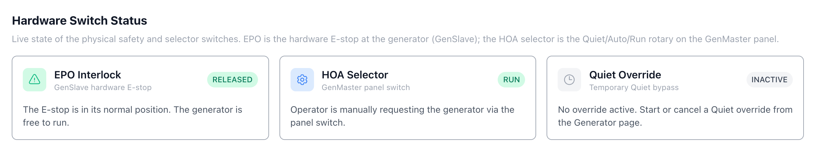
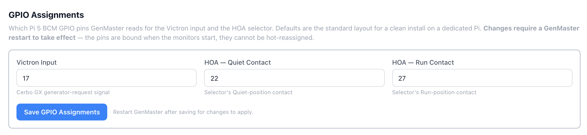
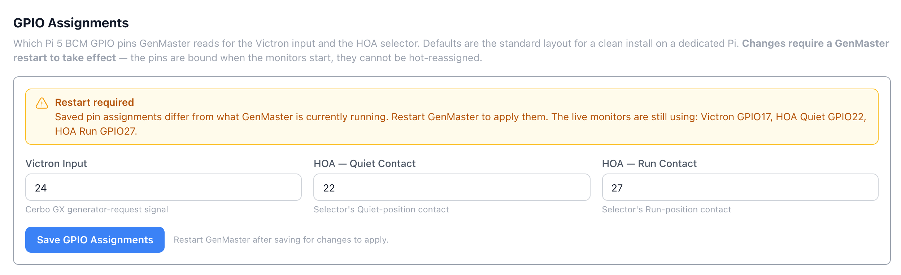

# System

The System page is the host-level dashboard for GenMaster — it shows server health, resource usage, SSL certificate status, GenSlave connectivity (mirrored from the GenSlave page), and lets you reboot or shut down the GenMaster Pi itself. There are four sub-tabs at the top: **Health**, **Network**, **Hardware**, and **Terminal**.

## Top action row

| Button | Effect |
|--------|--------|
| **Reboot** | Reboots the GenMaster host. The web UI will go offline for ~60 seconds. Behavior on boot depends on the active **Boot Arming Policy** (see Generator page). |
| **Shutdown** | Powers off the GenMaster host. Someone will need physical access to power it back on. |
| **Refresh** | Re-poll all health metrics immediately. |

!!! danger "Reboot behavior depends on the Boot Arming Policy"
    The default `fail_safe` policy disarms the relay on every boot — so after a reboot you'll need to re-arm before scheduled or Victron-driven runs fire again. The `boot_disarmed_failsafe` notification (configurable in Notifications) tells you when this happens. Under the alternative `preserve_state` policy, the armed state is kept across the reboot and the system can auto-resume. Either way, `generator_running` is reset to False and any in-progress runs are closed with reason `error`. Choose the policy that matches your installation's safety profile under Generator → Boot Arming Policy.

## Health sub-tab

The default view. Shows:

### System Health badge

A big banner showing **HEALTHY** / **DEGRADED** / **UNHEALTHY** plus version (`GenMaster v1.0.0`) and last-update time.

Below the banner, three counters:

- **Passed** — number of healthchecks currently green.
- **Warnings** — number in warning state.
- **Errors** — number failing.

### Docker Containers

Quick container summary: Running / Stopped / Unhealthy / Total. For full details click through to [Containers](containers.md).

### Core Services

Specific named services that are required for normal operation: `genmaster api`, `nginx`, etc. Each shows green/red.

### Host System Resources

| Metric | Notes |
|--------|-------|
| **CPU** | Host CPU percentage. Brief spikes during DB writes are normal. |
| **Memory** | Host RAM usage. The Pi 5 8GB has plenty of headroom for normal operation. |
| **Disk** | Free space on the boot drive. Below 10% triggers a warning. |

### SSL Certificates

| Field | Meaning |
|-------|---------|
| **Domain** | The hostname covered by the certificate. |
| **Valid For** | Days remaining until expiration. |
| **Expires** | Exact expiration timestamp. |
| **Force Renew** | Triggers a Certbot renewal immediately, even if renewal isn't due yet. |

Let's Encrypt certificates auto-renew at 30 days remaining. The Force Renew button is for cases where you've changed domain settings and need a fresh cert today.

### GenSlave

A condensed mirror of the [GenSlave](genslave.md) page top-level status: `CONNECTED` / `DISCONNECTED` badge, online status, last heartbeat time. For details, navigate to the GenSlave tab.

### Docker Storage

Shows total disk used by Docker (images + volumes + containers + build cache) so you can spot when cleanup is needed.

### WiFi Watchdog

A separate connectivity-recovery service that pings a known target every minute and restarts the WiFi interface if connectivity is lost.

| Field | Meaning |
|-------|---------|
| **RUNNING / STOPPED** | Watchdog daemon state. |
| **Service Enabled** | Toggle — disable if you don't want automatic WiFi recovery. |
| **Consecutive Failures** | Failed pings since last success. |
| **Last Recovery** | Timestamp the watchdog last forced a WiFi restart. |

## Network sub-tab

Shows the GenMaster host's network interfaces: name (`eth0`, `wlan0`, `tailscale0`), IP, netmask, gateway, DNS, MAC, link state. WiFi interfaces also show signal strength.

Use this when:

- You need to find the GenMaster's LAN IP for SSH access.
- Verifying Tailscale is up after enabling it.
- Diagnosing a "GenSlave shows offline" issue from the master side.

!!! example "Sensitive data"
    All IPs, MAC addresses, and SSIDs on this tab identify your network — mask before sharing.

## Hardware sub-tab

The Hardware tab is where GenMaster surfaces the live state of the two physical control switches (the GenSlave EPO and the GenMaster HOA selector) and lets you configure which GPIO pins they're wired to. For the operator guide to the switches themselves — what they do, how to wire them, what each banner means — see [Hardware Switches](hardware-switches.md). This page covers the tab in the System page specifically.

The tab has two sections: **Hardware Switch Status** at the top, and **GPIO Assignments** below it. The tab polls live state every 5 seconds while it's visible.

### Hardware Switch Status

Three cards summarize what the system is currently seeing from the hardware. When nothing is active and everything is in its default position, all three cards are neutral:

| Card | What it shows |
|------|---------------|
| **EPO Interlock** | The GenSlave hardware E-stop. Green **RELEASED** when the mushroom button is up; red **ENGAGED** when it's pressed. The body line tells you the practical consequence — "free to run" vs. "cannot run from any source until physically released." |
| **HOA Selector** | The 3-position rotary at GenMaster. **AUTO** (gray), **QUIET** (blue), **RUN** (green), or **FAULT** (amber) when both contacts read closed at the same time. |
| **Quiet Override** | The temporary Quiet bypass started from the Generator page. **INACTIVE** when no override is running; green **ACTIVE** when one is, with the remaining time in the body line. |

The cards change colour and badge as the hardware state changes. Two examples:

When the EPO is engaged, the EPO Interlock card flips to a red ENGAGED badge. The HOA Selector and Quiet Override cards are unaffected — they show what they show regardless of the EPO.

When the HOA selector is in Run, the HOA Selector card flips to a green RUN badge. This view is the fastest way to confirm "the system actually sees the switch position I just turned to" — handy when troubleshooting wiring on a new install.

### GPIO Assignments

The GPIO Assignments panel sets which Pi 5 BCM GPIO pins GenMaster reads for the Victron input and the HOA selector contacts. Defaults are the standard wiring (Victron 17, HOA Quiet 22, HOA Run 27); change these only if your build wires the contacts to different pins.

| Field | Default | Purpose |
|-------|---------|---------|
| **Victron Input** | 17 | Pi 5 BCM pin reading the Cerbo GX generator-request relay. |
| **HOA — Quiet Contact** | 22 | Pi 5 BCM pin for the Quiet-position NO contact. |
| **HOA — Run Contact** | 27 | Pi 5 BCM pin for the Run-position NO contact. |

Live validation:

- Each pin must be a valid BCM GPIO number (0–27).
- All three pins must be distinct — no function can share a pin with another.

If either rule is broken the Save button greys out and a red message explains the problem. Fix the value and the button re-enables.

!!! warning "Changes require a GenMaster restart"
    The pins are bound when the EPO/HOA monitors start, so they cannot be hot-reassigned. After you Save, the panel shows a "Restart required" banner with the pins GenMaster is **currently** running, until you restart the container.

The banner lists the running pins explicitly so you know what's actually being read while you decide when to restart. Use **System → Reboot** to restart the host (and the GenMaster container with it), or redeploy the container if you'd rather avoid a full host reboot.

## Terminal sub-tab

A web-based shell into the GenMaster container (or host, depending on configuration). Useful for quick diagnostics without leaving the browser.

!!! warning "Terminal access is full-power"
    Anyone who can reach the Terminal can run any command the container can run. Terminal access should be restricted to admin accounts and protected with a strong password.

## What's next

- Restart specific services from [Containers](containers.md).
- Adjust who can reach the GenMaster web UI: [Settings → Access Control](settings.md#access-control).
- Add or change WiFi profiles, set static IPs: see [Network Configuration](network-configuration.md).
- Recover from a bad WiFi static-IP change: [Network Recovery](network-recovery.md).
- Full operator guide to the EPO and HOA switches: [Hardware Switches](hardware-switches.md).
