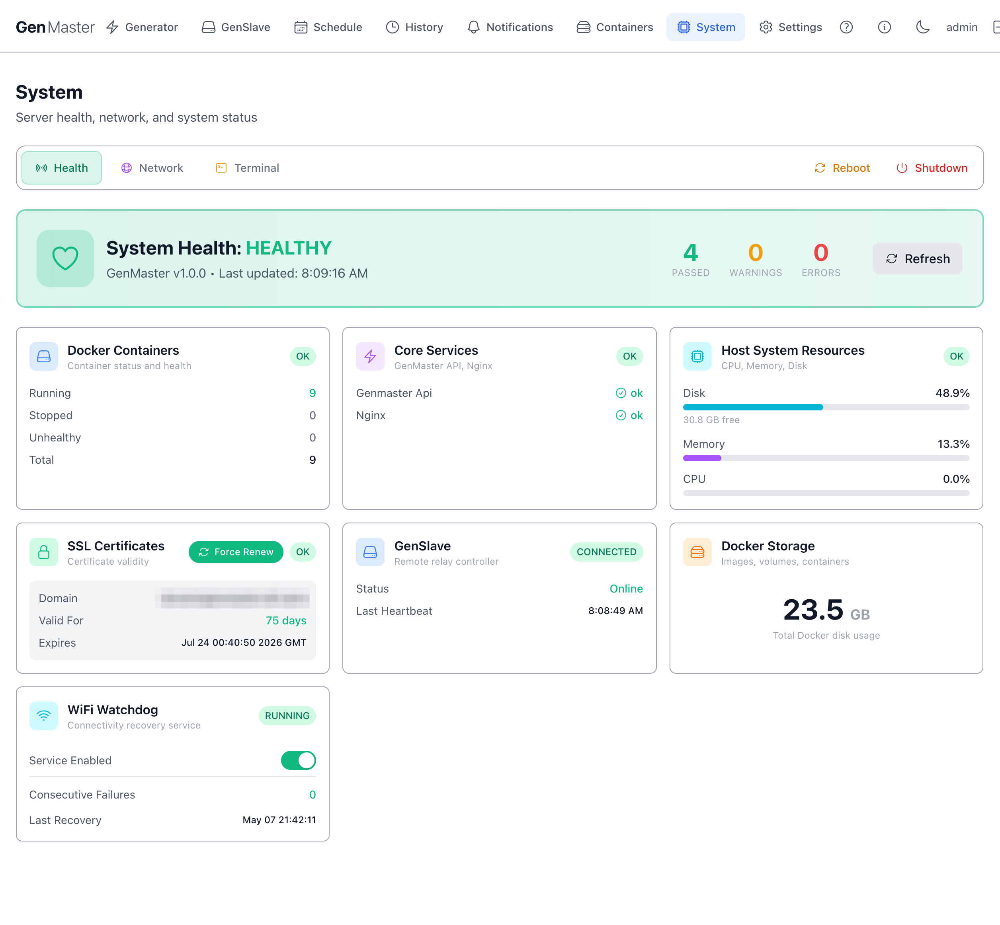
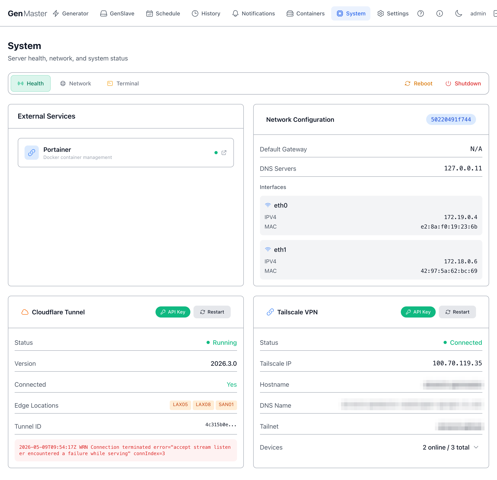
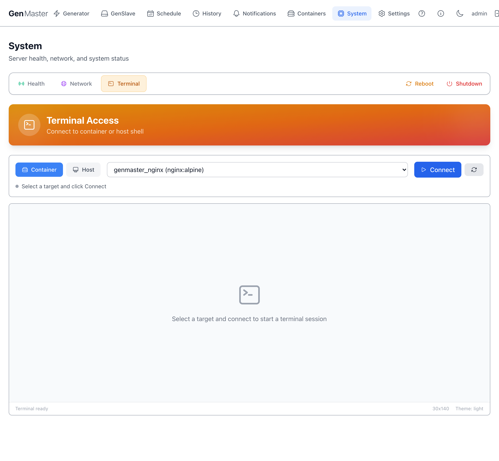

# System

The System page is the host-level dashboard for GenMaster — it shows server health, resource usage, SSL certificate status, GenSlave connectivity (mirrored from the GenSlave page), and lets you reboot or shut down the GenMaster Pi itself. There are three sub-tabs at the top: **Health**, **Network**, and **Terminal**.

## Top action row

| Button | Effect |
|--------|--------|
| **Reboot** | Reboots the GenMaster host. The web UI will go offline for ~60 seconds. Behavior on boot depends on the active **Boot Arming Policy** (see Generator page). |
| **Shutdown** | Powers off the GenMaster host. Someone will need physical access to power it back on. |
| **Refresh** | Re-poll all health metrics immediately. |

!!! danger "Reboot behavior depends on the Boot Arming Policy"
    The default `fail_safe` policy disarms the relay on every boot — so after a reboot you'll need to re-arm before scheduled or Victron-driven runs fire again. The `boot_disarmed_failsafe` notification (configurable in Notifications) tells you when this happens. Under the alternative `preserve_state` policy, the armed state is kept across the reboot and the system can auto-resume. Either way, `generator_running` is reset to False and any in-progress runs are closed with reason `error`. Choose the policy that matches your installation's safety profile under Generator → Boot Arming Policy.

## Health sub-tab

The default view. Shows:

### System Health badge

A big banner showing **HEALTHY** / **DEGRADED** / **UNHEALTHY** plus version (`GenMaster v1.0.0`) and last-update time.

Below the banner, three counters:

- **Passed** — number of healthchecks currently green.
- **Warnings** — number in warning state.
- **Errors** — number failing.

### Docker Containers

Quick container summary: Running / Stopped / Unhealthy / Total. For full details click through to [Containers](containers.md).

### Core Services

Specific named services that are required for normal operation: `genmaster api`, `nginx`, etc. Each shows green/red.

### Host System Resources

| Metric | Notes |
|--------|-------|
| **CPU** | Host CPU percentage. Brief spikes during DB writes are normal. |
| **Memory** | Host RAM usage. The Pi 5 8GB has plenty of headroom for normal operation. |
| **Disk** | Free space on the boot drive. Below 10% triggers a warning. |

### SSL Certificates

| Field | Meaning |
|-------|---------|
| **Domain** | The hostname covered by the certificate. |
| **Valid For** | Days remaining until expiration. |
| **Expires** | Exact expiration timestamp. |
| **Force Renew** | Triggers a Certbot renewal immediately, even if renewal isn't due yet. |

Let's Encrypt certificates auto-renew at 30 days remaining. The Force Renew button is for cases where you've changed domain settings and need a fresh cert today.

### GenSlave

A condensed mirror of the [GenSlave](genslave.md) page top-level status: `CONNECTED` / `DISCONNECTED` badge, online status, last heartbeat time. For details, navigate to the GenSlave tab.

### Docker Storage

Shows total disk used by Docker (images + volumes + containers + build cache) so you can spot when cleanup is needed.

### WiFi Watchdog

A separate connectivity-recovery service that pings a known target every minute and restarts the WiFi interface if connectivity is lost.

| Field | Meaning |
|-------|---------|
| **RUNNING / STOPPED** | Watchdog daemon state. |
| **Service Enabled** | Toggle — disable if you don't want automatic WiFi recovery. |
| **Consecutive Failures** | Failed pings since last success. |
| **Last Recovery** | Timestamp the watchdog last forced a WiFi restart. |

## Network sub-tab

Shows the GenMaster host's network interfaces: name (`eth0`, `wlan0`, `tailscale0`), IP, netmask, gateway, DNS, MAC, link state. WiFi interfaces also show signal strength.

Use this when:

- You need to find the GenMaster's LAN IP for SSH access.
- Verifying Tailscale is up after enabling it.
- Diagnosing a "GenSlave shows offline" issue from the master side.

!!! example "Sensitive data"
    All IPs, MAC addresses, and SSIDs on this tab identify your network — mask before sharing.

## Terminal sub-tab

A web-based shell into the GenMaster container (or host, depending on configuration). Useful for quick diagnostics without leaving the browser.

!!! warning "Terminal access is full-power"
    Anyone who can reach the Terminal can run any command the container can run. Terminal access should be restricted to admin accounts and protected with a strong password.

## What's next

- Restart specific services from [Containers](containers.md).
- Adjust who can reach the GenMaster web UI: [Settings → Access Control](settings.md#access-control).
